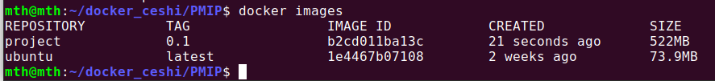
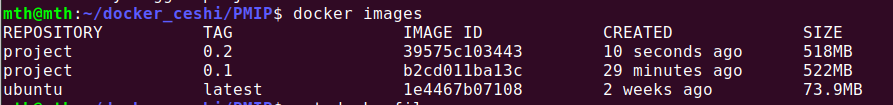
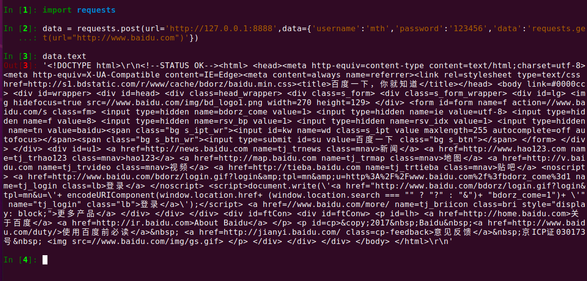
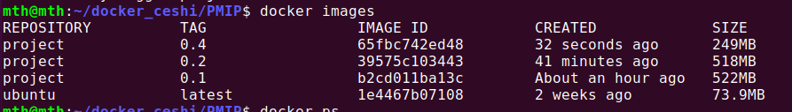
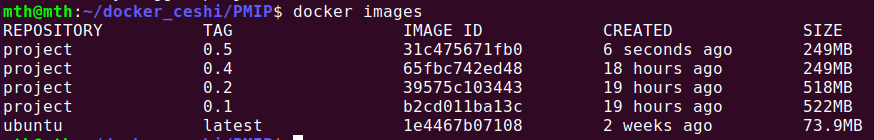
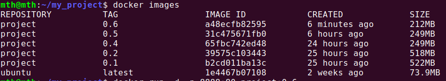

# 一次对dockerfile所生成镜像的大小优化

**针对前两天构建的一个ubuntu + nginx + uwsgi + python 的代理IP服务 进行优化的尝试**

## 0.1版本的dockerfile文件：

```shell
FROM ubuntu
MAINTAINER tina_han<553630934@qq.com>
# 更改apt源
RUN sed -i s@/archive.ubuntu.com/@/mirrors.aliyun.com/@g /etc/apt/sources.list
RUN apt-get clean
RUN apt-get update
RUN apt-get install -y vim
RUN apt-get install -y python3
RUN apt-get install -y python3-pip
# 更改pip源
RUN pip3 config set global.index-url http://mirrors.aliyun.com/pypi/simple
RUN pip3 config set install.trusted-host mirrors.aliyun.com
RUN pip3 install pip -U
RUN pip3 install django
RUN pip3 install requests
RUN pip3 install uwsgi
# 设置时区，安装nignx前需要
RUN ln -sf /usr/share/zoneinfo/Asia/Shanghai /etc/localtime
RUN echo 'Asia/Shanghai' >/etc/timezone
RUN apt-get install -y nginx
# 更换一个 nginx 的配置文件
RUN rm /etc/nginx/sites-enabled/default
COPY default /etc/nginx/sites-enabled/
# 导入项目
ADD PMIP.tar.gz /home/
# 启动容器
CMD ["sh", "-c", "uwsgi -i /home/PMIP/PMIP/uwsgi.ini && nginx -g 'daemon off;'"]
```

可以看到，这里每一条语句都使用了一个独立的 run，这是非常不建议的写法，网上很多攻略都说，把多条RUN合成一条，可以减少镜像层数，并且减小镜像大小

当前镜像大小为522M



接下来我们把RUN合成一条

## 0.2 RUN 合并（对于镜像大小没鸟用）

```shell
FROM ubuntu
MAINTAINER tina_han<553630934@qq.com>
RUN sed -i s@/archive.ubuntu.com/@/mirrors.aliyun.com/@g /etc/apt/sources.list && \
    ln -sf /usr/share/zoneinfo/Asia/Shanghai /etc/localtime && \
    echo 'Asia/Shanghai' >/etc/timezone && \
    apt-get clean && \
    apt-get update && \
    apt-get install -y vim python3 python3-pip nginx && \
    pip3 config set global.index-url http://mirrors.aliyun.com/pypi/simple && \
    pip3 config set install.trusted-host mirrors.aliyun.com && \
    pip3 install pip -U && \
    pip3 install django requests uwsgi && \
    rm /etc/nginx/sites-enabled/default
COPY default /etc/nginx/sites-enabled/
ADD PMIP.tar.gz /home/
CMD ["sh", "-c", "uwsgi -i /home/PMIP/PMIP/uwsgi.ini && nginx -g 'daemon off;'"]
```



合并之后依然有５１８M，结果显示　RUN　合并后对镜像大小并没有什么影响

## 0.3 不下载非必要依赖(构建镜像报错)

apt-get --no-install-recommends，可以不下载非必要依赖

```shell
FROM ubuntu
MAINTAINER tina_han<553630934@qq.com>
RUN sed -i s@/archive.ubuntu.com/@/mirrors.aliyun.com/@g /etc/apt/sources.list && \
    ln -sf /usr/share/zoneinfo/Asia/Shanghai /etc/localtime && \
    echo 'Asia/Shanghai' >/etc/timezone && \
    apt-get clean && \
    apt-get update && \
    # 不下载非必要依赖
    apt-get install -y --no-install-recommends vim python3 python3-pip nginx && \
    pip3 config set global.index-url http://mirrors.aliyun.com/pypi/simple && \
    pip3 config set install.trusted-host mirrors.aliyun.com && \
    pip3 install pip -U && \
    pip3 install django requests uwsgi && \
    rm /etc/nginx/sites-enabled/default
COPY default /etc/nginx/sites-enabled/
ADD PMIP.tar.gz /home/
CMD ["sh", "-c", "uwsgi -i /home/PMIP/PMIP/uwsgi.ini && nginx -g 'daemon off;'"]
```

```shell
ERROR: Command errored out with exit status 1: /usr/bin/python3 -u -c 'import sys, setuptools, tokenize; sys.argv[0] = '"'"'/tmp/pip-install-tim3jkzo/uwsgi/setup.py'"'"'; __file__='"'"'/tmp/pip-install-tim3jkzo/uwsgi/setup.py'"'"';f=getattr(tokenize, '"'"'open'"'"', open)(__file__);code=f.read().replace('"'"'\r\n'"'"', '"'"'\n'"'"');f.close();exec(compile(code, __file__, '"'"'exec'"'"'))' install --record /tmp/pip-record-uqbm4rmh/install-record.txt --single-version-externally-managed --compile --install-headers /usr/local/include/python3.8/uwsgi Check the logs for full command output.
```

## 0.4 将非运行环境删除（好用！！！）

**删除非运行环境时，需要与构建该环境在同一个RUN中，否则非运行环境仍然会被带入镜像中（以其中某一层的方式存在）**

rm -rf /var/cache/apk/*

rm -rf /var/lib/apt/lists/*

apt-get autoremove -y

apt-get remove -y python3-pip

```shell
FROM ubuntu
MAINTAINER tina_han<553630934@qq.com>
RUN sed -i s@/archive.ubuntu.com/@/mirrors.aliyun.com/@g /etc/apt/sources.list && \
    ln -sf /usr/share/zoneinfo/Asia/Shanghai /etc/localtime && \
    echo 'Asia/Shanghai' >/etc/timezone && \
    apt-get clean && \
    apt-get update && \
    apt-get install -y python3 python3-pip nginx && \
    pip3 config set global.index-url http://mirrors.aliyun.com/pypi/simple && \
    pip3 config set install.trusted-host mirrors.aliyun.com && \
    pip3 install pip -U && \
    pip3 install django requests uwsgi && \
    # 删除不必要的环境
    rm -rf /var/cache/apk/* && \
    rm -rf /var/lib/apt/lists/* && \
    apt-get remove -y python3-pip && \
    # autoremove 慎用，删除自动安装的依赖包，千万不要在主机上尝试
    apt-get autoremove -y && \
    rm /etc/nginx/sites-enabled/default
COPY default /etc/nginx/sites-enabled/
ADD PMIP.tar.gz /home/
CMD ["sh", "-c", "uwsgi -i /home/PMIP/PMIP/uwsgi.ini && nginx -g 'daemon off;'"]
```





**经本地测试镜像可用，大小为249M，缩减一半以上**

## 0.5 缩减RUN语句之后的层数（经测试无用）

**猜测：**docker 每一层都会包含上一层的所有数据，那么试试看，我们让环境安装之后的层数变少的话，是不是镜像大小也会变少

**结论：**docker每一层是记录的针对上一层的变化，并不会复制上一层的数据，就像是 **git**

我们将之前的最后两行提到RAN的上面去

```shell
FROM ubuntu
MAINTAINER tina_han<553630934@qq.com>
ADD PMIP.tar.gz /home/
CMD ["sh", "-c", "uwsgi -i /home/PMIP/PMIP/uwsgi.ini && nginx -g 'daemon off;'"]
RUN sed -i s@/archive.ubuntu.com/@/mirrors.aliyun.com/@g /etc/apt/sources.list && \
    ln -sf /usr/share/zoneinfo/Asia/Shanghai /etc/localtime && \
    echo 'Asia/Shanghai' >/etc/timezone && \
    apt-get clean && \
    apt-get update && \
    apt-get install -y vim python3 python3-pip nginx && \
    pip3 config set global.index-url http://mirrors.aliyun.com/pypi/simple && \
    pip3 config set install.trusted-host mirrors.aliyun.com && \
    pip3 install pip -U && \
    pip3 install django requests uwsgi && \
    # 删除非必要环境和文件
    rm -rf /var/cache/apk/* && \
    rm -rf /var/lib/apt/lists/* && \
    apt-get remove -y python3-pip && \
    apt-get autoremove -y && \
    rm /etc/nginx/sites-enabled/default
COPY default /etc/nginx/sites-enabled/
```



结果显示没有任何鸟用，说明猜测错误

##  0.6 启动容器之前修改文件，而不是进入容器修改（省个vim的空间）

**可以省一个vim**

```shell
FROM ubuntu
MAINTAINER tina_han<553630934@qq.com>
RUN sed -i s@/archive.ubuntu.com/@/mirrors.aliyun.com/@g /etc/apt/sources.list && \
    ln -sf /usr/share/zoneinfo/Asia/Shanghai /etc/localtime && \
    echo 'Asia/Shanghai' >/etc/timezone && \
    apt-get clean && \
    apt-get update && \
    # 这里多出来一个安装 libpython3.8 因为在取消VIM的安装后，因为 apt-get autoremove 会删除掉 libpython3.8.so.1.0这个文件，导致uwsgi无法启动成功,所以我们手动安装一下。
    apt-get install -y libpython3.8 python3 python3-pip nginx && \
    pip3 config set global.index-url http://mirrors.aliyun.com/pypi/simple && \
    pip3 config set install.trusted-host mirrors.aliyun.com && \
    pip3 install pip -U && \
    pip3 install django requests uwsgi && \
    rm -rf /var/cache/apk/* && \
    rm -rf /var/lib/apt/lists/* && \
    apt-get autoremove -y python3-pip && \
    rm /etc/nginx/sites-enabled/default
# 将之前的ADD命令换成了COPY，这样可以在启动容器之前先对里面的settings.py进行修改
COPY project /home/
COPY default /etc/nginx/sites-enabled/
CMD ["sh", "-c", "uwsgi -i /home/PMIP/PMIP/uwsgi.ini && nginx -g 'daemon off;'"]
```



可以看出镜像又缩小了几十兆

## 0.7 暂时先优化到这里了，分段构建我实在是理解不了……自己还是太弱了