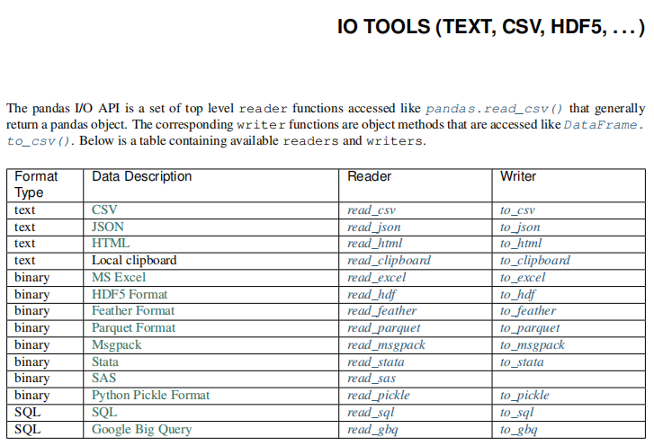

数据分析

**什么是数据分析？**

数据分析是指用适当的统计分析方法对收集来的大量数据进行分析，提取有用信息和形成结论而对数据加以详细研究和概括总结的过程。

**数据分析经典案例**

（一）啤酒与尿布

沃尔玛在对消费者购物行为分析时发现，男性顾客在购买婴儿尿片时，常常会顺便搭配几瓶啤酒来犒劳自己，于是尝试推出了将啤酒和尿布摆在一起的促销手段。没想到这个举措居然使尿布和啤酒的销量都大幅增加了。

（二）数据新闻让英国撤军

2010年10月23日《卫报》利用维基解密的数据做了一篇“数据新闻”。将伊拉克战争中所有的人员伤亡情况均标注于地图之上。地图上一个红点便代表一次死伤事件，鼠标点击红点后弹出的窗口则有详细的说明：伤亡人数、时间，造成伤亡的具体原因。密布的红点多达39万，显得格外触目惊心。一经刊出立即引起朝野震动，推动英国最终做出撤出驻伊拉克军队的决定。

（三）微软数据分析成功预测奥斯卡21项大奖

2013年，微软纽约研究院的经济学家大卫•罗斯柴尔德（David Rothschild）利用数据分析技术成功预测24个奥斯卡奖项中的19个，成为人们津津乐道的话题。后来，罗斯柴尔德再接再厉，成功预测第86届奥斯卡金像奖颁奖典礼24个奖项中的21个。


**数据分析三驾马车**

1. 统计学
2. 业务
3. 算法与编程

通过三种技能贯穿数据分析思想，培养自己的业务需求分析能力与编程能力，解决具体行业场景的数据分析问题。


**课程设计**

总结后端知识体系，了解数据分析、人工智能与后端的关系。

课程体系设计。学习的重点。学习方法。

徐铭  xuming@tedu.cn	 15201603213       251041263


**使用python做数据分析的常用库**

1. numpy		基础数值算法
2. scipy               科学计算
3. matplotlib      数据可视化
4. pandas           序列高级函数

## numpy

### numpy概述

1. Numerical Python，数值的Python，补充了Python语言所欠缺的数值计算能力。
2. Numpy是其它数据分析及机器学习库的底层库。
3. Numpy完全标准C语言实现，运行效率充分优化。
4. Numpy开源免费。

#### numpy`历史`

1. 1995年，Numeric，Python语言数值计算扩充。
2. 2001年，Scipy->Numarray，多维数组运算。
3. 2005年，Numeric+Numarray->Numpy。
4. 2006年，Numpy脱离Scipy成为独立的项目。

#### numpy的核心：多维数组

1. 代码简洁：减少Python代码中的循环。
2. 底层实现：厚内核(C)+薄接口(Python)，保证性能。

### numpy基础

#### ndarray数组

用np.ndarray类的对象表示n维数组

```python
import numpy as np
ary = np.array([1, 2, 3, 4, 5, 6])
print(type(ary))
```

##### 内存中的ndarray对象

**元数据（metadata）**

存储对目标数组的描述信息，如：ndim、dimensions、dtype、data等。

**实际数据**

完整的数组数据

将实际数据与元数据分开存放，一方面提高了内存空间的使用效率，另一方面减少对实际数据的访问频率，提高性能。

​	**dtype 指定了每个元素的类型长度，这样在寻址过程中，位置是被计算出来的，比python列表寻址更快。**

##### ndarray数组对象的特点

1. Numpy数组是同质数组，即所有元素的数据类型必须相同
2. Numpy数组的下标从0开始，最后一个元素的下标为数组长度减1

##### ndarray数组对象的创建

np.array(任何可被解释为Numpy数组的逻辑结构)

```python
import numpy as np
a = np.array([1, 2, 3, 4, 5, 6])
print(a)
```

np.arange(起始值(0),终止值,步长(1))

```python
import numpy as np
a = np.arange(0, 5, 1)
print(a)
b = np.arange(0, 10, 2)
print(b)
```

np.zeros(全为0的数组元素个数, dtype='类型')

```python
import numpy as np
a = np.zeros(10)
# [0. 0. 0. 0. 0. 0. 0. 0. 0. 0.]
# dtype='bool'	得到一组False
a = np.zeros((2,3))  # 创建一个2行3列的全为零的数组
print(a)
```

np.ones(数组元素个数, dtype='类型')

```python
import numpy as np
a = np.ones(10)
print(a)

```

##### ndarray对象属性的基本操作

**数组的维度：**np.ndarray.shape       

```python
import numpy as np
ary = np.array([1, 2, 3, 4, 5, 6])
print(type(ary), ary, ary.shape)	# ary.shape 返回元组
#二维数组
ary = np.array([
    [1,2,3,4],
    [5,6,7,8]
])
print(type(ary), ary, ary.shape)
```

**元素的类型：**np.ndarray.dtype

```python
import numpy as np
ary = np.array([1, 2, 3, 4, 5, 6])
print(type(ary), ary, ary.dtype)
#转换ary元素的类型
# 禁止使用ary.dtype = 'XXXX'  
b = ary.astype(float)
# 返回新的数组
print(type(b), b, b.dtype)
#转换ary元素的类型
c = ary.astype(str)
print(type(c), c, c.dtype)
```

**数组元素的个数：**np.ndarray.size

```python
import numpy as np
ary = np.array([
    [1,2,3,4],
    [5,6,7,8]
])
#观察维度，size，len的区别
print(ary.shape, ary.size, len(ary))

# ary.size 返回最底层的数量，  len(ary) 和列表一样
```

**数组元素索引(下标)**

数组对象[..., 页号, 行号, 列号]

下标从0开始，到数组len-1结束。

```python
import numpy as np
a = np.array([[[1, 2],
               [3, 4]],
              [[5, 6],
               [7, 8]]])
print(a, a.shape)
print(a[0])
print(a[0][0])
print(a[0][0][0])
print(a[0, 0, 0])
for i in range(a.shape[0]):
    for j in range(a.shape[1]):
        for k in range(a.shape[2]):
            print(a[i, j, k])
```

##### ndarray对象属性操作详解

**Numpy的内部基本数据类型**

| 类型名       | 类型表示符                              |
| ------------ | --------------------------------------- |
| 布尔型       | bool_                                   |
| 有符号整数型 | int8(-128~127) / int16 / int32 / int64  |
| 无符号整数型 | uint8(0~255) / uint16 / uint32 / uint64 |
| 浮点型       | float16 / float32 / float64             |
| 复数型       | complex64 / complex128                  |
| 字串型       | str_，每个字符用32位Unicode编码表示     |
| 日期类型     | datetime64                              |

**自定义复合类型**

```python
# 自定义复合类型
import numpy as np

data=[
	('zs', [90, 80, 85], 15),
	('ls', [92, 81, 83], 16),
	('ww', [95, 85, 95], 15)
]
#第一种设置dtype的方式
a = np.array(data, dtype='3str, 3int32, int32')
print(a)
print(a[0]['f0'], ":", a[1]['f1'])
print("=====================================")
# f 表示filed 字段，这种取一列数据的方式比python 原生复合列表取同一列的效率高得多

#第二种设置dtype的方式
b = np.array(data, dtype=[('name', 'str', 2),
                    ('scores', 'int32', 3),
                    ('age', 'int32', 1)])
print(b[0]['name'], ":", b[0]['scores'])
print("=====================================")

#第三种设置dtype的方式
c = np.array(data, dtype={'names': ['name', 'scores', 'ages'],
                    'formats': ['U3', '3int32', 'int32']})
print(c[0]['name'], ":", c[0]['scores'], ":", c.itemsize)
print("=====================================")

#第四种设置dtype的方式  
d = np.array(data, dtype={'name': ('U3', 0),
                    'scores': ('3int32', 16),
                    'age': ('int32', 28)})
print(d[0]['names'], d[0]['scores'], d.itemsize)

print("=====================================")

#测试日期类型数组
f = np.array(['2011', '2012-01-01', '2013-01-01 01:01:01','2011-02-01'])
f = f.astype('M8[D]')
f = f.astype('i4')
print(f[3]-f[0])

f.astype('bool')
```

**类型字符码**

| 类型              | 字符码                              |
| ----------------- | ----------------------------------- |
| np.bool           | ?                                   |
| np.int8/16/32/64  | i1 / i2 / i4 / i8                   |
| np.uint8/16/32/64 | u1 / u2 / u4 / u8                   |
| np.float/16/32/64 | f2 / f4 / f8                        |
| np.complex64/128  | c8 / c16                            |
| np.str            | U                                   |
| np.datetime64     | M8[Y] M8[M] M8[D] M8[h] M8[m] M8[s] |

**字节序前缀，用于多字节整数和字符串：**
`</>/[=]分别表示小端/大端/硬件字节序。`

**类型字符码格式**

<字节序前缀><维度><类型><字节数或字符数>

| 3i4      | 释义                                                         |
| -------- | ------------------------------------------------------------ |
| 3i4      | 大端字节序，3个元素的一维数组，每个元素都是整型，每个整型元素占4个字节。 |
| <(2,3)u8 | 小端字节序，6个元素2行3列的二维数组，每个元素都是无符号整型，每个无符号整型元素占8个字节。 |
| U7       | 包含7个字符的Unicode字符串，每个字符占4个字节，采用默认字节序。 |

###### ndarray数组维度操作	

算准了再转

**视图变维（数据共享）：** reshape() 与 ravel() 

```python
import numpy as np
a = np.arange(1, 9)
print(a)		# [1 2 3 4 5 6 7 8]
b = a.reshape(2, 4)	#视图变维  : 变为2行4列的二维数组
print(b)
c = b.reshape(2, 2, 2) #视图变维    变为2页2行2列的三维数组
print(c)
d = c.ravel()	#视图变维	变为1维数组
print(d)
```

**复制变维（数据独立）：**flatten()

```python
e = c.flatten()
print(e)
a += 10
print(a, e, sep='\n')
```

**就地变维：直接改变原数组对象的维度，不返回新数组**

```python
a.shape = (2, 4)
print(a)
a.resize(2, 2, 2)
print(a)
```

###### ndarray数组索引操作

```python
# 数组对象切片的参数设置与列表切面参数类似
#  步长+：默认切从首到尾
#  步长-：默认切从尾到首
数组对象[起始位置:终止位置:步长, ...]
# 默认位置步长：1
```

```python
import numpy as np
a = np.arange(1, 10)
print(a)  # 1 2 3 4 5 6 7 8 9
print(a[:3])  # 1 2 3
print(a[3:6])   # 4 5 6
print(a[6:])  # 7 8 9
print(a[::-1])  # 9 8 7 6 5 4 3 2 1
print(a[:-4:-1])  # 9 8 7
print(a[-4:-7:-1])  # 6 5 4
print(a[-7::-1])  # 3 2 1
print(a[::])  # 1 2 3 4 5 6 7 8 9
print(a[:])  # 1 2 3 4 5 6 7 8 9
print(a[::3])  # 1 4 7
print(a[1::3])  # 2 5 8
print(a[2::3])  # 3 6 9
```

**多维数组的切片操作**

```python
import numpy as np
a = np.arange(1, 28)
a.resize(3,3,3)
print(a)
#切出1页 
print(a[1, :, :])		
#切出所有页的1行
print(a[:, 1, :])		
#切出0页的1行1列
print(a[0, :, 1])		
```

**ndarray数组的掩码操作**

```python
import numpy as np
a = np.arange(1, 10)
mask = [True, False,True, False,True, False,True, False,True]
print(a[mask])


# 索引掩码
a = np.array(['mi','huawei','apple','oppo'])
mask = [1,2,1,0,3,2,2,1]
print(a[mask])

```

##### 多维数组的组合与拆分

垂直方向操作：

```python
import numpy as np
a = np.arange(1, 7).reshape(2, 3)
b = np.arange(7, 13).reshape(2, 3)
# 垂直方向完成组合操作，生成新数组
c = np.vstack((a, b))
# 垂直方向完成拆分操作，生成两个数组
d, e = np.vsplit(c, 2)
```

水平方向操作：

```python
import numpy as np
a = np.arange(1, 7).reshape(2, 3)
b = np.arange(7, 13).reshape(2, 3)
# 水平方向完成组合操作，生成新数组 
c = np.hstack((a, b))
# 水平方向完成拆分操作，生成两个数组
d, e = np.hsplit(c, 2)
```

深度方向操作：（3维）

```python
import numpy as np
a = np.arange(1, 7).reshape(2, 3)
b = np.arange(7, 13).reshape(2, 3)
# 深度方向（3维）完成组合操作，生成新数组
i = np.dstack((a, b))
# 深度方向（3维）完成拆分操作，生成两个数组
k, l = np.dsplit(i, 2)
```

长度不等的数组组合：

```python
import numpy as np
a = np.array([1,2,3,4,5])
b = np.array([1,2,3,4])
# 填充b数组使其长度与a相同
b = np.pad(b, pad_width=(0, 1), mode='constant', constant_values=-1)
#  pad_width=(0, 1)    0,在b的头部补充0个元素，1，在b的尾部补充1个元素
print(b)
# 垂直方向完成组合操作，生成新数组
c = np.vstack((a, b))
print(c)
```

多维数组组合与拆分的相关函数：

```python
# 通过axis作为关键字参数指定组合的方向，取值如下：
# 若待组合的数组都是二维数组：
#	0: 垂直方向组合
#	1: 水平方向组合
# 若待组合的数组都是三维数组：
#	0: 垂直方向组合
#	1: 水平方向组合
#	2: 深度方向组合
np.concatenate((a, b), axis=0)
# 通过给出的数组与要拆分的份数，按照某个方向进行拆分，axis的取值同上
np.split(c, 2, axis=0)
```

简单的一维数组组合方案

```python
a = np.arange(1,9)		#[1, 2, 3, 4, 5, 6, 7, 8]
b = np.arange(9,17)		#[9,10,11,12,13,14,15,16]
#把两个数组摞在一起成两行
c = np.row_stack((a, b))
print(c)
#把两个数组组合在一起成两列
d = np.column_stack((a, b))
print(d)
```

##### ndarray类的其他属性

- shape - 维度
- dtype - 元素类型
- size - 元素数量
- ndim - 维数，len(shape)
- itemsize - 元素字节数
- nbytes - 总字节数 = size x itemsize
- real - 复数数组的实部数组
- imag - 复数数组的虚部数组
- T - 数组对象的转置视图
- flat - 扁平迭代器

```python
import numpy as np
a = np.array([[1 + 1j, 2 + 4j, 3 + 7j],
              [4 + 2j, 5 + 5j, 6 + 8j],
              [7 + 3j, 8 + 6j, 9 + 9j]])
print(a.shape)
print(a.dtype)
print(a.ndim)
print(a.size)
print(a.itemsize)
print(a.nbytes)
print(a.real, a.imag, sep='\n')
print(a.T)
print([elem for elem in a.flat])
b = a.tolist()
print(b)
```


# 数据分析DAY02

```python
# 显示所有列
pandas.set_option('display.max_columns', None)
# 显示所有行
pandas.set_option('display.max_rows', None)
# 调整显示宽度，以便整行显示
pandas.set_option('display.width',1000)
```

基于numpy的电信流失用户初步数据分析。

```python
import numpy as np
import matplotlib.pyplot as mp

def loadtxt():   
    """
    读取csv文件，返回保存所有数据的ndarray对象。
    """
    rows = [] 
    with open('CustomerSurvival.csv', 'r') as f:
        for i, line in enumerate(f.readlines()):
            if i == 0:
                continue
            row = line[:-1].split(',')
            rows.append(tuple(row))
    data = np.array(rows, dtype={
        'names':['index','pack_type','extra_time','extra_flow','pack_change',
             'contract','asso_pur','group_user','use_month','loss'], 
        'formats':['i4', 'i4', 'f8', 'f8', 'i4', 'i4', 'i4', 'i4', 'i4', 'i4']})
    return data

data = loadtxt()

# 流失用户与非流失用户占比？
print('-----流失用户与非流失用户占比？----------------------------')
loss_data = data[data['loss']==1]
unloss_data = data[data['loss']==0]
print('流失用户占比：', len(loss_data) / len(data))
print('非流失用户占比：', len(unloss_data) / len(data))

# 有几种套餐类型？
print('-----有几种套餐类型？----------------------------')
pack_types = data['pack_type']
pack_types = set(pack_types)
print(pack_types)

# 三种套餐类型样本数量占比？
print('-----三种套餐类型样本数量占比？----------------------------')
for pack_type in pack_types:
    sub_data = data[data['pack_type'] == pack_type]
    print(pack_type, ':', len(sub_data) / len(data), end='   ')
    # 统计每种套餐类型的用户中，流失与非流失用户的比例
    loss, unloss = len(sub_data[sub_data['loss']==1])/len(sub_data), len(sub_data[sub_data['loss']==0])/len(sub_data)
    print('其中 流失用户占比:', loss, '   非流失用户占比:', unloss)

# 更改过套餐类型样本数量占比？
print('-----更改过套餐类型样本数量占比？----------------------')
pack_change0 = data[data['pack_change'] == 0]
print('未改过套餐用户占比:', len(pack_change0) / len(data))
# 统计流失与非流失用户的比例
loss, unloss = len(pack_change0[pack_change0['loss']==1])/len(pack_change0), len(pack_change0[pack_change0['loss']==0])/len(pack_change0)
print('其中 流失用户占比:', loss, '   非流失用户占比:', unloss)

pack_change1 = data[data['pack_change'] == 1]
print('更改过套餐用户占比:', len(pack_change1) / len(data))
loss, unloss = len(pack_change1[pack_change1['loss']==1])/len(pack_change1), len(pack_change1[pack_change1['loss']==0])/len(pack_change1)
print('其中 流失用户占比:', loss, '   非流失用户占比:', unloss)
```


## pandas

### pandas介绍

Python Data Analysis Library

pandas是基于NumPy 的一种工具，该工具是为了解决数据分析任务而创建的。Pandas 纳入 了大量库和一些标准的数据模型，提供了高效地操作大型结构化数据集所需的工具。

### pandas核心数据结构

数据结构是计算机存储、组织数据的方式。 通常情况下，精心选择的数据结构可以带来更高的运行或者存储效率。数据结构往往同高效的检索算法和索引技术有关。

#### Series

Series可以理解为一个一维的数组，只是index名称可以自己改动。类似于定长的有序字典，有Index和 value。

```python
import pandas as pd
import numpy as np

# 创建一个空的系列
s = pd.Series()
# 从ndarray创建一个Series
data = np.array(['张三','李四','王五','赵柳'])
s = pd.Series(data)
s = pd.Series(data,index=['100','101','102','103'])
# 从字典创建一个Series
data = {'100' : '张三', '101' : '李四', '102' : '王五'}
s = pd.Series(data)
# 从标量创建一个Series
s = pd.Series(5, index=[0, 1, 2, 3])
```

访问Series中的数据：

```python
# 使用索引检索元素
s = pd.Series([1,2,3,4,5],index = ['a','b','c','d','e'])
print(s[0], s[:3], s[-3:])   # 按照字符串索引切片的时候是【左闭右闭】的
# 使用标签检索数据
print(s['a'], s[['a','c','d']])
```

Series常用属性：

```python
s1.values		# list
s1.index
s1.dtype
s1.size
s1.ndim
s1.shape
```

**pandas日期类型数据处理**

```python
# pandas识别的日期字符串格式
dates = pd.Series(['2011', '2011-02', '2011-03-01', '2011/04/01', 
                   '2011/05/01 01:01:01', '01 Jun 2011'])
# to_datetime() 转换日期数据类型
dates = pd.to_datetime(dates)   # [<class 'pandas._libs.tslibs.timestamps.Timestamp'>,]
print(dates, dates.dtype, type(dates))
# 获取时间的某个日历字段的数值
print(dates.dt.day)

```

Series.dt提供了很多日期相关操作，如下：

```python
Series.dt.year	The year of the datetime.
Series.dt.month	The month as January=1, December=12.
Series.dt.day	The days of the datetime.
Series.dt.hour	The hours of the datetime.
Series.dt.minute	The minutes of the datetime.
Series.dt.second	The seconds of the datetime.
Series.dt.microsecond	The microseconds of the datetime.
Series.dt.week	The week ordinal of the year.
Series.dt.weekofyear	The week ordinal of the year.
Series.dt.dayofweek	The day of the week with Monday=0, Sunday=6.
Series.dt.weekday	The day of the week with Monday=0, Sunday=6.
Series.dt.dayofyear	The ordinal day of the year.
Series.dt.quarter	The quarter of the date.
Series.dt.is_month_start	Indicates whether the date is the first day of the month.
Series.dt.is_month_end	Indicates whether the date is the last day of the month.
Series.dt.is_quarter_start	Indicator for whether the date is the first day of a quarter.
Series.dt.is_quarter_end	Indicator for whether the date is the last day of a quarter.
Series.dt.is_year_start	Indicate whether the date is the first day of a year.
Series.dt.is_year_end	Indicate whether the date is the last day of the year.
Series.dt.is_leap_year	Boolean indicator if the date belongs to a leap year.
Series.dt.days_in_month	The number of days in the month.
```

日期运算：

```python
# datetime日期运算
delta = dates - pd.to_datetime('1970-01-01')
print(delta, delta.dtype, type(delta))
# 把时间偏移量换算成天数
print(delta.dt.days)
```

通过指定周期和频率，使用`date_range()`函数就可以创建日期序列。 默认情况下，频率是'D'。

```python
import pandas as pd
# 以日为频率
datelist = pd.date_range('2019/08/21', periods=5)
print(datelist)
# 以月为频率
datelist = pd.date_range('2019/08/21', periods=5,freq='M')  # freq='D':天  'M':'月'  'B':剔除周末
print(datelist)
# 构建某个区间的时间序列
start = pd.datetime(2017, 11, 1)
end = pd.datetime(2017, 11, 5)
dates = pd.date_range(start, end)
print(dates)
```

`bdate_range()`用来表示商业日期范围，不同于`date_range()`，它不包括星期六和星期天。

```python
import pandas as pd
datelist = pd.bdate_range('2011/11/03', periods=5)
print(datelist)
```

#### DataFrame

DataFrame是一个类似于表格的数据类型，可以理解为一个二维数组，索引有两个维度，可更改。DataFrame具有以下特点：

​				【像MySQL中的表】

- 列可以是不同的类型
- 大小可变
- 标记轴(行和列)      #  行，列的索引都可以改
- 针对行与列进行轴向统计

```python
import pandas as pd

# 创建一个空的DataFrame
df = pd.DataFrame()
print(df)

# 从列表创建DataFrame
data = [1,2,3,4,5]
df = pd.DataFrame(data)
print(df)
data = [['Alex',10],['Bob',12],['Clarke',13]]
df = pd.DataFrame(data,columns=['Name','Age'])
print(df)
data = [['Alex',10],['Bob',12],['Clarke',13]]
df = pd.DataFrame(data,columns=['Name','Age'],dtype=float)
print(df)
data = [{'a': 1, 'b': 2},{'a': 5, 'b': 10, 'c': 20}]
df = pd.DataFrame(data)
print(df)

# 从字典来创建DataFrame
data = {'Name':['Tom', 'Jack', 'Steve', 'Ricky'],'Age':[28,34,29,42]}
df = pd.DataFrame(data, index=['s1','s2','s3','s4'])
print(df)d
data = {'one' : pd.Series([1, 2, 3], index=['a', 'b', 'd']),
        'two' : pd.Series([1, 2, 3, 4], index=['a', 'b', 'c', 'd'])}
df = pd.DataFrame(data)
print(df)
```

**DataFrame常用属性**

| 编号 | 属性或方法 | 描述                                |
| ---- | ---------- | ----------------------------------- |
| 1    | `axes`     | 返回 行/列 标签（index）列表。      |
| 2    | `columns`  | 返回列标签                          |
| 3    | `index`    | 返回行标签                          |
| 4    | `dtype`    | 返回对象的数据类型(`dtype`)。       |
| 5    | `empty`    | 如果系列为空，则返回`True`。        |
| 6    | `ndim`     | 返回底层数据的维数，默认定义：`1`。 |
| 7    | `size`     | 返回基础数据中的元素数。            |
| 8    | `values`   | 将系列作为`ndarray`返回。           |
| 9    | `head(n)`  | 返回前`n`行。                       |
| 10   | `tail(n)`  | 返回最后`n`行。                     |

实例代码：

```python
import pandas as pd

data = {'Name':['Tom', 'Jack', 'Steve', 'Ricky'],'Age':[28,34,29,42]}
df = pd.DataFrame(data, index=['s1','s2','s3','s4'])
df['score']=pd.Series([90, 80, 70, 60], index=['s1','s2','s3','s4'])
print(df)
print(df.axes)
print(df['Age'].dtype)
print(df.empty)   
print(df.ndim)
print(df.size)
print(df.values)
print(df.head(3)) # df的前三行
print(df.tail(3)) # df的后三行
```


#### 核心数据结构操作

**列访问**

DataFrame的单列数据为一个Series。根据DataFrame的定义可以 知晓DataFrame是一个带有标签的二维数组，每个标签相当每一列的列名。

```python
d = {'one' : pd.Series([1, 2, 3], index=['a', 'b', 'c']),
     'two' : pd.Series([1, 2, 3, 4], index=['a', 'b', 'c', 'd']), 
     'three' : pd.Series([1, 3, 4], index=['a', 'c', 'd'])}

df = pd.DataFrame(d)
print(df[df.columns[:2]])

# 返回多列的DataFrame
DataFrame[['w','z']] 
```

**列添加**

DataFrame添加一列的方法非常简单，只需要新建一个列索引。并对该索引下的数据进行赋值操作即可。

```python
import pandas as pd
	# 加列的时候要用Series 并指定行级索引
df['four']=pd.Series([90, 80, 70, 60], index=['a', 'b', 'c', 'd'])
print(df)
```

**列删除** 

删除某列数据需要用到pandas提供的方法pop，pop方法的用法如下：

```python
import pandas as pd

d = {'one' : pd.Series([1, 2, 3], index=['a', 'b', 'c']), 
     'two' : pd.Series([1, 2, 3, 4], index=['a', 'b', 'c', 'd']), 
     'three' : pd.Series([10, 20, 30], index=['a', 'b', 'c'])}
df = pd.DataFrame(d)
print("dataframe is:")
print(df)

# 删除一列： one
del(df['one'])
print(df)

#调用pop方法删除一列
df.pop('two')
print(df)

# 不会删除原数据，返回删除之后的新数据
df = df.drop(['three'],axis=1)
```

**行访问**

如果只是需要访问DataFrame某几行数据的实现方式则采用数组的选取方式，使用 ":" 即可：

```python
import pandas as pd

d = {'one' : pd.Series([1, 2, 3], index=['a', 'b', 'c']), 
    'two' : pd.Series([1, 2, 3, 4], index=['a', 'b', 'c', 'd'])}

df = pd.DataFrame(d)
print(df[2:4])	# 不建议使用	容易与列访问产生混肴
```

**loc**是针对DataFrame索引名称的切片方法。loc方法使用方法如下：

```python
import pandas as pd

d = {'one' : pd.Series([1, 2, 3], index=['a', 'b', 'c']), 
     'two' : pd.Series([1, 2, 3, 4], index=['a', 'b', 'c', 'd'])}

df = pd.DataFrame(d)
print(df.loc['b'])
print(df.loc[['a', 'b']])
```

**iloc**和loc区别是iloc接收的必须是行索引和列索引的位置。iloc方法的使用方法如下：

```python
import pandas as pd

d = {'one' : pd.Series([1, 2, 3], index=['a', 'b', 'c']),
     'two' : pd.Series([1, 2, 3, 4], index=['a', 'b', 'c', 'd'])}

df = pd.DataFrame(d)
print(df.iloc[2])
print(df.iloc[[2, 3]])
```

**行添加**

```python
import pandas as pd

df = pd.DataFrame([['zs', 12], ['ls', 4]], columns = ['Name','Age'], index=[0, 1])
df2 = pd.DataFrame([['ww', 16], ['zl', 8]], columns = ['Name','Age'], index=[2, 3])

df = df.append(df2)
print(df)
```

**行删除**

使用索引标签从DataFrame中删除或删除行。 如果标签重复，则会删除多行。

```python
import pandas as pd

df = pd.DataFrame([['zs', 12], ['ls', 4]], columns = ['Name','Age'])
df2 = pd.DataFrame([['ww', 16], ['zl', 8]], columns = ['Name','Age'])
df = df.append(df2)
# 删除index为0的行
df = df.drop(0)
print(df)
```

**修改DataFrame中的数据**

​	从行访问列，无法修改元素，从列访问行，可以修改，但是有警告，都不建议使用：

**更改DataFrame中的数据，原理是将这部分整列数据提取出来，修改后重新赋值为新的数据。**

```python
import pandas as pd

df = pd.DataFrame([['zs', 12], ['ls', 4]], columns = ['Name','Age'])
df2 = pd.DataFrame([['ww', 16], ['zl', 8]], columns = ['Name','Age'])
df = df.append(df2)
df['Name'][0] = 'Tom'
print(df)

```

#### 复合索引

DataFrame的行级索引与列级索引都可以设置为复合索引，表示从不同的角度记录数据。

```python
data = np.floor(np.random.normal(85, 3, (6,3)))
# 正态分布，均值为85，标准差为3，6行3列 data = np.random.normal(85, 3, (6,3))
# np.floor()  向下取整
df = pd.DataFrame(data)
index = [('classA', 'F'), ('classA', 'M'), ('classB', 'F'), ('classB', 'M'), ('classC', 'F'), ('classC', 'M')]
df.index = pd.MultiIndex.from_tuples(index)
# 把行级索引，改为复合索引
columns = [('Age', '20+'), ('Age', '30+'), ('Age', '40+')]
df.columns = pd.MultiIndex.from_tuples(columns)
```

复合索引的访问：

```python
# 访问行
df.loc['classA']
df.loc['classA', 'F']
df.loc[['classA', 'classC']]

# 访问列
df.Age
df.Age['20+']
df['Age']
df['Age', '20+']
```

### Jupyter notebook

Jupyter Notebook（此前被称为 IPython notebook）是一个交互式笔记本，支持运行 40 多种编程语言。使用浏览器作为界面，向后台的IPython服务器发送请求，并显示结果。 Jupyter Notebook 的本质是一个 Web 应用程序，便于创建和共享文学化程序文档，支持实时代码，数学方程，可视化和 markdown。 

IPython 是一个 python 的交互式 shell，比默认的python shell 好用得多，支持变量自动补全，自动缩进，支持 bash shell 命令，内置了许多很有用的功能和函数。

**安装Jupyter notebook**

```python
pip install jupyter  -i  https://pypi.tuna.tsinghua.edu.cn/simple/
```

**启动Jupyter notebook**

```
jupyter notebook
```


### 数据加载	请使用绝对路径



#### 处理普通文本

读取文本：read_csv(),读取逗号分隔符文件  		 read_table()不建议使用


| 方法参数           | 参数解释                                                     |
| ------------------ | ------------------------------------------------------------ |
| filepath_or_buffer | 文件路径                                                     |
| sep                | 列之间的分隔符。read_csv()默认为为',', read_table()默认为'\t' |
| header             | 默认将首行设为列名。`header=None`时应手动给出列名。          |
| names              | `header=None`时设置此字段使用【列表】初始化列名。            |
| index_col          | 将某一列作为行级索引。若使用列表，则设置复合索引。           |
| usecols            | 选择读取文件中的某些列。设置为为相应列的索引列表。           |
| skiprows           | 跳过行。可选择跳过前n行或给出跳过的行索引列表。              |
| encoding           | 编码。                                                       |

写入文本：dataFrame.to_csv()


| 方法参数           | 参数解释                                          |
| ------------------ | ------------------------------------------------- |
| filepath_or_buffer | 文件路径                                          |
| sep                | 列之间的分隔符。默认为','                         |
| na_rep             | 写入文件时dataFrame中缺失值的内容。默认空字符串。 |
| columns            | 定义需要写入文件的列。                            |
| header             | 是否需要写入表头。默认为True。                    |
| index              | 会否需要写入行索引。默认为True。                  |
| encoding           | 编码。                                            |

案例：读取电信数据集。

```python
pd.read_csv('CustomerSurvival.csv', header=None, index_col=0)
```

#### 处理JSON

读取json：read_json()


| 方法参数           | 参数解释 |
| ------------------ | -------- |
| filepath_or_buffer | 文件路径 |
| encoding           | 编码。   |

案例：读取电影评分数据：

```python
pd.read_json('ratings.json')
```

写入json：to_json()

| 方法参数           | 参数解释                                                    |
| ------------------ | ----------------------------------------------------------- |
| filepath_or_buffer | 文件路径； 若设置为None，则返回json字符串                   |
| orient             | 设置面向输出格式：['records', 'index', 'columns', 'values'] |

案例：

```python
data = {'Name':['Tom', 'Jack', 'Steve', 'Ricky'],'Age':[28,34,29,42]}
df = pd.DataFrame(data, index=['s1','s2','s3','s4'])
df.to_json(orient='records')
```

其他文件读取方法参见：<https://www.pypandas.cn/docs/user_guide/io.html>


### 数值型描述统计

#### 算数平均值

$S = [s_1, s_2, ..., s_n] $

样本中的每个值都是真值与误差的和。

$mean = \frac{(s_1 + s_2 + ... + s_n) }{n}$

算数平均值表示对真值的无偏估计。

```python
m = np.mean(array)
m = array.mean()
m = df.mean(axis=0)
```

案例：针对电影评分数据做均值分析：

```python
mean = ratings['John Carson'].mean()
mean = np.mean(ratings['John Carson'])
means = ratings.mean(axis=1)
```

#### 加权平均值

求平均值时，考虑不同样本的重要性，可以为不同的样本赋予不同的权重。

样本：$S = [s_1, s_2, s_3 ... s_n]$

权重：$W =[w_1, w_2, w_3 ... w_n]$

加权平均值：
$$
a = \frac{s_1w_1 + s_2w_2 + ... + s_nw_n}{w_1+w_2+...+w_n}
$$
代码实现：

```
a = np.average(array, weights=volumes)

```

案例：自定义权重，求加权平均。

```python
# 加权均值
w = np.array([3,1,1,1,1,1,1])
np.average(ratings.loc['Inception'], weights=w)

mask = ~pd.isna(ratings.loc['Inception']) 
np.average(ratings.loc['Inception'][mask], weights=w[mask])
```

#### 最值

**np.max() / np.min() / np.ptp()：** 返回一个数组中最大值/最小值/极差（最大值减最小值）

```python
import numpy as np
# 产生9个介于[10, 100)区间的随机数
a = np.random.randint(10, 100, 9)
print(a)
print(np.max(a), np.min(a), np.ptp(a))
```

**np.argmax() np.argmin()：** 返回一个数组中最大/最小元素的下标

```python
print(np.argmax(a), np.argmin(a))
print(series.idxmax(), series.idxmin())
print(dataframe.idxmax(), dataframe.idxmin())
```

**np.maximum() np.minimum()：** 将两个同维数组中对应元素中最大/最小元素构成一个新的数组

```python
print(np.maximum(a, b), np.minimum(a, b), sep='\n')
```


#### 中位数

一般取中位数是为了和平均值做比较


将多个样本按照大小排序，取中间位置的元素。

**若样本数量为奇数，中位数为最中间的元素**

$[1, 2000, 3000, 4000, 10000000]$

**若样本数量为偶数，中位数为最中间的两个元素的平均值**

$[1,2000,3000,4000,5000,10000000]$

案例：分析中位数的算法，测试numpy提供的中位数API：

```python
import numpy as np
closing_prices = np.loadtxt('../../data/aapl.csv', 
	delimiter=',', usecols=(6), unpack=True)
size = closing_prices.size
sorted_prices = np.msort(closing_prices)
median = (sorted_prices[int((size - 1) / 2)] + 
          sorted_prices[int(size / 2)]) / 2
print(median)
# 以上是基本算法，下面是API
median = np.median(closing_prices)
print(median)
```

#### 频数与众数

频数指一组数据中各离散值出现的次数，而众数则是指一组数据中出现次数最多的值。

```python
cars = np.array(['bmw', 'bmw', 'bz', 'audi', 'bz', 'bmw'])
cars = pd.Series(cars)
# 这是 Series 的属性
cars.value_counts()
cars.mode()
```


#### 四分位数

所谓四分位数，即把数值由小到大排列并分成四等份，处于三个分割点位置的数值就是四分位数。

- 第1四分位数 (Q1)，又称“较小四分位数”，等于该样本中所有数值由小到大排列后第25%的数字。
- 第2四分位数 (Q2)，又称“中位数”，等于该样本中所有数值由小到大排列后第50%的数字。
- 第3四分位数 (Q3)，又称“较大四分位数”，等于该样本中所有数值由小到大排列后第75%的数字。

第3四分位数与第1四分位数的差距又称四分位距（InterQuartile Range,IQR）

```python
ary = np.array([1,1,1,2,2,2,2,2,2,2,3,3,3,3,3,3,3,3,3,3,3,3,4,4,4,4,5,5,5])
s = pd.Series(ary)
s.quantile([.0, .25, .5, .75, 1.])
# 结果相邻两个数的差值越小，该区间分布越密集
```


#### 标准差

样本（sample）：
$$
S = [s_1, s_2, s_3, ..., s_n]
$$
平均值：
$$
m = \frac{s_1 + s_2 + s_3 + ... + s_n}{n}
$$
离差（deviation）：表示某组数据距离某个中心点的偏离程度
$$
D = [d_1, d_2, d_3, ..., d_n]\\
d_i = S_i-m
$$
离差方：
$$
Q = [q_1, q_2, q_3, ..., q_n]\\
q_i=d_i^2
$$
总体方差（variance）：		值越大，离散越剧烈
$$
v = \frac{(q_1+q_2+q_3 + ... + q_n)}{n}
$$
总体标准差（standard deviation）：		值越大，离散越剧烈
$$
s = \sqrt{v}
$$
样本方差：	分母是：n - 常数
$$
v' = \frac{(q_1+q_2+q_3 + ... + q_n)}{n-1}
$$
其中，n-1称之为“贝塞尔校正”，这是因为抽取样本时候，采集的样本主要是落在中心值附近，那么通过这些样本计算的方差会小于等于对总体数据集方差的无偏估计值。为了能弥补这方面的缺陷，那么我们把公式的n改为n-1,以此来提高方差的数值。称为贝塞尔校正系数。

样本标准差：
$$
s' = \sqrt{v'}
$$
案例： 根据标准差理论，针对评分数据进行方差分析：

```python
ratings.std(axis=0)	# 返回样本标准差

numpy.std()	# 返回总体标准差	加上参数：ddof=1 则返回样本标准差，1就是那个常数
```


# 数据分析DAY03

#### 宏观数值统计

```python
dataframe.describe()
```

#### 协方差、相关矩阵、相关系数

通过两组统计数据计算而得的协方差可以评估这两组统计数据的相似程度（相关性）。

**样本**：

```python
A = [a1, a2, ..., an]
B = [b1, b2, ..., bn]
```

**平均值**：

```python
ave_a = (a1 + a2 +...+ an)/n
ave_b = (b1 + b2 +...+ bn)/n
```

**离差**（用样本中的每一个元素减去平均数，求得数据的误差程度）：

```python
dev_a = [a1, a2, ..., an] - ave_a
dev_b = [b1, b2, ..., bn] - ave_b
```

**协方差**

协方差可以简单反映两组统计样本的相关性，值为正，则为正相关；值为负，则为负相关，绝对值越大相关性越强。

两个同样权重的向量采用此种方式计算相关性

```
cov_ab = mean(dev_a x dev_b)
cov_ba = mean(dev_b x dev_a)
```

案例：计算两组股票数据的协方差，得出分析结论。

```python
bhp = pd.read_csv('../data/bhp.csv', header=None, usecols=[6], names=['closing'])
vale = pd.read_csv('../data/vale.csv', header=None, usecols=[6], names=['closing'])

#平均值
ave_bhp = np.mean(bhp)
ave_vale = np.mean(vale)
#离差
dev_bhp = bhp - ave_bhp
dev_vale = vale - ave_vale
#协方差
cov_ab = np.mean(dev_bhp*dev_vale)
cov_ab
```

**相关系数**

协方差除去两组统计样本标准差的乘积是一个[-1, 1]之间的数。该结果称为统计样本的相关系数。

```python
# a组样本 与 b组样本做对照后的相关系数
cov_ab/(std_a x std_b)
# b组样本 与 a组样本做对照后的相关系数
cov_ba/(std_b x std_a)
# a样本与a样本作对照   b样本与b样本做对照   二者必然相等
cov_ab/(std_a x std_b)=cov_ba/(std_b x std_a)

```

通过相关系数可以分析两组数据的相关性：

```python
若相关系数越接近于0，越表示两组样本越不相关。
若相关系数越接近于1，越表示两组样本正相关。
若相关系数越接近于-1，越表示两组样本负相关。
```

案例：输出案例中两组数据的相关系数。

```python
print('相关系数：', cov_ab/(np.std(a)*np.std(b)), cov_ba/(np.std(a)*np.std(b)))
```

**相关矩阵**
$$
\left[ \begin{array}{c}
\frac{var\_a}{std\_a \times std\_a} & \frac{cov\_ab}{std\_a \times std\_b} \\
\frac{cov\_ba}{std\_b \times std\_a} & \frac{var\_b}{std\_b \times std\_b}\\
\end{array} 
\right ]
$$
矩阵正对角线上的值都为1。（同组样本自己相比绝对正相关）
$$
\left[ \begin{array}{ccc}
1 & \frac{cov\_ab}{std\_a \times std\_b} \\
\frac{cov\_ba}{std\_b \times std\_a} & 1\\
\end{array} 
\right ]
$$
numpy与pandas提供了求得相关矩阵与协方差矩阵的API：

```python
# 相关矩阵
a = [5, 3, 5, 3, 1]
b = [4, 2, 3, 4, 2]
np.corrcoef(a, b)
dataFrame.corr()

# 协方差矩阵 
# [[aa的协方差，ab的协方差], [ba的协方差, bb的协方差]]
np.cov(a, b)			
dataFrame.cov()
```

### 项目：保健品消费情况特征描述性统计分析

```python
...
...
...
...
```

**apply函数**

遍历元素，参数函数可以是 lambda

pandas提供了apply函数方便的处理Series与DataFrame；apply函数支持逐一处理数据集中的每个元素都会执行一次目标函数，把返回值存入结果集中。：

```python
# series.apply()
ary = np.array(['80公斤','83公斤','78公斤','74公斤','84公斤'])
s = pd.Series(ary)
def func(x):
    return x[:2]
s.apply(func)

# dataframe.apply()
def func(x):
    x[pd.isna(x)] = x.mean()
    return x
ratings.apply(func, axis=1)
```

### 排序

*Pandas*有两种排序方式，它们分别是按标签与按实际值排序。

```python
import numpy as np

d = {'Name':pd.Series(['Tom','James','Ricky','Vin','Steve','Minsu','Jack','Lee','David','Gasper','Betina','Andres']),
 'Age':pd.Series([25,26,25,23,30,29,23,34,40,30,51,46]),
 'Rating':pd.Series([4.23,3.24,3.98,2.56,3.20,4.6,3.8,3.78,2.98,4.80,4.10,3.65])}
unsorted_df = pd.DataFrame(d)
```

**按标签（行）排序**

使用`sort_index()`方法，通过传递`axis`参数和排序顺序，可以对`DataFrame`进行排序。 默认情况下，按照升序对行标签进行排序。

```python
# 按照行标进行排序
sorted_df=unsorted_df.sort_index()
print (sorted_df)
# 控制排序顺序
sorted_df = unsorted_df.sort_index(ascending=False)
print (sorted_df)
```

**按标签（列）排序**

```python
# 按照列标签进行排序
sorted_df=unsorted_df.sort_index(axis=1)
print (sorted_df)
```

**按某列值排序**

像索引排序一样，`sort_values()`是按值排序的方法。它接受一个`by`参数，它将使用要与其排序值的`DataFrame`的列名称。

```python
sorted_df = unsorted_df.sort_values(by='Age')
print (sorted_df)
# 先按Age进行升序排序，然后按Rating降序排序
sorted_df = unsorted_df.sort_values(by=['Age', 'Rating'], ascending=[True, False])
print (sorted_df)
```

### 数据合并

#### concat

concat函数是在pandas的方法，可以根据不同的轴合并数据集。

```python
r = pd.concat(datas, axis=0, join='outer', ignore_index=False, 
              keys=['x', 'y', 'z'])
```

纵向合并：


横向合并：


# 数据分析DAY04


#### merge & join

pandas具有全功能、高性能的内存连接操作，与SQL之类的关系数据库非常相似。与其他开源实现相比，这些方法的性能要好得多(在某些情况下要好一个数量级以上)

pandas提供了merge函数实现高效的内存链接操作：

```python
pd.merge(left, right, how='inner', on=None, left_on=None, right_on=None,left_index=False, right_index=False)
```

| 参数名称    | 说明                                                         |
| ----------- | ------------------------------------------------------------ |
| left        | 接收DataFrame或Series。表示要添加的新数据。无默认。          |
| right       | 接收DataFrame或Series。表示要添加的新数据。无默认。。        |
| how         | 接收inner，outer，left，right。表示数据的连接方式。默认为inner。 |
| on          | 接收string或sequence。表示外键字段名。默认为None。           |
| left_on     | 接收string或sequence。关联操作时左表中的关联字段名。         |
| right_on    | 接收string或sequence。关联操作时右表中的关联字段名。         |
| left_index  | 接收boolean。表示是否将left参数接收数据的index作为连接主键。默认为False。 |
| right_index | 接收boolean。表示是否将right参数接收数据的index作为连接主键。默认为False。 |
| sort        | 接收boolean。表示是否根据连接键对合并后的数据进行排序。默认为False。 |
| suffixes    | 接收接收tuple。表示用于追加到left和right参数接收数据重叠列名的尾缀默认为('_x', '_y')。 |

合并两个DataFrame：

```python
import pandas as pd
left = pd.DataFrame({
         'student_id':[1,2,3,4,5,6,7,8,9,10,11,12,13,14,15,16,17,18,19,20],
         'student_name': ['Alex', 'Amy', 'Allen', 'Alice', 'Ayoung', 'Billy', 'Brian', 'Bran', 'Bryce', 'Betty', 'Emma', 'Marry', 'Allen', 'Jean', 'Rose', 'David', 'Tom', 'Jack', 'Daniel', 'Andrew'],
         'class_id':[1,1,1,2,2,2,3,3,3,4,1,1,1,2,2,2,3,3,3,2], 
         'gender':['M', 'M', 'F', 'F', 'M', 'M', 'F', 'F', 'M', 'M', 'F', 'F', 'M', 'M', 'F', 'F', 'M', 'M', 'F', 'F'], 
         'age':[20,21,22,20,21,22,23,20,21,22,20,21,22,23,20,21,22,20,21,22], 
         'score':[98,74,67,38,65,29,32,34,85,64,52,38,26,89,68,46,32,78,79,87]})
right = pd.DataFrame(
         {'class_id':[1,2,3,5],
         'class_name': ['ClassA', 'ClassB', 'ClassC', 'ClassE']})
# 合并两个DataFrame
data = pd.merge(left,right)
print(data)
```

其他合并方法同数据库相同：

| 合并方法 | SQL等效            | 描述             |
| -------- | ------------------ | ---------------- |
| `left`   | `LEFT OUTER JOIN`  | 使用左侧对象的键 |
| `right`  | `RIGHT OUTER JOIN` | 使用右侧对象的键 |
| `outer`  | `FULL OUTER JOIN`  | 使用键的联合     |
| `inner`  | `INNER JOIN`       | 使用键的交集     |

实验：

```python
# 合并两个DataFrame (左连接)
rs = pd.merge(left,right,on='subject_id', how='right')
print(rs)
# 合并两个DataFrame (左连接)
rs = pd.merge(left,right,on='subject_id', how='outer')
print(rs)
# 合并两个DataFrame (左连接)
rs = pd.merge(left,right,on='subject_id', how='inner')
print(rs)
```

### 分组聚合

pandas提供了功能类似于数据库中group by语句的用于拆分数据组的方法pd.groupby()；该方法提供的是分组聚合步骤中的拆分功能，能根据索引或字段对数据进行分组（Split） 进而针对得到的多组数据执行聚合操作（Apply），最终合并为最终结果（Combine）。


**分组**

groupby方法的参数及其说明：

```python
DataFrame.groupby(by=None, axis=0, as_index=True, sort=True)
# 返回值是一个分组对象，要查看分组细节，需要调用方法
```

| 参数名称 | 说明                                                         |
| -------- | ------------------------------------------------------------ |
| by       | 接收list，string，mapping或generator。用于确定进行分组的依据。无默认。 |
| axis     | 接收int。表示操作的轴向，默认对行进行操作。默认为0。         |
| as_index | 接收boolearn。表示聚合后的聚合标签是否以DataFrame索引形式输出。默认为True。 |
| sort     | 接收boolearn。表示是否对分组依据分组标签进行排序。默认为True。 |

用groupby方法分组后的结果并不能直接查看，而是被存在内存中，输出的是内存地址。实际上分组后的数据对象（Groupby对象）类似Series与DataFrame，是pandas提供的一种对象。

Groupby对象的常用方法：

| 方法                       | 说明              |
| -------------------------- | ----------------- |
| groupObject.get_group('A') | 返回A组的详细数据 |
| groupObject.size()         | 返回每一组的频数  |

```python
grouped = data.groupby(by=['class_id', 'gender'])
grouped.get_group((1, 'M'))
grouped = data.groupby(by=['class_id', 'gender'])
grouped.get_group((1, 'M'))
# 必须是元组
```

**聚合**

聚合函数为每个组返回聚合值。当创建了分组(*groupby*)对象，就可以对每个分组的其他字段数据执行求和、求标准差等操作。

使用聚合函数agg进行组内计算：

```python
grouped = data.groupby(by='class_id')
grouped.agg({'score':np.mean})
```

对于某个字段希望只做求均值操作，而对另一个字段则希望只做求和操作，可以使用字典的方式，将两个字段名分别作为key：

```python
grouped.agg({'age':np.max, 'score':np.mean})
```

还可以这样：

```python
result = grouped.agg(
    {'age':np.max, 'score':[np.mean, np.max]})
```

pandas支持的聚合函数有：

| 方法名称 | 说明                                 |
| -------- | ------------------------------------ |
| count    | 计算分组的数目，包括缺失值。         |
| head     | 返回每组的前n个值。                  |
| max      | 返回每组最大值。                     |
| mean     | 返回每组的均值。                     |
| median   | 返回每组的中位数。                   |
| cumcount | 对每个分组中组员的进行标记，0至n-1。 |
| size     | 返回每组的大小。                     |
| min      | 返回每组最小值。                     |
| std      | 返回每组的标准差。                   |
| sum      | 返回每组的和。                       |

### 透视表与交叉表

**透视表**

透视表(pivot_table)是各种电子表格程序和其他数据分析软件中一种常见的数据汇总工具。**它根据一个或多个键对数据进行分组聚合，并根据每个分组进行数据汇总**。

```python
# 以class_id与gender做分组汇总数据，默认聚合统计所有列
print(data.pivot_table(index=['class_id', 'gender']))

# 以class_id与gender做分组汇总数据，聚合统计score列
print(data.pivot_table(index=['class_id', 'gender'], values=['score']))

# 以class_id与gender做分组汇总数据，聚合统计score列，针对age的每个值列级分组统计
print(data.pivot_table(index=['class_id', 'gender'], values=['score'], columns=['age']))

# 以class_id与gender做分组汇总数据，聚合统计score列，针对age的每个值列级分组统计，添加行、列小计
print(data.pivot_table(index=['class_id', 'gender'], values=['score'], columns=['age'], margins=True))

# 以class_id与gender做分组汇总数据，聚合统计score列，针对age的每个值列级分组统计，添加行、列小计
print(data.pivot_table(index=['class_id', 'gender'], values=['score'],  columns=['age'], margins=True, aggfunc='max'))
```

**交叉表**

交叉表(cross-tabulation, 简称crosstab)是一种用于**计算分组频率的特殊透视表**：

```python
# 按照class_id分组，针对不同的gender，统计数量
print(pd.crosstab(data.class_id, data.gender, margins=True))
```

### 项目：分析影响学生成绩的因素

| 字段                        | 说明             |
| --------------------------- | ---------------- |
| gender                      | 性别             |
| race/ethnicity              | 种族             |
| parental level of education | 父母教育水平     |
| lunch                       | 午餐             |
| test preparation course     | 是否通过预科考试 |
| math score                  | 数学得分         |
| reading score               | 阅读得分         |
| writing score               | 写作得分         |

实现：

```python
...
...
...
...
```


## 数据可视化	网页当中显示图表使用 ECharts


### matplotlib

matplotlib是python的一个绘图库。使用它可以很方便的绘制出版质量级别的图形。

#### matplotlib基本功能

1. 基本绘图 （在二维平面坐标系中绘制连续的线）
   1. 设置线型、线宽和颜色  
   2. 设置坐标轴范围
   3. 设置坐标刻度
   4. 设置坐标轴
   5. 图例
   6. 特殊点
   7. 备注
2. 图形对象(图形窗口)
   1. 子图
   2. 刻度定位器
   3. 刻度网格线
   4. 半对数坐标
   5. 散点图
   6. 填充
   7. 条形图
   8. 饼图
   9. 等高线图
   10. 热成像图
   11. 三维曲面
   12. 简单动画


#### matplotlib基本功能详解

#### 基本绘图

##### 1）绘图核心API

案例： 绘制简单直线


```python
import numpy as np
import matplotlib.pyplot as plt

# 绘制简单直线
x = np.array([1, 2, 3, 4, 5])
y = np.array([3, 6, 9, 12, 15])

# 绘制水平线、垂线
plt.axhline(y=6, ls=":", c="blue")  # 添加水平直线
plt.axvline(x=4, ls="-", c="red")  # 添加垂直直线

# 绘制多段垂线
plt.vlines([2, 3, 3.5],  # 垂线的x坐标值
           [10, 20, 30],  # 每条垂线起始y坐标
           [25, 35, 45])  # 每条垂线结束y坐标

plt.plot(x, y)
plt.show() # 显示图片，阻塞方法
```


##### 2）设置线型、线宽


linestyle: 设置线型，常见取值有实线（'-'）、虚线（'--'）、点虚线（'-.'）、点线（':'）

linewidth：线宽	1,2,3,4

color：颜色

```
颜色的英文单词：red, blue, green等
颜色的英文缩写：r, b, g
元组：(0.3, 0.4, 0.5)   (r, g, b)
     (0.3, 0.3, 0.6, 0.3)  最后一位是透明度
字符串：#aabbcc
```

alpha: 设置透明度（0~1之间）

案例：绘制正弦、余弦曲线，并设置线型、线宽、颜色、透明度

```python
# 绘制正弦曲线
import numpy as np
import matplotlib.pyplot as plt
import math

x = np.arange(0, 2 * np.pi, 0.1)  # 以0.1为单位，生成0~6的数据
print(x)
y1 = np.sin(x)
y2 = np.cos(x)

# 绘制图形
plt.plot(x, y1, label="sin", linewidth=2)  # 实线，线宽2像素
plt.plot(x, y2, label="cos", linestyle="--", linewidth=4)  # 虚线，线宽4像素

plt.xlabel("x")  # x轴文字
plt.ylabel("y")  # y轴文字

# 设置坐标轴范围
plt.xlim(0, 2 * math.pi)
plt.ylim(-1, 2)

plt.title("sin & cos")  # 图标题
plt.legend()  # 图例
plt.show()
```


##### 3）设置坐标轴范围 

语法：

```python
#x_limt_min:	<float> x轴范围最小值
#x_limit_max:	<float> x轴范围最大值
plt.xlim(x_limt_min, x_limit_max)
#y_limt_min:	<float> y轴范围最小值
#y_limit_max:	<float> y轴范围最大值
plt.ylim(y_limt_min, y_limit_max)
```

##### 4）设置坐标刻度


语法：

```python
#x_val_list: 	x轴刻度值序列
#x_text_list:	x轴刻度标签文本序列 [可选]
plt.xticks(x_val_list , x_text_list )
#y_val_list: 	y轴刻度值序列
#y_text_list:	y轴刻度标签文本序列 [可选]
plt.yticks(y_val_list , y_text_list )
```

案例：绘制二次函数曲线

```python
# 绘制二次函数曲线
import numpy as np
import matplotlib.pyplot as plt
import math

x = np.arange(-5, 5, 0.1)  # 以0.1为单位，生成-5~5的数据
print(x)
y = x ** 2

# 绘制图形
plt.plot(x, y, label="$y = x ^ 2$",
         linewidth=2,  # 线宽2像素
         color="red",  # 颜色
         alpha=0.5)  # 透明度

plt.xlabel("x")  # x轴文字
plt.ylabel("y")  # y轴文字

# 设置坐标轴范围
plt.xlim(-10, 10)
plt.ylim(-1, 30)

# 设置刻度
x_tck = np.arange(-10, 10, 2)
x_txt = x_tck.astype("U")
plt.xticks(x_tck, x_txt)

y_tck = np.arange(-1, 30, 5)
y_txt = y_tck.astype("U")
plt.yticks(y_tck, y_txt)

plt.title("square")  # 图标题
plt.legend(loc="upper right")  # 图例 upper right, center
plt.show()
```


***刻度文本的特殊语法*** -- *LaTex排版语法字符串*

网页要支持latex需要 js 的插件

```python
r'$x^n+y^n=z^n$',   r'$\int\frac{1}{x} dx = \ln |x| + C$',     r'$-\frac{\pi}{2}$'
```

$$
x^n+y^n=z^n,  \int\frac{1}{x} dx = \ln |x| + C,     -\frac{\pi}{2}
$$

##### 5）设置坐标轴  


坐标轴名：left / right / bottom / top

```python
# 获取当前坐标轴字典，{'left':左轴,'right':右轴,'bottom':下轴,'top':上轴 }
# 获取坐标系
ax = plt.gca()
# 获取其中某个坐标轴
axis = ax.spines['坐标轴名']
# 设置坐标轴的位置。 该方法需要传入2个元素的元组作为参数
# type: <str> 移动坐标轴的参照类型  一般为'data' (以数据的值作为移动参照值)
# val:  参照值
axis.set_position((type, val))
# 设置坐标轴的颜色
# color: <str> 颜色值字符串
axis.set_color(color)
```

案例：设置坐标轴格式

```python
# 设置坐标轴
import matplotlib.pyplot as plt

ax = plt.gca()
axis_b = ax.spines['bottom']  # 获取下轴
axis_b.set_position(('data', 0))  # 设置下轴位置, 以数据作为参照值	参数是元组，第一个元素是固定写法

axis_l = ax.spines['left']  # 获取左轴
axis_l.set_position(('data', 0))  # 设置左轴位置, 以数据作为参照值

ax.spines['top'].set_color('none')  # 设置顶部轴无色
ax.spines['right'].set_color('none')  # 设置右部轴无色

plt.show()
```


##### 6）图例

显示两条曲线的图例，并测试loc属性。

```python
# 再绘制曲线时定义曲线的label
# label: <关键字参数 str> 支持LaTex排版语法字符串
plt.plot(xarray, yarray ... label='', ...)
# 设置图例的位置
# loc: <关键字参数> 制定图例的显示位置 (若不设置loc，则显示默认位置)
#	 ===============   =============
#    Location String   Location Code
#    ===============   =============
#    'best'            0
#    'upper right'     1
#    'upper left'      2
#    'lower left'      3
#    'lower right'     4
#    'right'           5
#    'center left'     6
#    'center right'    7
#    'lower center'    8
#    'upper center'    9
#    'center'          10
#    ===============   =============
plt.legend(loc='') 
# 不写参数会默认找最优位置
```

##### 7）特殊点


语法：

```python
# xarray: <序列> 所有需要标注点的水平坐标组成的序列
# yarray: <序列> 所有需要标注点的垂直坐标组成的序列
plt.scatter(xarray, yarray, 
           marker='', 		#点型 ~ matplotlib.markers
           s='', 			#大小
           edgecolor='', 	#边缘色
           facecolor='',	#填充色
           zorder=3			#绘制图层编号 （编号越大，图层越靠上）
)

```

示例：在二次函数图像中添加特殊点

```python
# 绘制特殊点
plt.scatter(x_tck,  # x坐标数组
            x_tck ** 2,  # y坐标数组
            marker="s",  # 点形状 s:square
            s=40,  # 大小
            facecolor="blue",  # 填充色
            zorder=3)  # 图层编号
```


*marker点型可参照：help(matplotlib.markers)*

*也可参照附录： matplotlib point样式*


##### 8）备注


语法：

```python
# 在图表中为某个点添加备注。包含备注文本，备注箭头等图像的设置。
plt.annotate(
    r'$\frac{\pi}{2}$',			#备注中显示的文本内容
    xycoords='data',			#备注目标点所使用的坐标系（data表示数据坐标系）
    xy=(x, y),	 				#备注目标点的坐标
    textcoords='offset points',	#备注文本所使用的坐标系（offset points表示参照点的偏移坐标系）
    xytext=(x, y),				#备注文本的坐标
    fontsize=14,				#备注文本的字体大小
    arrowprops=dict()			#使用字典定义文本指向目标点的箭头样式
)
```

arrowprops参数使用字典定义指向目标点的箭头样式

```python
#arrowprops字典参数的常用key
arrowprops=dict(
	arrowstyle='',		#定义箭头样式
    connectionstyle=''	#定义连接线的样式
)

```

箭头样式（arrowstyle）字符串如下

```
============   =============================================
Name           Attrs
============   =============================================
  '-'          None
  '->'         head_length=0.4,head_width=0.2
  '-['         widthB=1.0,lengthB=0.2,angleB=None
  '|-|'        widthA=1.0,widthB=1.0
  '-|>'        head_length=0.4,head_width=0.2
  '<-'         head_length=0.4,head_width=0.2
  '<->'        head_length=0.4,head_width=0.2
  '<|-'        head_length=0.4,head_width=0.2
  '<|-|>'      head_length=0.4,head_width=0.2
  'fancy'      head_length=0.4,head_width=0.4,tail_width=0.4
  'simple'     head_length=0.5,head_width=0.5,tail_width=0.2
  'wedge'      tail_width=0.3,shrink_factor=0.5
============   =============================================


```

连接线样式（connectionstyle）字符串如下

```
============   =============================================
Name           Attrs
============   =============================================
  'angle' 		angleA=90,angleB=0,rad=0.0
  'angle3' 		angleA=90,angleB=0`   
  'arc'			angleA=0,angleB=0,armA=None,armB=None,rad=0.0
  'arc3' 		rad=0.0
  'bar' 		armA=0.0,armB=0.0,fraction=0.3,angle=None
============   =============================================


```

示例：在二次函数图像中添加备注

```python
# 设置备注
plt.annotate(
    r'$y = x ^ 2$',			#备注中显示的文本内容
    xycoords='data',			#备注目标点所使用的坐标系（data表示数据坐标系）
    xy=(4, 16),	 				#备注目标点的坐标 (4,16)
    textcoords='offset points',	#备注文本所使用的坐标系（offset points表示参照点的偏移坐标系）
    xytext=(20, 30),				#备注文本的坐标
    fontsize=14,				#备注文本的字体大小
    arrowprops=dict(
        arrowstyle="->", connectionstyle="angle3"
    )			#使用字典定义文本指向目标点的箭头样式
)
```


*marker点型可参照：help(matplotlib.markers)*

*也可参照附录： matplotlib point样式*


#### 高级绘图

语法：绘制两个窗口，一起显示。

```python
# 手动构建 matplotlib 窗口
plt.figure(
    'sub-fig',					#窗口标题栏文本 
    figsize=(4, 3),		#窗口大小 <元组>
	facecolor=''		#图表背景色
)
plt.show()
```

plt.figure方法不仅可以构建一个新窗口，如果已经构建过title='xxx'的窗口，又使用figure方法构建了title='xxx' 的窗口的话，mp将不会创建新的窗口，而是把title='xxx'的窗口置为当前操作窗口。

**设置当前窗口的参数**

语法：测试窗口相关参数

```python
# 设置图表标题 显示在图表上方
plt.title(title, fontsize=12)
# 设置水平轴的文本
plt.xlabel(x_label_str, fontsize=12)
# 设置垂直轴的文本
plt.ylabel(y_label_str, fontsize=12)
# 设置刻度参数   labelsize设置刻度字体大小
plt.tick_params(..., labelsize=8, ...)
# 设置图表网格线  linestyle设置网格线的样式
	#	-  or solid 粗线
	#   -- or dashed 虚线
	#   -. or dashdot 点虚线
	#   :  or dotted 点线
plt.grid(linestyle='')
# 设置紧凑布局，把图表相关参数都显示在窗口中
# 如果发现图表有覆盖的地方，就可以调用tight_layout
plt.tight_layout() 

```

示例：绘制两个图像窗口

```python
# 绘制两个图像窗口
import matplotlib.pyplot as plt

plt.figure("FigureA", facecolor="lightgray")
plt.grid(linestyle="-.")  # 设置网格线

plt.figure("FigureB", facecolor="gray")
plt.xlabel("Date", fontsize=14)
plt.ylabel("Price", fontsize=14)
plt.grid(linestyle="--")  # 设置网格线
plt.tight_layout()  # 设置紧凑布局

plt.show()
```

执行结果：

##### 1）子图

**矩阵式布局**

绘制矩阵式子图布局相关API：

```python
plt.figure('Subplot Layout', facecolor='lightgray')
# 拆分矩阵
	# rows:	行数
    # cols:	列数
    # num:	编号
plt.subplot(rows, cols, num)
	#	1 2 3
	#	4 5 6
	#	7 8 9 
plt.subplot(3, 3, 5)		#操作3*3的矩阵中编号为5的子图
plt.subplot(335)			#简写

```

案例：绘制9宫格矩阵式子图，每个子图中写一个数字。

```python
plt.figure('Subplot Layout', facecolor='lightgray')

for i in range(9):
	plt.subplot(3, 3, i+1)
	plt.text(
		0.5, 0.5, i+1, 
		ha='center',	# 水平对齐方式
		va='center',	# 垂直对齐方式
		size=36,
		alpha=0.5,
		withdash=False
	)
	plt.xticks([])
	plt.yticks([])

plt.tight_layout()
plt.show()

```

执行结果：


**网格式布局(很少使用)**

网格式布局支持单元格的合并。

绘制网格式子图布局相关API：

```python
import matplotlib.gridspec as mg
plt.figure('Grid Layout', facecolor='lightgray')
# 调用GridSpec方法拆分网格式布局
# rows:	行数
# cols:	列数
# gs = mg.GridSpec(rows, cols)	拆分成3行3列
gs = mg.GridSpec(3, 3)	
# 合并0行与0、1列为一个子图表
plt.subplot(gs[0, :2])
plt.text(0.5, 0.5, '1', ha='center', va='center', size=36)
plt.show()

```

案例：绘制一个自定义网格布局。

```python
import matplotlib.gridspec as mg
plt.figure('GridLayout', facecolor='lightgray')
gridsubs = plt.GridSpec(3, 3)
# 合并0行、0/1列为一个子图
plt.subplot(gridsubs[0, :2])
plt.text(0.5, 0.5, 1, ha='center', va='center', size=36)
plt.tight_layout()
plt.xticks([])
plt.yticks([])

```

**自由式布局(很少使用)**

自由式布局相关API：

```python
plt.figure('Flow Layout', facecolor='lightgray')
# 设置图标的位置，给出左下角点坐标与宽高即可
# left_bottom_x: 坐下角点x坐标
# left_bottom_x: 坐下角点y坐标
# width:		 宽度
# height:		 高度
# plt.axes([left_bottom_x, left_bottom_y, width, height])
plt.axes([0.03, 0.03, 0.94, 0.94])
plt.text(0.5, 0.5, '1', ha='center', va='center', size=36)
plt.show()

```

案例：测试自由式布局，定位子图。

```python
plt.figure('FlowLayout', facecolor='lightgray')

plt.axes([0.1, 0.2, 0.5, 0.3])
plt.text(0.5, 0.5, 1, ha='center', va='center', size=36)
plt.show()

```

##### 2）散点图

可以通过每个点的坐标、颜色、大小和形状表示不同的特征值。

| 身高 | 体重 | 性别 | 年龄段 | 种族 |
| ---- | ---- | ---- | ------ | ---- |
| 180  | 80   | 男   | 中年   | 亚洲 |
| 160  | 50   | 女   | 青少   | 美洲 |

绘制散点图的相关API：

```python
plt.scatter(
    x, 					# x轴坐标数组
    y,					# y轴坐标数组
    marker='', 			# 点型
    s=10,				# 大小
    color='',			# 颜色
    edgecolor='', 		# 边缘颜色
    facecolor='',		# 填充色
    zorder=''			# 图层序号
)
```

numpy.random提供了normal函数用于产生符合 正态分布 的随机数 

```python
n = 100
# 172:	期望值
# 10:	标准差		99.98%分布范围是在正负3倍标准差范围内
# n:	数字生成数量
x = np.random.normal(172, 20, n)
y = np.random.normal(60, 10, n)

```


案例：绘制平面散点图。

```python
# 散点图示例
import matplotlib.pyplot as plt
import numpy as np

n = 40
# 期望值：期望值是该变量输出值的平均数
# 标准差：是反映一组数据离散程度最常用的一种量化形式，是表示精确度的重要指标
x = np.random.normal(172, 20 ,n ) # 期望值, 标准差, 生成数量
y = np.random.normal(60, 10, n) # 期望值, 标准差, 生成数量

x2 = np.random.normal(180, 20 ,n ) # 期望值, 标准差, 生成数量
y2 = np.random.normal(70, 10, n) # 期望值, 标准差, 生成数量

plt.figure("scatter", facecolor="lightgray")
plt.title("Scatter Demo")
plt.scatter(x, y, c="red", marker="D")
plt.scatter(x2, y2, c="blue", marker="v")

plt.xlim(100, 240)
plt.ylim(0, 100)
plt.show()
```


*cmap颜色映射表参照附件：cmap颜色映射表*

##### 3）填充

以某种颜色自动填充两条曲线的闭合区域。

```python
plt.fill_between(
	x,				# x轴的水平坐标
    sin_x,			# 下边界曲线上点的垂直坐标
    cos_x,			# 上边界曲线上点的垂直坐标
    sin_x<cos_x, 	# 填充条件，为True时填充
    color='', 		# 填充颜色
    alpha=0.2		# 透明度
)
```

案例：绘制两条曲线： sin_x = sin(x)    cos_x = cos(x / 2) / 2	[0-8π]  

```python
import matplotlib.pyplot as plt
import numpy as np

n = 1000
x = np.linspace(0, 8 * np.pi, n)  # 返回指定间隔上的等距数字

sin_y = np.sin(x)  # 计算sin函数值
cos_y = np.cos(x / 2) / 2  # 计算cos函数值

plt.figure('Fill', facecolor='lightgray')
plt.title('Fill', fontsize=20)
plt.xlabel('x', fontsize=14)  # x轴标签
plt.ylabel('y', fontsize=14)  # y轴
plt.tick_params(labelsize=10)  # 刻度
plt.grid(linestyle=':')

plt.plot(x, sin_y, c='dodgerblue', label=r'$y=sin(x)$')
plt.plot(x, cos_y, c='orangered', label=r'$y=\frac{1}{2}cos(\frac{x}{2})$')

# 填充cos_y < sin_y的部分
plt.fill_between(x, cos_y, sin_y, cos_y < sin_y, color='dodgerblue', alpha=0.5)
# 填充cos_y > sin_y的部分
plt.fill_between(x, cos_y, sin_y, cos_y > sin_y, color='orangered', alpha=0.5)

plt.legend()
plt.show()
```

##### 4）条形图（柱状图）

绘制柱状图的相关API：

```python
# 设置使中文显示完整
plt.rcParams['font.sans-serif']=['SimHei']
plt.rcParams['axes.unicode_minus']=False
# 如果中文设置不成功
	# 安装错误提示中缺失的字体	安装方式百度
    # 删除缓存目录	路径百度
    # 重启……

plt.figure('Bar', facecolor='lightgray')
plt.bar(
	x,				# 水平坐标数组
    y,				# 柱状图高度数组
    width,			# 柱子的宽度
    color='', 		# 填充颜色
    label='',		#
    alpha=0.2		#
)
```

案例：先以柱状图绘制苹果12个月的销量，然后再绘制橘子的销量。

```python
import matplotlib.pyplot as plt
import numpy as np

apples = np.array([30, 25, 22, 36, 21, 29, 20, 24, 33, 19, 27, 15])
oranges = np.array([24, 33, 19, 27, 35, 20, 15, 27, 20, 32, 20, 22])

plt.figure('Bar', facecolor='lightgray')
plt.title('Bar', fontsize=20)
plt.xlabel('Month', fontsize=14)
plt.ylabel('Price', fontsize=14)
plt.tick_params(labelsize=10)
plt.grid(axis='y', linestyle=':')
plt.ylim((0, 40))

x = np.arange(len(apples))  # 产生均匀数组，长度等同于apples

plt.bar(x - 0.2,  # 横轴数据
       apples,  # 纵轴数据
       0.4,  # 柱体宽度
       color='dodgerblue',
       label='Apple')
plt.bar(x + 0.2,  # 横轴数据
       oranges,  # 纵轴数据
       0.4,  # 柱体宽度
       color='orangered', label='Orange', alpha=0.75)

plt.xticks(x, ['Jan', 'Feb', 'Mar', 'Apr', 'May', 'Jun', 'Jul', 'Aug', 'Sep', 'Oct', 'Nov', 'Dec'])

plt.legend()
plt.show()
```

##### 5）直方图

执行结果：


绘制直方图相关API：

```python
plt.hist(
    x, 					# 值列表		
    bins, 				# 直方柱数量
    color, 				# 颜色
    edgecolor 			# 边缘颜色
)
```

案例：绘制统计直方图显示图片像素亮度分布：

```python
import numpy as np
import matplotlib.pyplot as plt
import scipy.misc as sm

img = sm.imread('../data/forest.jpg', True)
print(img.shape)

pixes = img.ravel()
plt.figure('Image Hist', facecolor='lightgray')
plt.title('Image Hist', fontsize=18)
plt.xticks(np.linspace(0, 255, 11))
plt.hist(x=pixes, bins=10, color='dodgerblue', range=(0, 255), edgecolor='white', normed=False)
plt.show()
```

##### 扩展：随机数模块与概率分布

numpy提供了random模块生成服从特定统计规律的随机数序列。

一组随机数可能呈现如下分布：

```
统计班级同学体重：[63.2, 76.5, 65.7, 68.9, 59.4 ... ]
统计班级同学身高：[163.2, 176.5, 165.7, 168.9, 159.4 ... ]
统计班级同学到班时间：['07:20:22','07:30:48','07:21:23','07:24:58' ...]
```

又或者呈现如下分布：

```
统计班级同学体重级别：[偏轻, 中等, 偏重, 超重, 中等, 偏重, 超重, 中等, 偏重...]
统计班级同学身高级别：[偏低, 中等, 中等, 中等, 中等, 偏高, 中等, 中等, 偏高...]
统计最近班级同学迟到人数（共10人）：[0, 1, 3, 0, 0, 1, 2, 0, 0, 0 ....]

```

###### 二项分布（binomial）

针对离散型数据的数学模型

二项分布就是重复n次独立事件的伯努利试验（Bernoulli experiment）。在每次试验中只有两种可能的结果，而且两种结果发生与否互相对立，并且相互独立，事件发生与否的概率在每一次独立试验中都保持不变，例如抛硬币。

```python
# 产生size个随机数，每个随机数来自n次尝试中的成功次数，其中每次尝试成功的概率为p
np.random.binomial(n, p, size)
```

二项分布可以用于求如下场景的概率的近似值：

1. 某人投篮命中率为0.3，投10次，进5个球的概率。

```python
sum(np.random.binomial(10, 0.3, 200000) == 5) / 200000
# == 5 结果是一堆True和False，再sum	True为1，False为0
```

1. 某人打客服电话，客服接通率是0.6，一共打了3次，都没人接的概率。

```python
sum(np.random.binomial(3, 0.6, 200000) == 0) / 200000
```

示例：模拟某人以30%命中率投篮，每次投10个，计算并打每种进球可能的概率

```python
# 二项式分布示例
import numpy as np
import matplotlib.pyplot as mp

# binomial: 从二项分布中抽取样本
# n:尝试次数  p:概率
r = np.random.binomial(10, 0.5, 200000)
mp.hist(r, 11, edgecolor='white')
mp.legend()
mp.show()
```

执行结果：


###### 超几何分布(hypergeometric)

超几何分布是统计学上一种离散概率分布。它描述了从有限N个物件（其中包含M个指定种类的物件）中抽出n个物件，成功抽出该指定种类的物件的次数（不放回）。以下是一组超几何分布的示例：

（1）10件产品中含有3件次品，从中任意取4件产品，所取出的次品件数服从超几何分布；
（2）袋中有8红球4白球，从中任意摸出5个球，摸出红球个数服从超几何分布；
（3）某班45个学生，女生20人，现从中选7人做代表，代表中所含女生的人数服从超几何分布；
（4）15张卡片中含有5件写有“奖”字，从中任意取3件产品，所取出的卡片中含有奖字的卡片张数服从超几何分布；

（5）10位代表中有5位支持候选人A，随机采访3人，其中支持候选人A的人数服从超几何分布；
（6）盘中装有10个粽子，豆沙粽2个，肉粽3个，白粽5个，从中任选3个，取到的豆沙粽的个数服从超几何分布。

API介绍：

```python
# 产生size个随机数，每个随机数t为在总样本中随机抽取nsample个样本后好样本的个数，总样本由ngood个好样本和nbad个坏样本组成
np.random.hypergeometric(ngood, nbad, nsample, size)
```


示例一：从6个好苹果、4个坏苹果中抽取3个苹果，返回好球的数量（执行10次）

```python
import numpy as np

# 从6个好球、4个坏球中抽取3个球，返回好球的数量（执行10次）
n = np.random.hypergeometric(6, 4, 3, 10)
print(n)
print(n.mean())
```

执行结果：

```
[2 2 3 1 2 2 1 3 2 2]
2.0


```


###### 正态分布(normal)

```python
# 产生size个随机数，服从标准正态(期望=0, 标准差=1)分布。
np.random.normal(size)
# 产生size个随机数，服从正态分布(期望=1, 标准差=10)。
np.random.normal(loc=1, scale=10, size)
```

$$
标准正态分布概率密度: \frac{e^{-\frac{x^2}{2}}}{\sqrt{2\pi}}
$$

案例：生成10000个服从正态分布的随机数并绘制随机值的频数直方图。

```python
import numpy as np
import matplotlib.pyplot as mp

samples = np.random.normal(size=10000)

mp.figure('Normal Distribution',facecolor='lightgray')
mp.title('Normal Distribution', fontsize=20)
mp.xlabel('Sample', fontsize=14)
mp.ylabel('Occurrence', fontsize=14)
mp.tick_params(labelsize=12)
mp.grid(axis='y', linestyle=':')
mp.hist(samples, 100, edgecolor='steelblue',
        facecolor='deepskyblue', label='Normal')
mp.legend()
mp.show()
```

执行结果：


## 

##### 6）饼图


绘制饼状图的基本API：

```python
plt.pie(
    values, 		# 值列表		
    spaces, 		# 扇形之间的间距列表
    labels, 		# 标签列表
    colors, 		# 颜色列表
    '%d%%',			# 标签所占比例格式
	shadow=True, 	# 是否显示阴影
    startangle=90	# 逆时针绘制饼状图时的起始角度
    radius=1		# 半径
)
```

案例：绘制饼状图显示6门编程语言的流行程度：

```python
import matplotlib.pyplot as plt
import numpy as np

plt.figure('pie', facecolor='lightgray')
plt.title('Pie', fontsize=20)
# 整理数据
values = [15, 13.3, 8.5, 7.3, 4.62, 51.28]	# 这里的数值不必相加=100，会自动计算每个数值在总量中的占比
spaces = [0.05, 0.01, 0.01, 0.01, 0.01, 0.01]
labels = ['Java', 'C', 'Python', 'C++', 'VB', 'Other']
colors = ['dodgerblue', 'orangered', 'limegreen', 'violet', 'gold','blue']
# 等轴比例	饼变成原型
plt.axis('equal')
plt.pie(
    values,  # 值列表
    spaces,  # 扇形之间的间距列表
    labels,  # 标签列表
    colors,  # 颜色列表
    '%d%%',  # 标签所占比例格式
    shadow=True,  # 是否显示阴影
    startangle=90,  # 逆时针绘制饼状图时的起始角度
    radius=1  # 半径
)
plt.legend()
plt.show()
```


## 数据分析DAY06

### pandas可视化

基于matplotlib实现的可视化

#### 基本绘图

##### Series数据可视化

Series提供了plot方法以index作为x，以value作为y，完成数据可视化：

```python
ts = pd.Series(np.random.randn(1000),
               index=pd.date_range('1/1/2000', periods=1000))
ts = ts.cumsum()
ts.plot()
```

##### DataFrame数据可视化

DataFrame提供了plot方法可以指定某一列作为x，某一列作为y，完成数据可视化：

```python
df3 = pd.DataFrame(np.random.randn(1000, 2), 
                   columns=['B', 'C']).cumsum()
df3['A'] = np.arange(len(df3))
df3.plot(x='A', y='B')
```

#### 高级绘图

plot()方法可以通过kind关键字参数提供不同的图像类型，包括：

| 类型            | 说明   |
| --------------- | ------ |
| `bar` or `barh` | 柱状图 |
| `hist`          | 直方图 |
| `box`           | 箱线图 |
| `scatter`       | 散点图 |
| `pie`           | 饼状图 |

相关API如下：

```python
# 柱状图
series.plot.bar()
dataFrame.plot.bar()
dataFrame.plot.barh()
```

直方图

```python
# 直方图
series.plot.hist(alpha=0.5, bins=5)
dataFrame.plot.hist(alpha=0.5, bins=5)
```

散点图

```python
# 散点图
df.plot.scatter(x='a', y='b', c=col, colormap='');
```

饼状图

```python
# 饼状图
series.plot.pie(figsize=(6, 6))
dataFrame.plot.pie(subplots=True, figsize=(6, 6), layout=(2, 2))
```

箱线图


```python
# 箱线图
# 先找出一组数据的上边缘、下边缘、中位数和两个四分位数；然后， 连接两个四分位数画出箱体；再将上边缘和下边缘与箱体相连接，中位数在箱体中间
df.plot.box()
# 分组箱线图
df.boxplot(by='X')
```

箱线图反应一组数据的集中趋势，四分位数的差可以反映一组数据的离散情况：

1. 中位数高，表示平均水平较高；反之则表示平均水平较低。
2. 箱子短，表示数据集中；箱子长，表示数据分散。


### 项目：分析影响学生成绩的因素

```
...
...
...
```

### 项目：泰坦尼克号生存人员数据分析与可视化

```python
...
...
...
```

### 项目：movielens电影数据分析与可视化

```python
...
...
...
```

### 项目：二手房源信息数据分析与可视化

```python
...
...
...
```

### 项目：电信流失用户数据分析与可视化

```python
...
...
...
```

### 

### 

# 数据分析DAY07

### 扩展：数据清洗

#### 检测与处理重复值

pandas提供了一个名为drop_duplicates的去重方法。该方法只对DataFrame或者Series类型有效。这种方法不会改变数据原始排列，并且兼具代码简洁和运行稳定的特点。该方法不仅支持单一特征的数据去重，还能够依据DataFrame的其中一个或者几个特征进行去重操作。

```python
dataFrame(Series).drop_duplicates(
    self, subset=None, keep='first', inplace=False)
```

| 参数名  | 说明                                                         |
| ------- | ------------------------------------------------------------ |
| subset  | 接收string或sequence。表示进行去重的列。默认为None，表示全部列。 |
| keep    | 接收特定string。表示重复时保留第几个数据。first：保留第一个。last：保留最后一个。false：只要有重复都不保留。默认为first。 |
| inplace | 接收boolean。表示是否在原表上进行操作。默认为False。         |

示例：

```python
import pandas as pd
data=pd.DataFrame({'A':[1,1,2,2],'B':['a','b','a','b']})
data
data.drop_duplicates('A', 'first', inplace=True)
data
```


#### 检测与处理缺失值

数据中的某个或某些特征的值是不完整的，这些值称为缺失值。
pandas提供了识别缺失值的方法isnull以及识别非缺失值的方法notnull，这两种方法在使用时返回的都是布尔值True和False。
结合sum函数和isnull、notnull函数，可以检测数据中缺失值的分布以及数据中一共含有多少缺失值。isnull和notnull之间结果正好相反，因此使用其中任意一个都可以判断出数据中缺失值的位置。

**1）删除法**

删除法分为删除观测记录和删除特征两种，pandas中提供了简便的删除缺失值的方法dropna，该方法既可以删除观测记录，亦可以删除特征。

```python
pandas.DataFrame.dropna(
    self, axis=0, how='any', thresh=None, subset=None, inplace=False)
```

| 参数名  | 说明                                                         |
| ------- | ------------------------------------------------------------ |
| axis    | 接收0或1。表示轴向，0为删除记录（行），1为删除特征（列）。默认为0。 |
| how     | 接收特定string。表示删除的形式。any表示只要有缺失值存在就执行删除操作。all表示当且仅当全部为缺失值时执行删除操作。默认为any。 |
| subset  | 接收类array数据。表示进行去重的列∕行。默认为None，表示所有列/行。 |
| inplace | 接收boolean。表示是否在原表上进行操作。默认为False。         |

示例：

```python
dates = pd.date_range('20130101', periods=6)
df = pd.DataFrame(np.arange(24).reshape((6,4)),index=dates, columns=['A','B','C','D'])
df.iloc[0,1] = np.nan
df.iloc[1,2] = np.nan
# df1接收，判断是否有缺失数据 NaN, 为 True 表示缺失数据:
df1=df.isnull()
df1
#每一列的缺失数据
df2=df.isnull().sum()
df2
#整个表的缺失数据
df2.sum()
# df1接收，去掉有 NaN 的行, 可以使用 dropna 一旦出现NaN就去除整行
df3=df.dropna(axis=0,how='any')
df3
```

**2）替换法**

替换法是指用一个特定的值替换缺失值。
特征可分为离散型和连续型，两者出现缺失值时的处理方法也是不同的。
缺失值所在特征为连续型时，通常利用其均值、中位数和众数等描述其集中趋势的统计量来代替缺失值。缺失值所在特征为离散型时，则经常选择使用众数来替换缺失值。

| 插补方法             | 方法描述                                                     |
| -------------------- | ------------------------------------------------------------ |
| 均值/中位数/众数插补 | 根据属性值的类型用该属性取值的平均数/中位数/众数进行插补     |
| 使用固定值           | 将缺失的属性值用一个常量替换。                               |
| 最近临插补           | 在记录中找到与缺失样本最接近的样本的该属性值插补             |
| 回归方法             | 对带有缺失值的变量,根据已有数据和与其有关的其他变量(因变量)的数据建立拟合模型来预测缺失的属性值 |
| 插值法               | 插值法是利用已知点建立合适的插值函数f(x),未知值由对应点x求出的函数值f(x)近似代替 |

pandas库中提供了缺失值替换的方法名为fillna，其基本语法如下：

```python
pandas.DataFrame.fillna(
    value=None, method=None, axis=None, inplace=False, limit=None)
```

常用参数及其说明如下：

| 参数名  | 说明                                                         |
| ------- | ------------------------------------------------------------ |
| value   | 接收scalar，dict，Series或者DataFrame。表示用来替换缺失值的值。无默认。 |
| method  | 接收特定string。backfill或bfill表示使用下一个非缺失值填补缺失值。pad或ffill表示使用上一个非缺失值填补缺失值。默认为None。 |
| axis    | 接收0或1。表示轴向。默认为1。                                |
| inplace | 接收boolean。表示是否在原表上进行操作。默认为False。         |
| limit   | 接收int。表示填补缺失值个数上限，超过则不进行填补。默认为None。 |

案例：

```python
# df2接收，如果是将 NaN 的值用其他值代替, 比如代替成 0:
dates = pd.date_range('20130101', periods=6)
df = pd.DataFrame(np.arange(24).reshape((6,4)),index=dates, columns=['A','B','C','D'])
df.iloc[0,1] = np.nan
df.iloc[1,2] = np.nan
# 固定值填补
df2=df.fillna(value=0)
df2
# 相似值填补
df3=df.fillna(method='pad', axis=1)
df3

```

**3）插值法**
删除法简单易行，但是会引起数据结构变动，样本减少；替换法使用难度较低，但是会影响数据的标准差，导致信息量变动。在面对数据缺失问题时，除了这两种方法之外，还有一种常用的方法—插值法。

scipy提供了插值算法可以通过一组散点得到一个符合一定规律插值器函数。这样当我们给插值器函数更多未知x，插值函数将会返回相应的y用于填补缺失值。

需求：统计各小区彩民买彩票的情况：

| 彩民数量 | 彩票购买量 |
| -------- | ---------- |
| 30       | 100注      |
| 40       | 120注      |
| 50       | 135注      |
| 60       | 155注      |
| 45       | -          |
| 65       | 170注      |

scipy提供的插值方法如下：

```python
import scipy.interpolate as si
func = si.interp1d(
    离散水平坐标, 
    离散垂直坐标,
    kind=插值算法(缺省为线性插值)
)
```

案例：

```python
"""
demo07_inter.py  插值器
"""
import numpy as np
import matplotlib.pyplot as mp
import scipy.interpolate as si

x = [30, 40, 50, 60, 65]
y = [100, 120, 135, 155, 170]
mp.scatter(x, y)

xs = np.linspace(min(x), max(x), 200)
# 通过这些散点，构建一个线性插值函数
linear = si.interp1d(x, y, kind='cubic')
print(linear(45))
ys = linear(xs)
mp.plot(xs, ys)

mp.show()
```


#### 检测与处理异常值

1. 简单统计量分析
   先对变量做一个描述性统计，找出哪些数据是不合理的，最常用的统计量是求最大值和最小值，判断变量是否在这个区间。

2. 3σ原则
   3σ原则又称为拉依达法则。该法则就是先假设一组检测数据只含有随机误差，对原始数据进行计算处理得到标准差，然后按一定的概率确定一个区间，认为误差超过这个区间的就属于异常值。
   这种判别处理方法仅适用于对正态或近似正态分布的样本数据进行处理。如果不符合正态分布，可以用远离平均值的多少倍标准差来表示。

3. 箱线图分析

   箱线图提供了识别异常值的一个标准，即异常值通常被定义为小于QL-1.5IQR或大于QU+1.5IQR的值。
   QL称为下四分位数，表示全部观察值中有四分之一的数据取值比它小。
   QU称为上四分位数，表示全部观察值中有四分之一的数据取值比它大。
   IQR称为四分位数间距，是上四分位数QU与下四分位数QL之差，其间包含了全部观察值的一半。

异常值的处理方法：

| 异常值处理方法       | 方法描述                                 |
| -------------------- | ---------------------------------------- |
| 删除含有异常值的记录 | 直接删除含有异常值的记录                 |
| 视为缺失值           | 将异常值视为缺失值，按照缺失值方法处理。 |
| 平均值修正           | 用前后两个观测值的均值进行修正。         |
| 不处理               | 直接在含有异常值的数据集上进行数据建模。 |

## 矩阵

矩阵是numpy.matrix类型的对象，该类继承自numpy.ndarray，任何针对多维数组的操作，对矩阵同样有效，但是作为子类矩阵又结合其自身的特点，做了必要的扩充，比如：乘法计算、求逆等。

### 1. 矩阵对象的创建

```python
# 等价于：numpy.matrix(..., copy=False)
# 由该函数创建的矩阵对象与参数中的源容器一定共享数据，无法拥有独立的数据拷贝
numpy.mat(任何可被解释为矩阵的二维容器)
```

```python
# 该函数可以接受字符串形式的矩阵描述：
# 数据项通过空格分隔，数据行通过分号分隔。例如：'1 2 3; 4 5 6'
numpy.mat(拼块规则)
```

示例：创建matrix

```python
# 创建matrix操作
import numpy as np

arr = np.arange(1, 10).reshape(3, 3)
print(arr)

# 第一种方式
m = np.matrix(arr, copy=True)
print(m)
print(m.shape)
print(type(m))

# 第二种方式:共享方式
m2 = np.mat(arr)
print(m2)

# 第三种方式
m3 = np.mat("1 2 3;4 5 6.0")
print(m3)
```


### 2. 矩阵的乘法运算

```python
# 矩阵乘法
import numpy as np

arr = np.array([[1, 1, 1],
                [2, 2, 2],
                [3, 3, 3]])
# 数组相乘, 各对应位置元素相乘
print(arr * arr)

# 矩阵相乘，第n行乘m列之和，作为结果的n, m个元素
# 矩阵相乘，第一个矩阵列数必须等于第二个矩阵行数

# A的列数要等于B的行数才能相乘，结果是一个A的行，B的列的新矩阵
m = np.mat(arr)
print(m * m)
```


### 3. 矩阵的逆矩阵

若两个矩阵A、B满足：AB = E （E为单位矩阵），则称B为A的逆矩阵。

**单位矩阵**

在矩阵的乘法中，有一种矩阵起着特殊的作用，如同数的乘法中的1，这种矩阵被称为单位矩阵。它是个方阵，从左上角到右下角的对角线（称为主对角线）上的元素均为1，除此以外全都为0，记为$I_n$或$E_n$ ，通常用I或E来表示。根据单位矩阵的特点，任何矩阵与单位矩阵相乘都等于本身，而且单位矩阵因此独特性有广泛用途。以下是一个单位矩阵示例：
$$
E_3 =
\left[ \begin{array}{ccc}
1 & 0 & 0\\
0 & 1 & 0\\
0 & 0 & 1\\
\end{array} 
\right ]
$$
逆矩阵示例：

```python
# 矩阵对象才有逆矩阵
e = np.mat("1 2 6; 3 5 7; 4 8 9")
print(e.I)
print(e * e.I)
```

注意：在计算过程中，可能出现如下错误，说明该矩阵不可逆。

```
numpy.linalg.LinAlgError: Singular matrix

```


### 4. ndarray提供的矩阵API

ndarray提供了方法让多维数组替代矩阵的运算： 

```python
a = np.array([
    [1, 2, 6],
    [3, 5, 7],
    [4, 8, 9]])
# 点乘法求ndarray的点乘结果，与矩阵的乘法运算结果相同
k = a.dot(a)
print(k)
# linalg模块中的inv方法可以求取a的逆矩阵
l = np.linalg.inv(a)
print(l)
```

执行结果：

```
[[ 31  60  74]
 [ 46  87 116]
 [ 64 120 161]]
[[-0.73333333  2.         -1.06666667]
 [ 0.06666667 -1.          0.73333333]
 [ 0.26666667  0.         -0.06666667]]

```

### 5. 矩阵应用

案例：解线性方程组

假设一帮孩子和家长出去旅游，去程坐的是bus，小孩票价为3元，家长票价为3.2元，共花了118.4；回程坐的是Train，小孩票价为3.5元，家长票价为3.6元，共花了135.2。分别求小孩和家长的人数。使用矩阵求解。表达成方程为：
$$
3x + 3.2y = 118.4\\
3.5x + 3.6y = 135.2
$$
表示成矩阵相乘：
$$
\left[ \begin{array}{ccc}
	3 & 3.2 \\
	3.5 & 3.6 \\
\end{array} \right]
\times
\left[ \begin{array}{ccc}
	x \\
    y \\
\end{array} \right]
=
\left[ \begin{array}{ccc}
	118.4 \\
	135.2 \\
\end{array} \right]
$$

```python
import numpy as np

# 解方程
prices = np.mat('3 3.2; 3.5 3.6')
totals = np.mat('118.4; 135.2')

x = np.linalg.lstsq(prices, totals)[0]  # 求最小二乘解
print(x)

x = np.linalg.solve(prices, totals)  # 求解线性方程的解
print(x)

x = prices.I * totals  # 利用矩阵的逆进行求解
print(x)
```

案例：斐波那契数列

1	1	 2	 3	5	8	13	21	34 ...

```python
X      1   1    1   1    1   1
       1   0    1   0    1   0
    --------------------------------
1  1   2   1    3   2    5   3
1  0   1   1    2   1    3   2
 F^1    F^2      F^3 	  F^4  ...  f^n
```

**代码**

```python
import numpy as np
n = 35

# 使用递归实现斐波那契数列
def fibo(n):
    return 1 if n < 3 else fibo(n - 1) + fibo(n - 2)
print(fibo(n))

# 使用矩阵实现斐波那契数列
print(int((np.mat('1. 1.; 1. 0.') ** (n - 1))[0, 0]))
```

## 数学建模

### 1. 线性模型

如下直线方程属于线性方程：
$$
y = kx + b
$$
图像可表示为：


在实际应用，输入和输出可以用线性模型进行拟合，称之为线性模型或线性问题（如房屋面积与总价、成年人的身高与体重）。表示成图像如下图所示：


#### 线性拟合

线性拟合就是试图找到一个最优的线性方程，可以最好的匹配当前样本（到所有样本的距离之和最短，误差最小）。若已知样本只有一个自变量$x$与一个因变量$y$，则线性方程可表示为：
$$
y = kx + b
$$
线性拟合就是根据一组x, y的值，来寻求最佳k,b的值，这个过程也可称为线性回归。

有一组散点描述时间序列下的股价：

```python
[x1, y1]
[x2, y2]
[x3, y3] 
...
[xn, yn]
```

我们希望所有点都可以被线性方程$y=kx + b$表示，姑且把所有样本带入方程可得：

```python
kx1 + b = y1
kx2 + b = y2
kx3 + b = y3
...
kxn + b = yn
```

这一组方程表示为矩阵相乘格式：
$$
\left[ \begin{array}{ccc}
x{_1} & 1\\
x{_2} & 1\\
x{_3} & 1 \\
x{_n} & 1 \\
\end{array} 
\right ]
\times
\left[ \begin{array}{ccc}
k\\
b\\
\end{array} 
\right ]
=
\left[ \begin{array}{ccc}
y{_1}\\
y{_2}\\
y{_3}\\
y{_n}\\
\end{array} 
\right ]
$$
样本过多，每两组方程即可求得一组k与b的值。$ A B x  np.linalg.lstsq(A, B) $可以通过最小二乘法求出所有结果中拟合误差最小的k与b的值。

案例：利用线型拟合画出股价的趋势线


1. 绘制趋势线（趋势可以表示为最高价、最低价、收盘价的均值）：

```python
# 线性拟合示例
import numpy as np
import datetime as dt


#### 1.读取数据
# 日期格式转换函数: 将日月年转换为年月日格式
def dmy2ymd(dmy):
    dmy = str(dmy, encoding="utf-8")
    # 从指定字符串返回一个日期时间对象
    dat = dt.datetime.strptime(dmy, "%d-%m-%Y").date()  # 字符串转日期
    tm = dat.strftime("%Y-%m-%d")  # 日期转字符串
    return tm


dates, open_prices, highest_prices, lowest_prices, close_prices = \
    np.loadtxt("../da_data/appl.csv",  # 文件路径
               delimiter=",",  # 指定分隔符
               usecols=(1, 3, 4, 5, 6),  # 读取的列(下标从0开始)
               unpack=True,  # 拆分数据
               dtype="M8[D], f8, f8, f8, f8",  # 指定每一列的类型
               converters={1: dmy2ymd})  #

#### 2.绘制图像
import matplotlib.pyplot as mp
import matplotlib.dates as md

# 绘制k线图，x轴为日期
mp.figure("APPL K-Line", facecolor="lightgray")
mp.title("APPL K-Line")
mp.xlabel("Day", fontsize=12)
mp.ylabel("Price", fontsize=12)

# 获取坐标轴
ax = mp.gca()
# 设置主刻度定位器为周定位器(每周一显示刻度文本)
ax.xaxis.set_major_locator(md.WeekdayLocator(byweekday=md.MO))
ax.xaxis.set_major_formatter(md.DateFormatter("%d %b %Y"))  # %b表示月份简写
# 设置次刻度定位器为天定位器
ax.xaxis.set_minor_locator(md.DayLocator())
mp.tick_params(labelsize=8)
dates = dates.astype(md.datetime.datetime)

mp.plot(dates, open_prices, color="dodgerblue", linestyle="--")
mp.gcf().autofmt_xdate()  # 旋转、共享日期显示

# 求得每天的趋势价格: 最高价、最低价、收盘价求平均值作为趋势价
trend_prices = (highest_prices + lowest_prices + close_prices) / 3
mp.scatter(dates, trend_prices, marker="o",
           color="orangered", s=80, label="Trend Points")

# 绘制趋势线
# A：日期转换为数字
# Y: 趋势价格(trend_prices)
days = dates.astype("M8[D]").astype("int32")
# print(days)
# column_stack: 将1d数组堆叠成2d数组
# ones_like: 返回与给定数组具有相同形状和类型的数组
A = np.column_stack((days, np.ones_like(days)))

# lstsq(least-squares solution):最小二乘法，最小化误差的平方和寻找数据的最佳函数匹配
Y = trend_prices
x = np.linalg.lstsq(A, Y, rcond=None)[0]  # x中包含了k, b的值

trend_line = x[0] * days + x[1]  # y = kx + b
mp.plot(dates, trend_line, color="orangered", label="Trend Line")

if x[0] > 0:
    print("总体趋势上涨")
elif x[0] < 0:
    print("总体趋势下跌")
else:
    print("总体趋势持平")

mp.grid(linestyle="--")
mp.legend()
mp.show()
```

执行结果：

控制台输出：

```
总体趋势上涨

```

**课后作业**

- 绘制顶部压力线（趋势线+(最高价 - 最低价)）

```python
trend_points = (highest_prices + lowest_prices + closing_prices) / 3
spreads = highest_prices - lowest_prices
resistance_points = trend_points + spreads
days = dates.astype(int)
x = np.linalg.lstsq(a, resistance_points)[0]
resistance_line = days * x[0] + x[1]
mp.scatter(dates, resistance_points, c='orangered', alpha=0.5, s=60, zorder=2)
mp.plot(dates, resistance_line, c='orangered', linewidth=3, label='Resistance')
```

- 绘制底部支撑线（趋势线-(最高价 - 最低价)）

```python
trend_points = (highest_prices + lowest_prices + closing_prices) / 3
spreads = highest_prices - lowest_prices
support_points = trend_points - spreads
days = dates.astype(int)
x = np.linalg.lstsq(a, support_points)[0]
support_line = days * x[0] + x[1]
mp.scatter(dates, support_points, c='limegreen', alpha=0.5, s=60, zorder=2)
mp.plot(dates, support_line, c='limegreen', linewidth=3, label='Support')
```

**线性模型的应用场景**

```python
海底管道腐蚀速率 数学模型

x1			x2			x3			y
深度		某元素浓度		温度		腐蚀速率
100		   0.001		 2			0.0001
100		   0.001		 2			0.0001
100		   0.001		 2			0.0001
100		   0.001		 2			0.0001
100		   0.001		 2			0.0001

```

### 2. 多项式模型

在有些数据分布中，使用一条曲线比直线能更好拟合数据，这就需要用到多项式拟合。如下图所示分布：


多项式的一般形式：
$$
y=p_{0}x^n + p_{1}x^{n-1} + p_{2}x^{n-2} + p_{3}x^{n-3} +...+p_{n}
$$
多项式拟合的目的是为了找到一组  $p_0, p_1, ...,  p_n$，使得拟合方程尽可能的与实际样本数据相符合。

假设拟合得到的多项式如下：
$$
f(x)=p_{0}x^n + p_{1}x^{n-1} + p_{2}x^{n-2} + p_{3}x^{n-3} +...+p_{n}
$$
则拟合函数与真实结果的差方如下：
$$
loss = (y_1-f(x_1))^2 + (y_2-f(x_2))^2 + ... + (y_n-f(x_n))^2
$$
那么多项式拟合的过程即为求取一组$p_0, p_1, ...,  p_n$, 使得loss的值最小。在程序中，多项式可以表示为一个数组，格式如下：

```python
f = [-6, 3, 8, 1]
```

表示多项式为：
$$
y=-6x^3 + 3x^2 + 8x + 1
$$
**多项式拟合相关API：**

```python
X = [x1, x2, ..., xn]
Y = [y1, y2, ..., yn]
#根据一组样本，并给出最高次幂，求出拟合系数
np.polyfit(X, Y, 最高次幂)
```

**多项式运算相关API：**

```python
#根据拟合系数与自变量求出拟合值, 由此可得拟合曲线坐标样本数据 [X, Y']
np.polyval(P, X)->Y'

#多项式函数求导，根据拟合系数求出多项式函数导函数的系数
np.polyder(P)->Q 

#已知多项式系数Q 求多项式函数的根（与x轴交点的横坐标）
xs = np.roots(Q)

#两个多项式函数的差函数（对应系数相减）的系数（可以通过差函数的根求取两个曲线的交点）
Q = np.polysub(P1, P2)
```


案例：求多项式 y = 4x<sup>3</sup> + 3x<sup>2</sup> - 1000x + 1曲线驻点的坐标。

```python
'''
1. 求出多项式的导函数
2. 求出导函数的根，若导函数的根为实数，则该点则为曲线驻点。
'''
import numpy as np
import matplotlib.pyplot as mp

x = np.linspace(-20, 20, 1000) #生成数据
P = [4, 3, -1000, 1] #原函数的系数列表
y = np.polyval(P, x) #计算函数的值

Q = np.polyder([4, 3, -1000, 1])  # 求导函数系数
print(Q)
xs = np.roots(Q)  # 求导函数的根（y等于0，此时函数变化率为0，即切线为水平线）
ys = np.polyval(P, xs) #计算变化率为0时的y值

mp.plot(x, y)
mp.scatter(xs, ys, s=80, c="orangered")
mp.show()
```

执行结果：


案例：使用多项式函数拟合两只股票bhp、vale的差价函数：

```python
'''
1. 计算两只股票的差价
2. 利用多项式拟合求出与两只股票差价相近的多项式系数，最高次为4
'''
import numpy as np
import datetime as dt

#### 1.读取数据
# 日期格式转换函数: 将日月年转换为年月日格式
def dmy2ymd(dmy):
    dmy = str(dmy, encoding="utf-8")
    # 从指定字符串返回一个日期时间对象
    dat = dt.datetime.strptime(dmy, "%d-%m-%Y").date()  # 字符串转日期
    tm = dat.strftime("%Y-%m-%d")  # 日期转字符串
    return tm


dates, bhp_close_prices = np.loadtxt("../da_data/bhp.csv",  # 文件路径
                                     delimiter=",",  # 指定分隔符
                                     usecols=(1, 6),  # 读取的列(下标从0开始)
                                     unpack=True,  # 拆分数据
                                     dtype="M8[D], f8",  # 指定每一列的类型
                                     converters={1: dmy2ymd})  #
dates, vale_close_prices = np.loadtxt("../da_data/vale.csv",  # 文件路径
                                      delimiter=",",  # 指定分隔符
                                      usecols=(1, 6),  # 读取的列(下标从0开始)
                                      unpack=True,  # 拆分数据
                                      dtype="M8[D], f8",  # 指定每一列的类型
                                      converters={1: dmy2ymd})  #

#### 2.绘制图像
import matplotlib.pyplot as mp
import matplotlib.dates as md

# 绘制k线图，x轴为日期
mp.figure("Polyfit", facecolor="lightgray")
mp.title("Polyfit")
mp.xlabel("Date", fontsize=12)
mp.ylabel("Price", fontsize=12)

# 获取坐标轴
ax = mp.gca()
# 设置主刻度定位器为周定位器(每周一显示刻度文本)
ax.xaxis.set_major_locator(md.WeekdayLocator(byweekday=md.MO))
ax.xaxis.set_major_formatter(md.DateFormatter("%d %b %Y"))  # %b表示月份简写
# 设置次刻度定位器为天定位器
ax.xaxis.set_minor_locator(md.DayLocator())
mp.tick_params(labelsize=8)
dates = dates.astype(md.datetime.datetime)

# 绘制差价函数
diff_prices = bhp_close_prices - vale_close_prices
mp.plot(dates, diff_prices, label="diff")

# 寻找拟合差价函数
days = dates.astype("M8[D]").astype("int32")
# 做最小二乘多项式拟合
P = np.polyfit(days,  # x
               diff_prices,  # y
               4)  # 维度
poly_prices = np.polyval(P, days) # 根据求得的系数，重新计算函数值
mp.plot(dates, poly_prices, label="Polyfit line")
mp.gcf().autofmt_xdate()  # 旋转、共享日期显示

mp.grid(linestyle="--")
mp.legend()
mp.show()
```

执行结果：


多项式拟合的注意事项：

- 多项式拟合不能在数据样本之外的范围做预测
- 多项式拟合时容易造成过拟合（函数和样本拟合度太高，样本以外的数据则拟合度很低）

### 3. 基于函数矢量化的股票回测模型

函数的矢量化指通过一个只能处理标量数据的函数得到一个可以处理矢量数据的函数，从而可以对大量数据进行矢量化计算。

numpy提供了vectorize函数，可以把处理标量的函数矢量化，返回的函数可以直接处理ndarray数组。

```python
# vectorize函数矢量化示例
import math
import numpy as np


def func(x, y):
    return math.sqrt(x ** 2 + y ** 2)


# 标量计算
x, y = 3, 4	
print(func(x, y))

# 矢量化计算
X = np.array([3, 6, 9])
Y = np.array([4, 8, 12])

vect_func = np.vectorize(func)  # 创建函数矢量化对象

print(vect_func(X, Y))
```

执行结果：

```
5.0
[ 5. 10. 15.]
```


numpy还提供了frompyfuc函数，也可以完成与vectorize相同的功能：

```python
# 把foo转换成矢量函数
# 原型：frompyfunc(func, nin, nout)
# func: 要矢量化的函数
# nin:输入参数个数
# nout:返回值个数
fun = np.frompyfunc(foo, 2, 1)
fun(X, Y)
```


案例：定义一种投资策略，传入某日期，基于均线理论返回是否应该按收盘价购买，并通过历史数据判断这种策略是否值得实施。

```python
import numpy as np
import matplotlib.pyplot as mp
import datetime as dt
import matplotlib.dates as md

# 日期格式转换函数: 将日月年转换为年月日格式
def dmy2ymd(dmy):
    dmy = str(dmy, encoding="utf-8")
    # 从指定字符串返回一个日期时间对象
    dat = dt.datetime.strptime(dmy, "%Y/%m/%d").date()
    tm = dat.strftime("%Y-%m-%d")  # 格式化
    return tm

dates, opening_prices, highest_prices, lowest_prices, closing_prices, ma5, ma10= \
    np.loadtxt("../data/pfyh.csv", #文件路径
               delimiter=",", #指定分隔符
               usecols=(0,1,2,3,4,5,6), #读取的列(下标从0开始)
               unpack=True, #拆分数据
               dtype="M8[D], f8, f8, f8, f8, f8, f8") #
mp.plot(dates, closing_prices)
mp.show()
# 定义一种投资策略，传入日期，基于均线理论返回是否应该按收盘价购买 1:应买入  0:应持有现状  -1:应卖出
def profit(m8date):
    mma5 = ma5[dates < m8date]
    mma10 = ma10[dates < m8date]
    # 至少两天数据才可以进行预测
    if mma5.size < 2:
        return 0
    # 出现金叉，则建议买入
    if (mma5[-2] <= mma10[-2]) and (mma5[-1] >= mma10[-1]):
        return 1
    # 出现死叉，则建议卖出
    if (mma5[-2] >= mma10[-2]) and (mma5[-1] <= mma10[-1]):
        return -1
    return 0

# 矢量化投资函数
vec_func = np.vectorize(profit)
# 使用适量换函数计算收益
profits = vec_func(dates)
print(profits)

# 定义资产
assets = 1000000
stocks = 0
payment_price = 0
status = 0
for index, profit in enumerate(profits):
    current_price = closing_prices[index]
    # 如果是买入并且赔了的状态，若已经跌出5%，则强制卖出
    if status == 1:
        payment_assets = payment_price * stocks
        current_assets = current_price * stocks
        if (payment_assets > current_assets) and ((payment_assets-current_assets) > payment_assets *0.05):
            payment_price = current_price
            assets = assets + stocks * payment_price
            stocks = 0
            status = -1
            print('止损：dates:{}, curr price:{:.2f}, assets:{:.2f}, stocks:{:d}'.format(dates[index], current_price, assets, stocks))
    if (profit == 1) and (status != 1): # 买入
        payment_price = current_price
        stocks = int(assets / payment_price)
        assets = assets - stocks * payment_price
        status = 1
        print('买入：dates:{}, curr price:{:.2f}, assets:{:.2f}, stocks:{:d}'.format(dates[index], current_price, assets, stocks))
    if (profit == -1) and (status != -1): # 卖出
        payment_price = current_price
        assets = assets + stocks * payment_price
        stocks = 0
        status = -1
        print('卖出：dates:{}, curr price:{:.2f}, assets:{:.2f}, stocks:{:d}'.format(dates[index], current_price, assets, stocks))
    print('持有：dates:{}, curr price:{:.2f}, assets:{:.2f}, stocks:{:d}'.format(dates[index], current_price, assets, stocks))
```

## 


## 金融领域数据分析示例

### 1. 移动均线

移动均线(Moving Average，简称MA)是用统计分析的方法，将一定时期内的证券价格（指数）加以平均，并把不同时间的平均值连接起来，形成一根MA，用以观察证券价格变动趋势的一种技术指标。移动平均线是由著名的美国投资专家Joseph E.Granville（葛兰碧，又译为格兰威尔）于20世纪中期提出来的。均线理论是当今应用最普遍的技术指标之一，它帮助交易者确认现有趋势、判断将出现的趋势、发现过度延生即将反转的趋势。

移动均线常用线有5天、10天、30天、60天、120天和240天的指标。其中，5天和10天的短期移动平均线，是短线操作的参照指标，称做日均线指标；30天和60天的是中期均线指标，称做季均线指标；120天、240天的是长期均线指标，称做年均线指标。

收盘价5日均线：从第五天开始，每天计算最近五天的收盘价的平均值所构成的一条线。

移动均线算法：

```python
一支股票价格序列： a b c d e f g h i j ...

(a+b+c+d+e)/5
(b+c+d+e+f)/5
(c+d+e+f+g)/5
...
(f+g+h+i+j)/5
```

在K线图中绘制5日均线图

```python
# 移动均线示例
import numpy as np
import datetime as dt


#### 1.读取数据
# 日期格式转换函数: 将日月年转换为年月日格式
def dmy2ymd(dmy):
    dmy = str(dmy, encoding="utf-8")
    # 从指定字符串返回一个日期时间对象
    dat = dt.datetime.strptime(dmy, "%d-%m-%Y").date()  # 字符串转日期
    tm = dat.strftime("%Y-%m-%d")  # 日期转字符串
    return tm


dates, open_prices, highest_prices, lowest_prices, close_prices = \
    np.loadtxt("../da_data/aapl.csv",  # 文件路径
               delimiter=",",  # 指定分隔符
               usecols=(1, 3, 4, 5, 6),  # 读取的列(下标从0开始)
               unpack=True,  # 拆分数据
               dtype="M8[D], f8, f8, f8, f8",  # 指定每一列的类型
               converters={1: dmy2ymd})  #

#### 2.绘制图像
import matplotlib.pyplot as mp
import matplotlib.dates as md

# 绘制k线图，x轴为日期
mp.figure("APPL K-Line", facecolor="lightgray")
mp.title("APPL K-Line")
mp.xlabel("Day", fontsize=12)
mp.ylabel("Price", fontsize=12)

# 获取坐标轴
ax = mp.gca()
# 设置主刻度定位器为周定位器(每周一显示刻度文本)
ax.xaxis.set_major_locator(md.WeekdayLocator(byweekday=md.MO))
ax.xaxis.set_major_formatter(md.DateFormatter("%d %b %Y"))  # %b表示月份简写
# 设置次刻度定位器为天定位器
ax.xaxis.set_minor_locator(md.DayLocator())
mp.tick_params(labelsize=8)
dates = dates.astype(md.datetime.datetime)

mp.plot(dates, open_prices, color="dodgerblue", linestyle="--")
mp.gcf().autofmt_xdate()  # 旋转、共享日期显示

# 绘制5日均值线
ma_5 = np.zeros(close_prices.size - 4)  # 均值数组
for i in range(ma_5.size):
    ma_5[i] = close_prices[i: i + 5].mean()  # 切片，求均值，并存入均值数组

mp.plot(dates[4:],  # 从第五天开始绘制
        ma_5,  # 数据
        color="orangered",
        label="MA_5")

mp.legend()
mp.show()
```

执行结果：


### 3. 布林带

#### 1）什么是布林带


布林带（Bollinger Band）是美国股市分析家约翰·布林根据统计学中的标准差原理设计出来的一种非常实用的技术指标，它由三条线组成：

中轨：移动平均线（图中白色线条）

上轨：中轨+2x5日收盘价标准差	（图中黄色线条，顶部的压力）

下轨：中轨-2x5日收盘价标准差 	（图中紫色线条，底部的支撑力）

布林带收窄代表稳定的趋势，布林带张开代表有较大的波动空间的趋势。

#### 2）布林带的业务指标与含义

利用股价与布林带上轨线、下轨线进行比较，以及结合变化趋势，判断股票买入、卖出的时机。

(1)股价由下向上穿越下轨线（Down）时，可视为买进信号。
(2)股价由下向上穿越中轨时，股价将加速上扬，是加仓买进的信号。
(3)股价在中轨与上轨(UPER）之间波动运行时为多头市场，可持股观望。
(4)股价长时间在中轨与上轨（UPER）间运行后，由上向下跌破中轨为卖出信号。
(5)股价在中轨与下轨（Down）之间向下波动运行时为空头市场，此时投资者应持币观望。
(6)布林中轨经长期大幅下跌后转平，出现向上的拐点，且股价在2～3日内均在中轨之上。此时，若股价回调，其回档低点往往是适量低吸的中短线切入点。
(7)对于在布林中轨与上轨之间运作的强势股，不妨以回抽中轨作为低吸买点，并以中轨作为其重要的止盈、止损线。
(8)飚升股往往股价会短期冲出布林线上轨运行，一旦冲出上轨过多，而成交量又无法持续放出，注意短线高抛了结，如果由上轨外回落跌破上轨，此时也是一个卖点。

#### 3）绘制布林带

以下是一个绘制布林带的示例。

```python
# 布林带示例
import numpy as np
import datetime as dt

#### 1.读取数据
# 日期格式转换函数: 将日月年转换为年月日格式
def dmy2ymd(dmy):
    dmy = str(dmy, encoding="utf-8")
    # 从指定字符串返回一个日期时间对象
    dat = dt.datetime.strptime(dmy, "%d-%m-%Y").date()  # 字符串转日期
    tm = dat.strftime("%Y-%m-%d")  # 日期转字符串
    return tm

dates, open_prices, highest_prices, lowest_prices, close_prices = \
    np.loadtxt("../da_data/aapl.csv",  # 文件路径
               delimiter=",",  # 指定分隔符
               usecols=(1, 3, 4, 5, 6),  # 读取的列(下标从0开始)
               unpack=True,  # 拆分数据
               dtype="M8[D], f8, f8, f8, f8",  # 指定每一列的类型
               converters={1: dmy2ymd})  #

#### 2.绘制图像
import matplotlib.pyplot as mp
import matplotlib.dates as md

# 绘制k线图，x轴为日期
mp.figure("APPL K-Line", facecolor="lightgray")
mp.title("APPL K-Line")
mp.xlabel("Day", fontsize=12)
mp.ylabel("Price", fontsize=12)

# 获取坐标轴
ax = mp.gca()
# 设置主刻度定位器为周定位器(每周一显示刻度文本)
ax.xaxis.set_major_locator(md.WeekdayLocator(byweekday=md.MO))
ax.xaxis.set_major_formatter(md.DateFormatter("%d %b %Y"))  # %b表示月份简写
# 设置次刻度定位器为天定位器
ax.xaxis.set_minor_locator(md.DayLocator())
mp.tick_params(labelsize=8)
dates = dates.astype(md.datetime.datetime)

mp.plot(dates, open_prices, color="dodgerblue", linestyle="--")
mp.gcf().autofmt_xdate()  # 旋转、共享日期显示

# 绘制5日均值线
ma_5 = np.zeros(close_prices.size - 4)  # 均值数组
for i in range(ma_5.size):
    ma_5[i] = close_prices[i: i + 5].mean()  # 切片，求均值，并存入均值数组

mp.plot(dates[4:],  # 从第五天开始绘制
        ma_5,  # 数据
        color="orangered",
        label="MA_5")

# 计算上轨、下轨线
stds = np.zeros(ma_5.size)
for i in range(stds.size):
    stds[i] = close_prices[i: i + 5].std()  # 计算标准差
upper = ma_5 + 2 * stds  # 计算上轨
lower = ma_5 - 2 * stds  # 计算下轨
# 绘制线
mp.plot(dates[4:], upper, color="green", label="UPPER")
mp.plot(dates[4:], lower, color="blue", label="LOWER")
# 填充布林带
mp.fill_between(dates[4:], upper, lower, lower < upper, color="orangered", alpha=0.05)

mp.grid(linestyle="--")
mp.legend()
mp.show()
```

执行结果：


### 基于函数矢量化的股票回测模型

```
def  model(data):
	# 基于均线、布林带等各种业务指标进行分析，从而得到结果。
	if xxx and  or xxx:
		return 1
 	elif xxxx:
 	    return -1
 	if  xx:
 		return 1
 	x = linalg.lstsq(xxx)
 	if xx  xxx:
 		return 0
 	.....
 	.....
 	.....
	return 1 ? -1 ? 0
```

函数的矢量化指通过一个只能处理标量数据的函数得到一个可以处理矢量数据的函数，从而可以对大量数据进行矢量化计算。

numpy提供了vectorize函数，可以把处理标量的函数矢量化，返回的函数可以直接处理ndarray数组。

```python
# vectorize函数矢量化示例
import math
import numpy as np

def func(x, y):
    return math.sqrt(x ** 2 + y ** 2)

# 标量计算
x, y = 3, 4	
print(func(x, y))

# 矢量化计算
X = np.array([3, 6, 9])
Y = np.array([4, 8, 12])

vect_func = np.vectorize(func)  # 创建函数矢量化对象
print(vect_func(X, Y))
```

执行结果：

```
5.0
[ 5. 10. 15.]

```

案例：定义一种投资策略，传入某日期，基于均线理论返回是否应该按收盘价购买，并通过历史数据判断这种策略是否值得实施。

```python
import numpy as np
import matplotlib.pyplot as mp
import datetime as dt
import matplotlib.dates as md

# 日期格式转换函数: 将日月年转换为年月日格式
def dmy2ymd(dmy):
    dmy = str(dmy, encoding="utf-8")
    # 从指定字符串返回一个日期时间对象
    dat = dt.datetime.strptime(dmy, "%Y/%m/%d").date()
    tm = dat.strftime("%Y-%m-%d")  # 格式化
    return tm

dates, opening_prices, highest_prices, lowest_prices, closing_prices, ma5, ma10= \
    np.loadtxt("../data/pfyh.csv", #文件路径
               delimiter=",", #指定分隔符
               usecols=(0,1,2,3,4,5,6), #读取的列(下标从0开始)
               unpack=True, #拆分数据
               dtype="M8[D], f8, f8, f8, f8, f8, f8") #
mp.plot(dates, closing_prices)
mp.show()
# 定义一种投资策略，传入日期，基于均线理论返回是否应该按收盘价购买 1:应买入  0:应持有现状  -1:应卖出
def profit(m8date):
    mma5 = ma5[dates < m8date]
    mma10 = ma10[dates < m8date]
    # 至少两天数据才可以进行预测
    if mma5.size < 2:
        return 0
    # 出现金叉，则建议买入
    if (mma5[-2] <= mma10[-2]) and (mma5[-1] >= mma10[-1]):
        return 1
    # 出现死叉，则建议卖出
    if (mma5[-2] >= mma10[-2]) and (mma5[-1] <= mma10[-1]):
        return -1
    return 0

# 矢量化投资函数
vec_func = np.vectorize(profit)
# 使用适量换函数计算收益
profits = vec_func(dates)
print(profits)

# 定义资产
assets = 1000000
stocks = 0
payment_price = 0
status = 0
for index, profit in enumerate(profits):
    current_price = closing_prices[index]
    # 如果是买入并且赔了的状态，若已经跌出5%，则强制卖出
    if status == 1:
        payment_assets = payment_price * stocks
        current_assets = current_price * stocks
        if (payment_assets > current_assets) and ((payment_assets-current_assets) > payment_assets *0.05):
            payment_price = current_price
            assets = assets + stocks * payment_price
            stocks = 0
            status = -1
            print('止损：dates:{}, curr price:{:.2f}, assets:{:.2f}, stocks:{:d}'.format(dates[index], current_price, assets, stocks))
    if (profit == 1) and (status != 1): # 买入
        payment_price = current_price
        stocks = int(assets / payment_price)
        assets = assets - stocks * payment_price
        status = 1
        print('买入：dates:{}, curr price:{:.2f}, assets:{:.2f}, stocks:{:d}'.format(dates[index], current_price, assets, stocks))
    if (profit == -1) and (status != -1): # 卖出
        payment_price = current_price
        assets = assets + stocks * payment_price
        stocks = 0
        status = -1
        print('卖出：dates:{}, curr price:{:.2f}, assets:{:.2f}, stocks:{:d}'.format(dates[index], current_price, assets, stocks))
    print('持有：dates:{}, curr price:{:.2f}, assets:{:.2f}, stocks:{:d}'.format(dates[index], current_price, assets, stocks))
```