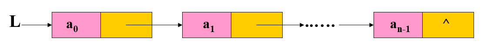
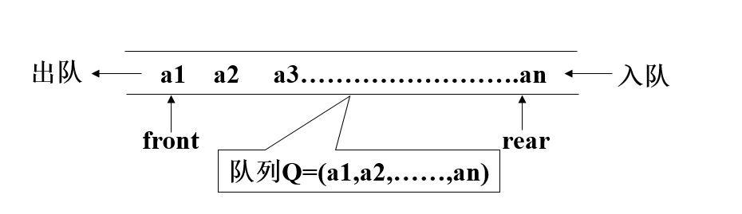
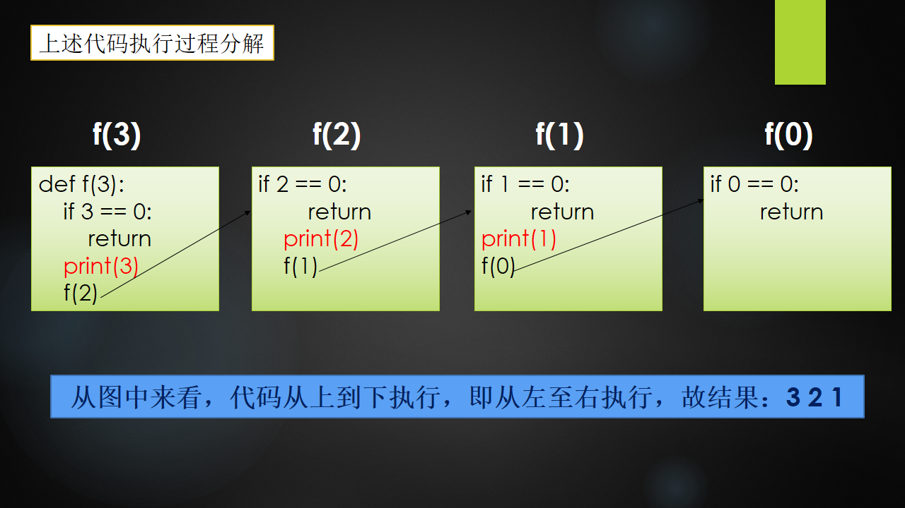
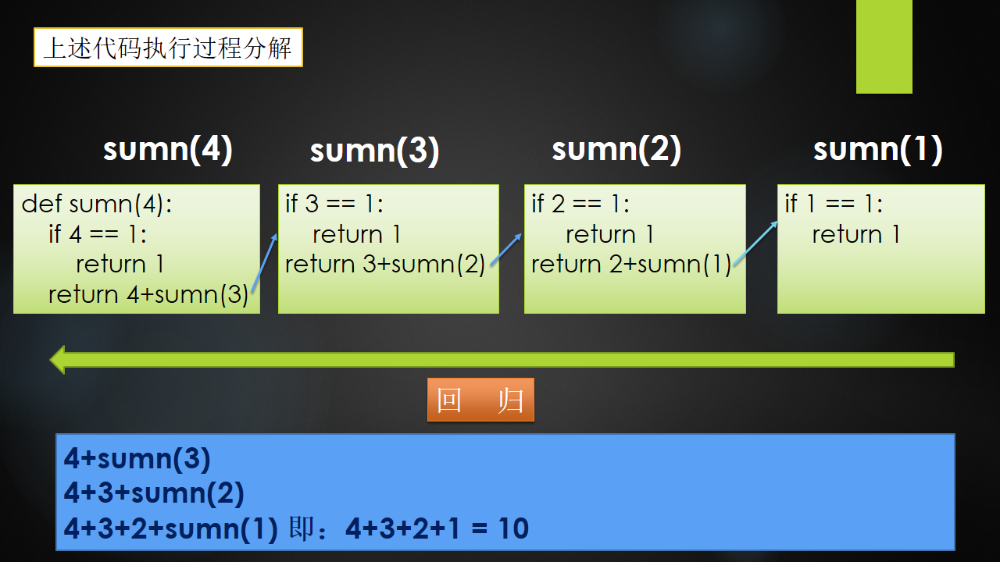

# **数据结构与算法-Day01**

## **算法概述**

- **算法-前序**

  ```python
  【1】Everybody!全场动作必须跟我整齐划一，来，我们一起来做一道题
      若n1+n2+n3=1000,且n1^2+n2^2=n3^2(n1,n2,n3为自然数),求出所有n1、n2、n3可能的组合
  
  【2】解题思路
      n1 = 0
      n2 = 0
      n3 = 0
      判断n1+n2+n3是否等于1000,之后变n3=1,n3=2,n3=3,... 然后再变n2
  
  【3】代码实现
      import time
  
      start_time = time.time()
      for n1 in range(0,1001):
          for n2 in range(0,1001):
              for n3 in range(0,1001):
                  if n1 + n2 + n3 == 1000 and n1**2 + n2**2 == n3**2:
                      print('[%d,%d,%d]' % (n1,n2,n3))
      end_time = time.time()
      print('执行时间:%.2f' % (end_time-start_time))
      
  【4】算法概念
      4.1) 解决问题的方法，是指解题方案的准确而完整的描述，是一系列解决问题的清晰指令
      4.2) 算法代表着用系统的方法描述解决问题的策略机制
  ```


## **时间复杂度概述**

- **时间复杂度 - 前序**

  ```python
  【1】各位，一万年太久，只争朝夕，来提升一下上题的效率吧！！！
      for n1 in range(0,1001):
          for n2 in range(0,1001):
              n3 = 1000 - n1 - n2
              if n1**2 + n2**2 == n3**2:
                  print('[%d,%d,%d]'%(n1,n2,n3))
  
  【2】总结与思考 : 解决同一个问题有多种算法,但是效率有区别,那么如何衡量呢？
      2.1) 执行时间反应算法效率 - 绝对靠谱吗？
           不是绝对靠谱: 因机器配置有高有低,不能冒然绝对去做衡量
    
      2.2) 那如何衡量更靠谱？？？
           运算数量 - 执行步骤的数量
         
  【4】时间复杂度概念
      4.1) 同一个算法，由于机器配置差异,每台机器执行的总时间不同,但是执行基本运算的数量大体相同，所以把算法执行步骤的数量称为时间复杂度
  ```

- **时间复杂度 - 大O表示法前序**

  ```python
  ################################################################
  【1】计算此算法的时间复杂度
      for n1 in range(0,1001):
          for n2 in range(0,1001):
              for n3 in range(0,1001):
                  if n1 + n2 + n3 == 1000 and n1**2 + n2**2 == n3**2:
                      print('[%d,%d,%d]' % (n1,n2,n3))
  ################################################################
  【2】计算步骤                
      T = 1000 * 1000 * 1000 * 2
      T = n * n * n * 2
      T(n) = n ** 3 * 2  即时间复杂度为: T(n)=n**3 * 2
  
  【3】时间复杂度T(n)的 大O表示法
      3.1) 函数1: T(n)=k * n**3 + c
      3.2) 函数2: g(n)=n**3
      3.3) 特点: 在趋向无穷的极限意义下，函数T(n)的增长速度受到函数g(n)的约束，也为函数T(n)与函数g(n)的特征相似，则称 g(n) 是 T(n) 的渐近函数，大O表示法则使用【渐近函数】来表示
          即: O(g(n)) 
          即: O(n^3)
          即: 上述时间复杂度为 O(n^3)		# 时间复杂度O 只保留高次冥
  
  【4】时间复杂度总结           
      4.1) 假设存在函数g，使得算法A处理规模为n的问题所用时间为T(n)=O(g(n))，则称O(g(n))为算法A的渐近时间复杂度，简称时间复杂度，记为T(n)
      4.2） 对算法进行特别具体细致分析虽然好，但实践中实际价值有限。对我们来说算法的时间性质和空间性质最重要的是数量级和趋势，这些是分析算法效率的主要部分。所以忽略系数，忽略常数，比如5*n^2 和 100*n^2属于一个量级，时间复杂度为O(n^2)
  ```

- **时间复杂度分类**

  ```python
  【1】最优时间复杂度 - 最少需要多少个步骤
  【2】最坏时间复杂度 - 最多需要多少个步骤
  【3】平均时间复杂度 - 平均需要多少个步骤
  
  我们平时所说的时间复杂度,指的是最坏时间复杂度
  ```

## **时间复杂度 - 计算规则**

- **计算原则**

  ```python
  【1】基本操作,只有常系数，认为其时间复杂度为O(1)
      顺序 - 基本步骤之间的累加
      print('abc') -> O(1)
      print('abc') -> O(1)
  
  【2】循环: 时间复杂度按乘法进行计算
      
  【3】分支: 时间复杂度取最大值(哪个分支执行次数多算哪个)
  
  【4】练习:请计算如下代码的时间复杂度
      for n1 in range(0,1001):
          for n2 in range(0,1001):
              n3 = 1000 - n1 - n2
              if n1**2 + n2**2 == n3**2:
                  print('[%d,%d,%d]'%(n1,n2,n3))
              
  T(n) = n * n * (1+1+max(1,0))
  T(n) = n**2 * 3
  T(n) = n**2
  T(n) = O(n**2)
  用大O表示法表示为 Tn = O(n^2)
  ```

- **常见时间复杂度**

  | 执行次数           | 时间复杂度 | 阶     |
  | ------------------ | ---------- | ------ |
  | 20（20个基本步骤） | O(1)       | 常数阶 |
  | 8n+6               | O(n)       | 线性阶 |
  | 2n^2 + 4n + 2      | O(n^2)     | 平方阶 |
  | 8logn + 16         | O(logn)    | 对数阶 |
  | 4n + 3nlogn + 22   | O(nlog(n)) | nlog阶 |
  | 2n^3 + 2n^2 + 4    | O(n^3)     | 立方阶 |
  | 2 ^ n              | O(2^n)     | 指数阶 |

- **O(1)**

  ```python
  【1】O(1)
      print('全场动作必须跟我整齐划一')
  
  【2】O(1)
      print('左边跟我一起画个龙')
      print('在你右边画一道彩虹')
      print('走起')
      print('左边跟我一起画彩虹')
      print('在你右边再画一条龙')
  ```

- **O(n)**

  ```python
  for i in range(n):
    print('在胸口比划一个郭富城')
  ```

- **O(n^2)**

  ```python
  【1】O(n^2)
      for i in range(n):
          for j in range(n):
              print('左边右边摇摇头')
      
  【2】O(n^2)
      for i in range(n):
          print('两根手指就像两个窜天猴')
          for j in range(n):
              print('指向闪耀的灯球')
  ```
  
- **O(n^3)**

  ```python
  for i in range(n):
      for j in range(n):
          for k in range(n):
              print('走你')
  ```

- **O(logn)**

  ```python
  n = 64
  while n > 1:
      print(n)
      n = n // 2
  
  【解释】
  2的6次方 等于 64，log264 = 6，所以循环减半的时间复杂度为O(log2n)，即O(logn)
  如果是循环减半的过程，时间复杂度为O(logn)或O(log2n)
  ```

- **O(nlogn)**

  ```python
  n = 64
  while n > 1:
    	for i in range(n):
      	print('哪里有彩虹告诉我')
      n = n // 2
  ```

- **常见时间复杂度排序**

  ```python
  O(1)<O(logn)<O(n)<O(nlogn)<O(n2)<O(n2logn)<O(n3)
  ```

- **练习: 写出如下的时间复杂度**

  ```python
  O(5)          --> O(1)
  O(2n+1)       --> O(n)
  O(n**2+n+1)   --> O(n**2)
  O(3n**3+1)    --> O(n**3)
  ```

- **终极总结两句话**

  ```python
  【1】时间复杂度是多少： T(n) = O(???)		# 固定写法
  【2】去掉系数、去掉常数、去掉低次幂，最终得到时间复杂度
  ```

## **数据结构概述**

- **数据结构描述**

  ```python
  【1】概述
      1.1) 在工作中，我们为了解决问题，需要将数据保存下来，然后根据数据存储方式设计算法进行处理，根据数据的存储方式我们使用不同的算法处理，而我们现在需要考虑算法解决问题的效率问题，所以需要考虑数据究竟如何保存，这就是数据结构
    
  【2】概念
      2.1) 数据是一个抽象的概念，将其进行分类后得到程序设计语言中的基本类型，如：list、tuple等。数据元素之间不是独立的，存在特定的关系，这些关系便是结构。数据结构指数据对象中数据元素之间的关系
      2.2) Python提供了很多现成的数据结构类型，如列表、元组、字典等，无须我们自己去定义，而Python没有定义的，就需要我们自己去定义实现这些数据的组织方式，称为Python扩展数据结构，如：栈、队列等
  
  【3】为什么学习数据结构
     在真正的项目开发中，大部分时间都是从数据库取数据 -> 数据操作和结构化 -> 返回给前端，在数据操作过程中需要合理地抽象，组织、处理数据，如果选用了错误的数据结构，就会造成代码运行低效
  ```
  
- **数据结构分类**

  ```python
  【1】线性结构 : n个数据元素的有序集合
      1.2) 顺序表 : 将数据结构中各元素按照其逻辑顺序存放于存储器一片连续的存储空间中
      1.3) 链表   : 将数据结构中各元素分布到存储器的不同点，用记录下一个结点位置的方式建立它们之间的联系
      1.4) 栈 : 后进先出
      1.5) 队列 : 先进先出
      
  【2】非线性结构
      2.1) 树形结构
      2.2) 图状结构
  ```

- **数据结构+算法总结**

  ```python
  【1】数据结构只是静态描述了数据元素之间的关系
  【2】高效的程序需要在数据结构的基础上设计和选择算法
  【3】程序 = 数据结构 + 算法
  【4】算法是为了解决实际问题而设计的，数据结构是算法需要处理的问题载体
  ```

## **抽象数据类型**

- **概念**

  ```python
  【1】定义
      抽象数据类型是指一个数学模型以及定义在此数学模型上的一组操作，及把数据类型和数据类型上的运算捆在一起进行封装。引入抽象数据类型的目的是把数据类型的表示和数据类型上的运算的实现与这些数据类型和运算在程序中的引用隔开，使他们相互独立
  
  【2】描述
      把原有的基本数据和这个数据所支持的操作放到一起，形成一个整体
  
  【3】最常用的数据运算
      3.1) 插入
      3.2) 删除
      3.3) 修改
      3.4) 查找
      3.5) 排序
  ```

## **线性表 - 顺序表**


- **顺序表的基本形式**

  ```python
  【1】特点 : 内存连续
  【2】分类
      2.1) 基本形式: 数据元素本身连续存储,每个元素所占存储单元大小固定相同
      2.2) 元素外置: 数据元素不连续存储，地址单元连续存储
  ```
  
  

## **线性表 - 链表**

- **定义**

  ```python
  【1】特点:
      1.1) 内存不连续的，而是一个个串起来的，需要每个链表的节点保存一个指向下一个节点的指针
    
  【2】和顺序表的对比
      2.1) 顺序表的构建需要预先知道数据大小来申请连续的存储空间，而在进行扩充时又需要进行数据的搬迁，使用起来不灵活，而链表结构可以充分利用计算机的内存空间，实现灵活的内存动态管理
  ```

- **示例 - 强化理解**

  ```python
  将线性表L=(a0,a1,……,an-1)中各元素分布在存储器的不同存储块，称为结点，每个结点（尾节点除外）中都持有一个指向下一个节点的引用，这样所得到的存储结构为链表结构
  ```

  

- **单链表 - 代码实现**

  ```python
  """
  创建单链表的数据结构：
  1、节点类 - 数据区、链接区
  2、单链表类(数学模型): 增加、删除... ...
  """
  
  class Node:
      """节点类"""
      def __init__(self, value):
          self.value = value
          self.next = None
  
  class SingleLinkList:
      """单链表类"""
      def __init__(self, node=None):
          """创建链表时: s=SingleLinkList()表示空链表,s=SingleLinkList(Node(100)) 表示有1个节点的单链表,头节点为None时，就是空链表"""
          self.head = node
  
      def is_empty(self):
          """判断链表是否为空"""
          return self.head == None
  
      def lengh(self):
          """获取链表长度"""
          # 游标：从头节点开始,一直往后移动,移动一次,+1
          current = self.head
          count = 0
          while current is not None:
              count += 1
              current = current.next
  
          return count
  
      def travel(self):
          """遍历整个链表"""
          current = self.head
          while current is not None:
              print(current.value,end=" ")
              current = current.next
          # 因为上面是end=" ",所以此处打印一个换行
          print()
  
      def add(self, item):
          """链表头部添加1个节点"""
          node = Node(item)
          # 1、把新添加的节点指针指向原来头节点
          node.next = self.head
          # 2、添加的节点设置为新的头
          self.head = node
  
      def append(self, item):
          """链表尾部添加1个节点,考虑空链表特殊情况"""
          node = Node(item)
          if self.is_empty():
              self.head = node
          else:
              current = self.head
              while current.next is not None:
                  current = current.next
              # 循环结束后,current指向尾节点
              current.next = node
              node.next = None
  
      def search(self, item):
          """查看在链表中是否存在"""
          current = self.head
          while current != None:
              if current.value == item:
                  return True
              else:
                  current = current.next
  
          return False
  
      def insert(self, pos, item):
          """在指定索引添加一个节点,索引值从0开始"""
          if pos < 0:
              self.add(item)
          elif pos > self.lengh() - 1:
              self.append(item)
          else:
              pre = self.head
              count = 0
              while count < (pos - 1):
                  count += 1
                  pre = pre.next
  
              # 循环结束后,pos指向(pos-1)位置
              node = Node(item)
              node.next = pre.next
              pre.next = node
  
  if __name__ == '__main__':
      s = SingleLinkList()
      # 终端1：True
      print(s.is_empty())
      # 链表：Node(100) -> Node(200) -> Node(300)
      s.add(200)
      s.add(100)
      s.append(300)
      # 终端2：3
      print(s.lengh())
      # 终端3：100 200 300
      s.travel()
      # 100 666 200 300
      s.insert(1, 666)
      # 终端4: 100 666 200 300
      s.travel()
      # 终端5: True
      print(s.search(666))
  ```
  

### **链表练习一**

- **题目**

  ```python
  【1】题目描述
      输入一个链表，按链表值从尾到头的顺序返回一个 ArrayList
   
  【2】试题解析
      将链表的每个值取出来然后存放到一个列表 ArrayList 中
    	解题思路1: 将链表中从头节点开始依次取出节点元素，append到array_list中，并进行最终反转
      解题思路2: 将链表中从头节点开始依次取出节点元素，insert到array_list中的第1个位置
  ```

- **代码实现**

  ```python
  """
  输入一个链表，按链表值从尾到头的顺序返回一个 ArrayList
  """
  
  class Node:
      """链表节点类"""
      def __init__(self,x):
          self.val = x
          self.next = None
  
  class Solution:
      # 返回从尾部到头部的序列，node为头节点
      def get_list_from_tail_to_head(self,node):
          array_list = []
          while node:
              array_list.insert(0,node.val)
              node = node.next
  
          return array_list
  
  if __name__ == '__main__':
  	s = Solution()
  	head = Node(100)
  	head.next = Node(200)
  	head.next.next = Node(300)
  	print(s.get_list_from_tail_to_head(head))
  ```

### **链表练习二**

- **题目**

  ```python
  【1】题目描述
      输入一个链表，反转链表后，输出新链表的表头
    
  【2】试题解析
      可以将链表的每一个节点取出来，插入到新的链表表头，同时要保存原链表的下一个节点
  ```

- **代码实现**

  ```python
  """
  输入一个链表，反转链表后，输出新链表的表头
  思路:
      1、创建2个游标,代表要进行反转操作的节点 和 上一个节点
      2、代码逻辑:
         当前节点指针指向上一个节点
         两个游标同时往后移动
         结束标准: 当要操作的节点为None时,结束! 此时pre代表的是新链表的头节点
  """
  class Node:
      def __init__(self, value):
          self.value = value
          self.next = None
  
  class Solution:
      def reverse_link_list(self, head):
          # 1、空链表情况
          if head == None:
              return
          # 2、非空链表情况
          pre = None
          cur = head
          while cur:
              # 记录下一个要操作反转的节点
              next_node = cur.next
              # 反转节点cur,并移动两个游标
              cur.next = pre
              pre = cur
              cur = next_node
  
          return pre.value
  
  if __name__ == '__main__':
      s = Solution()
      # 1、空链表情况
      head = None
      print(s.reverse_link_list(head))
      # 2、只有1个节点情况
      head = Node(100)
      print(s.reverse_link_list(head))
      # 3、有多个节点情况
      head = Node(100)
      head.next = Node(200)
      head.next.next = Node(300)
      print(s.reverse_link_list(head))
  ```

## **线性表 - 栈（LIFO)**

- **定义**

  ```python
  栈是限制在一端进行插入操作和删除操作的线性表（俗称堆栈），允许进行操作的一端称为"栈顶"，另一固定端称为"栈底"，当栈中没有元素时称为"空栈"
  ```

- **特点**

  ```python
  【1】栈只能在一端进行数据操作
  【2】栈模型具有后进先出的规律（LIFO）
  ```


- **栈的代码实现**

  ```python
  # 栈的操作有入栈（压栈），出栈（弹栈），判断栈是否为空等操作
  """
  sstack.py  栈模型的顺序存储
  重点代码
  
  思路:
  1. 利用列表完成顺序存储,但是列表功能多,不符合栈模型特点
  2. 使用类将列表封装,提供符合栈特点的接口方法
  """
  
  # 顺序栈模型
  class Stack(object):
      def __init__(self):
          # 开辟一个顺序存储的模型空间
          # 列表的尾部表示栈顶
          self.elems = []
  
      def is_empty(self):
          """判断栈是否为空"""
          return self.elems == []
  
      def push(self,val):
          """入栈"""
          self.elems.append(val)
  
      def pop(self):
          """出栈"""
          if self.is_empty():
              raise StackError("pop from empty stack")
          # 弹出一个值并返回
          return self.elems.pop()
  
      def top(self):
          """查看栈顶元素"""
          if self.is_empty():
              raise StackError("Stack is empty")
          return self.elems[0]
  
  
  if __name__ == '__main__':
      st = Stack()
      st.push(1)
      st.push(3)
      st.push(5)
      print(st.top())
      while not st.is_empty():
          print(st.pop())
  ```

## **线性表 - 队列（FIFO）**

- **定义**

  ```python
  队列是限制在两端进行插入操作和删除操作的线性表，允许进行存入操作的一端称为"队尾"，允许进行删除操作的一端称为"队头"
  ```

- **特点**

  ```python
  1) 队列只能在队头和队尾进行数据操作
  2) 队列模型具有先进先出规律（FIFO）
  ```



- **队列的代码实现** 

  ```python
  # 队列的操作有入队，出队，判断队列的空满等操作
  """
  思路分析:
  1. 基于列表完成数据的存储
  2. 通过封装功能完成队列的基本行为
  3. 无论那边做对头/队尾 都会在操作中有内存移动
  """
  
  # 队列操作
  class SQueue:
      def __init__(self):
          self.elems = []
  
      # 判断队列是否为空
      def is_empty(self):
          return self.elems == []
  
      # 入队
      def enqueue(self,val):
          self.elems.append(val)
  
      # 出队
      def dequeue(self):
          if not self._elems:
              raise Exception("Queue is empty")
          return self.elems.pop(0) # 弹出第一个数据
  
  
  if __name__ == '__main__':
      sq = SQueue()
      sq.enqueue(10)
      sq.enqueue(20)
      sq.enqueue(30)
      while not sq.is_empty():
          print(sq.dequeue())
  ```

  ## **今日作业**

  ```python
【1】手写单链表
  【2】输入一个链表，输出该链表中倒数第 k 个节点
  【3】输入两个单调递增的链表，输出两个链表合成后的链表，当然我们需要合成后的链表满足单调不减规则
  【4】使用链式存储方式实现栈
  【5】使用链式存储方式实现队列
  ```
  
  


# **Day01回顾**

- **数据结构、算法、程序**

  ```python
  【1】数据结构: 解决问题时使用何种数据类型，数据到底如何保存，只是静态描述了数据元素之间的关系
  【2】算法:    解决问题的方法，为了解决实际问题而设计的，数据结构是算法需要处理的问题载体
  【3】程序:    数据结构 + 算法
  ```
  
- **数据结构分类**

  ```python
  【1】线性结构 : 多个数据元素的有序集合
      1.1) 顺序存储 - 线性表
          a> 定义: 将数据结构中各元素按照其逻辑顺序存放于存储器一片连续的存储空间中
          b> 示例: 顺序表、列表
          c> 特点: 内存连续，溢出时开辟新的连续内存空间进行数据搬迁并存储
  
      1.2) 链式存储 - 线性表
          a> 定义: 将数据结构中各元素分布到存储器的不同点，用记录下一个结点位置的方式建立联系
          b> 示例: 单链表、单向循环链表
          c> 特点:
              单链表: 内存不连续，每个节点保存指向下一个节点的指针，尾节点指针指向"None"
              单向循环链表: 内存不连续，每个节点保存指向下一个节点指针，尾节点指针指向"头节点"
      1.3) 栈 - 线性表
          a> 后进先出 - LIFO
          b> 栈顶进行入栈、出栈操作，栈底不进行任何操作
          c> 顺序存储实现栈、链式存储实现栈
      1.4) 队列 - 线性表
          a> 先进先出 - FIFO
          b> 队尾进行入队操作、队头进行出队操作
          c> 顺序存储实现队列、链式存储实现队列
  ```
  
- **算法效率衡量-时间复杂度T(n)**

  ```python
  【1】定义: 算法执行步骤的数量
  
  【2】分类
      2.1) 最优时间复杂度
      2.2) 最坏时间复杂度 - 平时所说
      2.3) 平均时间复杂度
  
  【3】时间复杂度大O表示法 T(n) = O(??)
      去掉执行步骤的系数、常数、低次幂
  
  【4】常见时间复杂度排序
      O(1)<O(logn)<O(n)<O(nlogn)<O(n2)<O(n2logn)<O(n3)
  ```


# **Day02笔记**

## **作业讲解**

### **链表作业题一**

- **题目描述 + 试题解析**

  ```python
  【1】题目描述
      输入一个链表，输出该链表中倒数第 k 个节点
    
  【2】试题解析
      可将链表中的每一个元素保存到列表中，在列表中寻找倒数第 k 个元素
  ```

- **代码实现**

  ```python
  class Node:
      """节点类"""
      def __init__(self, value):
          self.value = value
          self.next = None
  
  class Solution:
      def get_k_node(self, head, k):
          li = []
          cur = head
          while cur:
              li.append(cur)
              cur = cur.next
  
          if k < 0 or k > len(li):
              raise IndexError('list index out of range')
          return li[-k]
  
  if __name__ == '__main__':
      s = Solution()
      # 创建链表：Node(100) -> Node(200) -> Node(300) -> None
      head = Node(100)
      head.next = Node(200)
      head.next.next = Node(300)
      # 终端1：倒数第2个 Node(200)
      print(s.get_k_node(head, 2).value)
      # 终端2：倒数第8个 IndexError
      print(s.get_k_node(head, 8))
  ```

### **链表作业题二**

- **题目描述 + 试题解析**

  ```python
  【1】题目描述
      输入两个单调递增的链表，输出两个链表合成后的链表，当然我们需要合成后的链表满足单调不减规则
    
  【2】试题解析
      a> 比较两个链表的头节点，确认合成后链表的头节点
      b> 继续依次比较两个链表元素的大小，将元素小的结点插入到新的链表中，直到一个链 表为空
  ```

- **代码实现**

  ```python
  """
  输入两个单调递增的链表，输出两个链表合成后的链表，当然我们需要合成后的链表满足单调不减规则
  思路:
      1、最终程序返回的是: 合并后链表的头节点
      2、先确定新链表的头节点
      3、互相比较,移动值小的游标
  """
  class Node:
      def __init__(self, value):
          self.value = value
          self.next = None
  
  class Solution:
      def merge_two_link_list(self, head1, head2):
          # 1、确定新链表的头节点
          h1 = head1
          h2 = head2
          if h1 and h2:
              if h1.value >= h2.value:
                  merge_head = h2
                  h2 = h2.next
              else:
                  merge_head = h1
                  h1 = h1.next
              p = merge_head
          elif h1:
              return h1
          else:
              return h2
          # 2、开始遍历两个链表进行合并
          while h1 and h2:
              if h1.value <= h2.value:
                  merge_head.next = h1
                  h1 = h1.next
              else:
                  merge_head.next = h2
                  h2 = h2.next
              # 移动合并后的游标
              merge_head = merge_head.next
          # 循环结束后,一定有一个游标为None
          if h1:
              merge_head.next = h1
          elif h2:
              merge_head.next = h2
  
          return p
  
  if __name__ == '__main__':
      s = Solution()
      # 链表1: 100 -> 200 -> 300 -> 400 -> None
      head1 = Node(100)
      head1.next = Node(200)
      head1.next.next = Node(300)
      head1.next.next.next = Node(400)
      # 链表2: 1 -> 200 -> 600 -> None
      head2 = Node(1)
      head2.next = Node(200)
      head2.next.next = Node(600)
      # 测试方法
      p = s.merge_two_link_list(head1, head2)
      while p:
          print(p.value, end=" ")
          p = p.next
  ```

### **链表作业题三**

- **题目描述 + 试题解析**

  ```python
  【1】题目描述
      输入两个链表，找出它们的第一个公共节点
  
  【2】试题解析
      如果有公共节点，则两个链表公共节点后面的节点一定完全相同，因为节点有数据区和指针区，而next只能指向1个节点
  
      思路：
  	    stack1 = []    存储第1个链表中的节点
  	    stack2 = []    存储第2个链表中的节点
  
  	    两边同时pop，后面节点一定相同，一直找到最后1个相同的节点即可
  ```

- **代码实现**

  ```python
  """
  输入两个链表，找出它们的第一个公共节点
  思路:
      1、两个链表中,从第一个公共节点开始,后面所有节点一定相同(都是公共节点)
      2、先把两个链表中所有的节点对象添加到两个列表中
      3、列表从后往前判断,到最后1个公共节点时返回
         示例: a is b
  """
  class Node:
      def __init__(self, value):
          self.value = value
          self.next = None
  
  class Solution:
      def get_first_public_node(self, head1, head2):
          # 1、创建2个列表,把节点添加进去
          li1 = []
          li2 = []
          cur1 = head1
          while cur1:
              li1.append(cur1)
              cur1 = cur1.next
          cur2 = head2
          while cur2:
              li2.append(cur2)
              cur2 = cur2.next
  
          # 从后往前依次判断两个列表中节点
          # li1 : [Node(100),Node(200),Node(300),Node(400)]
          # li2 : [Node(666),Node(300),Node(400)]
          node = None
          while li1 and li2 and li1[-1] is li2[-1]:
              node = li1.pop()
              li2.pop()
  
          return node
  
  if __name__ == '__main__':
      s = Solution()
      n100 = Node(100)
      n200 = Node(200)
      n300 = Node(300)
      n400 = Node(400)
      n666 = Node(666)
      # 链表1: 100 -> 200 -> 300 -> 400 -> None
      head1 = n100
      head1.next = n200
      n200.next = n300
      n300.next = n400
      # 链表2: 666 -> 300 -> 400 -> None
      head2 = n666
      head2.next = n300
      n300.next = n400
      # 测试方法
      print(s.get_first_public_node(head1, head2).value)
  ```

## **线性表 - 栈（LIFO)**

- **定义**

  ```python
  栈是限制在一端进行插入操作和删除操作的线性表（俗称堆栈），允许进行操作的一端称为"栈顶"，另一固定端称为"栈底"，当栈中没有元素时称为"空栈"
  ```

- **特点**

  ```python
  【1】栈只能在一端进行数据操作
  【2】栈模型具有后进先出的规律（LIFO）
  ```


- **顺序栈代码实现**

  ```python
  """
  顺序存储的方式实现栈
  思路：
      1、栈 ：LIFO 后进先出
      2、设计
         列表尾部作为栈顶（入栈、出栈操作）
         列表头部作为栈底（不进行任何操作）
  """
  class Stack:
      def __init__(self):
          """初始化一个空栈"""
          self.elems = []
  
      def is_empty(self):
          """判断栈是否为空栈"""
          return self.elems == []
  
      def push(self, item):
          """入栈: 相当于在链表尾部添加1个元素"""
          self.elems.append(item)
  
      def destack(self):
          """出栈: 相当于在列表尾部弹出1个元素"""
          if self.is_empty():
              raise Exception('destack from empty stack')
          return self.elems.pop()
  
  if __name__ == '__main__':
      s = Stack()
      # 栈(栈底->栈顶): 100 200 300
      s.push(100)
      s.push(200)
      s.push(300)
      # 终端1: 300 200 100 异常
      print(s.destack())
      print(s.destack())
      print(s.destack())
      print(s.destack())
  ```

- **链式栈代码实现**

  ```python
  """
  链式存储方式实现栈
  思路：
      1、栈：LIFO 后进先出
      2、设计
         链表头部作为栈顶（入栈、出栈操作）
         链表尾部作为栈底（不进行任何操作）
  """
  class Node:
      """节点类"""
      def __init__(self, value):
          self.value = value
          self.next = None
  
  class LinkListStack:
      def __init__(self):
          """初始化一个空栈"""
          self.head = None
  
      def is_empty(self):
          """判断是否为空栈"""
          return self.head == None
  
      def push(self, item):
          """入栈操作: 相当于在链表的头部添加一个节点"""
          node = Node(item)
          node.next = self.head
          self.head = node
  
      def pop(self):
          """出栈操作: 相当于删除链表头节点"""
          if self.is_empty():
              raise Exception('pop from empty LinkListStack')
          item = self.head.value
          self.head = self.head.next
  
          return item
  
  if __name__ == '__main__':
      s = LinkListStack()
      # 栈（栈底->栈顶）：300 200 100
      s.push(100)
      s.push(200)
      s.push(300)
      # 终端1: 300
      print(s.pop())
      # 终端2: False
      print(s.is_empty())
  ```

## **线性表 - 队列（FIFO）**

- **定义**

  ```python
  队列是限制在两端进行插入操作和删除操作的线性表，允许进行存入操作的一端称为"队尾"，允许进行删除操作的一端称为"队头"
  ```

- **特点**

  ```python
  1) 队列只能在队头和队尾进行数据操作
  2) 队列模型具有先进先出规律（FIFO）
  ```


- **顺序队列代码实现** 

  ```python
  """
  顺序存储方式去实现队列模型
  思路：
      1、队列：FIFO 先进先出,队尾负责入队,队头负责出队
      2、设计：
         列表头部作为队头,负责出队
         列表尾部作为队尾,负责入队
  """
  class Queue:
      def __init__(self):
          """初始化一个空队列"""
          self.elems = []
  
      def is_empty(self):
          """判断队列是否为空"""
          return self.elems == []
  
      def enqueue(self, item):
          """队尾入队: append(item)"""
          self.elems.append(item)
  
      def dequeue(self):
          """队头出队: pop(0)"""
          if self.is_empty():
              raise Exception('dequeue from empty Queue')
          return self.elems.pop(0)
  
  if __name__ == '__main__':
      q = Queue()
      # 队列: 100 200 300
      q.enqueue(100)
      q.enqueue(200)
      q.enqueue(300)
      # 终端1: 100
      print(q.dequeue())
      # 终端2: False
      print(q.is_empty())
  ```

- **链式队列代码实现**

  ```python
  """
  链式存储方式去实现队列
  思路：
      1、队列：FIFO 先进先出
      2、设计：
         链表头部作为队头,负责出队操作
         链表尾部作为队尾,负责入队操作
  """
  class Node:
      def __init__(self, value):
          self.value = value
          self.next = None
  
  class LinkListQueue:
      def __init__(self):
          """初始化一个空队列"""
          self.head = None
  
      def is_empty(self):
          """判断队列是否为空"""
          return self.head == None
  
      def enqueue(self, item):
          """队尾入队: 相当于在链表尾部添加一个节点"""
          node = Node(item)
          # 空队列情况
          if self.is_empty():
              self.head = node
              return
          # 非空队列
          cur = self.head
          while cur.next:
              cur = cur.next
          # 循环结束后,cur一定是指向了原链表尾节点
          cur.next = node
          node.next = None
  
      def dequeue(self):
          """队头出队: 相当于删除链表头节点"""
          if self.is_empty():
              raise Exception('dequeue from empty LinkListQueue')
          cur = self.head
          # 删除头节点
          self.head = self.head.next
  
          return cur.value
  
  if __name__ == '__main__':
      q = LinkListQueue()
      # 队列: 100 200 300
      q.enqueue(100)
      q.enqueue(200)
      q.enqueue(300)
      # 终端1: 100
      print(q.dequeue())
      # 终端2: False
      print(q.is_empty())
  ```

  ### **栈和队列练习一**

- **题目描述+试题解析**

  ```python
  【1】题目描述
      用两个栈来实现一个队列，完成队列的 Push 和 Pop 操作。队列中的元素为 int 类型
  
  【2】试题解析
      1、队列特点：先进先出（时刻铭记保证先进先出）
      2、栈 A 用来做入队列，栈 B 用来做出队列，当栈 B 为空时，栈 A 全部出栈到栈 B，栈B 再出栈(即出队列) 
      3、精细讲解
        stack_a: 入队列（队尾）
        stack_b: 出队列（队头）
    
        stack_a队尾: [1,2,3]
        stack_b队头: []
           stack_b.append(stack_a.pop()) # [3,2,1]
           stack_b.pop()  # 1   
  ```

- **代码实现**

  ```python
  """
  用两个栈来实现一个队列，完成队列的 Push 和 Pop 操作。队列中的元素为 int 类型
  思路：
      1、明确目标：实现队列（FIFO）
      2、实现载体：2个栈（LIFO）
      3、设计（计划使用顺序栈模型,而不使用链式栈模型）
         栈A(列表A)：入队
         栈B(列表B)：出队
         最终实现先进先出的效果,队列模型嘎然而生
  """
  class Solution:
      def __init__(self):
          """初始化2个顺序栈"""
          self.stack_a = []
          self.stack_b = []
  
      def push(self, item):
          """入队操作：相当于在stack_a中添加一个元素"""
          self.stack_a.append(item)
  
      def pop(self):
          """出队操作：相当于在stack_b中弹出一个元素"""
          # 先从栈B中pop(),当B栈为空的时候,再去判断A栈是否为空
          if self.stack_b:
              return self.stack_b.pop()
  
          # B栈为空时,判断A栈,把A栈中所有的元素再次添加到B栈中
          while self.stack_a:
              self.stack_b.append(self.stack_a.pop())
  
          # 循环结束后,A栈中所有的元素又全部到的B栈中
          if self.stack_b:
              return self.stack_b.pop()
  
  if __name__ == '__main__':
      s = Solution()
      # 入栈: 100 200 300
      s.push(100)
      s.push(200)
      s.push(300)
      # 终端1: 100
      print(s.pop())
      print(s.pop())
      print(s.pop())
  ```

## **树形结构**

- **定义**

  ```python
  树（Tree）是n（n≥0）个节点的有限集合T，它满足两个条件：有且仅有一个特定的称为根（Root）的节点；其余的节点可以分为m（m≥0）个互不相交的有限集合T1、T2、……、Tm，其中每一个集合又是一棵树，并称为其根的子树（Subtree）
  ```


- **基本概念** 

  ```python
  # 1. 树的特点
  * 每个节点有零个或者多个子节点
  * 没有父节点的节点称为根节点
  * 每一个非根节点有且只有一个父节点
  * 除了根节点外,每个子节点可以分为多个不相交的子树
  
  # 2. 相关概念
  1) 节点的度: 一个节点的子树的个数
  2) 树的度: 一棵树中,最大的节点的度成为树的度
  3) 叶子节点: 度为0的节点
  4) 父节点
  5) 子节点
  6) 兄弟节点
  7) 节点的层次: 从根开始定义起,根为第1层
  8) 深度: 树中节点的最大层次
  ```


## **二叉树**

- **定义**

  ```python
  二叉树（Binary Tree）是n（n≥0）个节点的有限集合，它或者是空集（n＝0），或者是由一个根节点以及两棵互不相交的、分别称为左子树和右子树的二叉树组成。二叉树与普通有序树不同，二叉树严格区分左孩子和右孩子，即使只有一个子节点也要区分左右
  ```


- **二叉树的分类 - 见图**

  ```python
  【1】满二叉树
      所有叶节点都在最底层的完全二叉树
  
  【2】完全二叉树
      对于一颗二叉树，假设深度为d，除了d层外，其它各层的节点数均已达到最大值，并且第d层所有节点从左向右连续紧密排列
      
  【3】二叉排序树
      任何一个节点，所有左边的值都会比此节点小，所有右边的值都会比此节点大
      
  【4】平衡二叉树
      当且仅当任何节点的两棵子树的高度差不大于1的二叉树
  ```

- **二叉树 - 添加元素代码实现**

  ```python
  """
  二叉树
  """
  
  class Node:
      def __init__(self, value):
          self.value = value
          self.left = None
          self.right = None
  
  class Tree:
      def __init__(self, node=None):
          """创建了一棵空树或者是只有树根的树"""
          self.root = node
  
      def add(self, value):
          """在树中添加一个节点"""
          node = Node(value)
          # 空树情况
          if self.root is None:
              self.root = node
              return
  
          # 不是空树的情况
          node_list = [self.root]
          while node_list:
              cur = node_list.pop(0)
              # 判断左孩子
              if cur.left is None:
                  cur.left = node
                  return
              else:
                  node_list.append(cur.left)
  
              # 判断右孩子
              if cur.right is None:
                  cur.right = node
                  return
              else:
                  node_list.append(cur.right)
  ```

### **广度遍历 - 二叉树**


- **广度遍历 - 代码实现**

  ```python
      def breadth_travel(self):
          """广度遍历 - 队列思想（即：列表的append()方法 和 pop(0) 方法"""
          # 1、空树的情况
          if self.root is None:
              return
          # 2、非空树的情况
          node_list = [self.root]
          while node_list:
              cur = node_list.pop(0)
              print(cur.value, end=' ')
              # 添加左孩子
              if cur.left is not None:
                  node_list.append(cur.left)
              # 添加右孩子
              if cur.right is not None:
                  node_list.append(cur.right)
  
          print()
  ```

### **深度遍历 - 二叉树**

```python
【1】遍历
    沿某条搜索路径周游二叉树，对树中的每一个节点访问一次且仅访问一次。

【2】遍历方式
    2.1) 前序遍历： 先访问树根，再访问左子树，最后访问右子树 - 根 左 右
    2.2) 中序遍历： 先访问左子树，再访问树根，最后访问右子树 - 左 根 右
    2.3) 后序遍历： 先访问左子树，再访问右子树，最后访问树根 - 左 右 根
```


```python
【1】前序遍历结果: 1 2 4 8 9 5 10 3 6 7
【2】中序遍历结果: 8 4 9 2 10 5 1 6 3 7
【3】后序遍历结果: 8 9 4 10 5 2 6 7 3 1
```

- **深度遍历 - 代码实现**

  ```python
  # 前序遍历
      def pre_travel(self, node):
          """前序遍历 - 根左右"""
          if node is None:
              return
  
          print(node.value, end=' ')
          self.pre_travel(node.left)
          self.pre_travel(node.right)
  
  # 中序遍历
      def mid_travel(self, node):
          """中序遍历 - 左根右"""
          if node is None:
              return
  
          self.mid_travel(node.left)
          print(node.value, end=' ')
          self.mid_travel(node.right)
  
  # 后续遍历
      def last_travel(self, node):
          """后序遍历 - 左右根"""
          if node is None:
              return
  
          self.last_travel(node.left)
          self.last_travel(node.right)
          print(node.value, end=' ')
  ```

- **二叉树完整代码**

  ```python
  """
  python实现二叉树
  """
  
  class Node:
      def __init__(self, value):
          self.value = value
          self.left = None
          self.right = None
  
  class Tree:
      def __init__(self, node=None):
          """创建了一棵空树或者是只有树根的树"""
          self.root = node
  
      def add(self, value):
          """在树中添加一个节点"""
          node = Node(value)
          # 空树情况
          if self.root is None:
              self.root = node
              return
  
          # 不是空树的情况
          node_list = [self.root]
          while node_list:
              cur = node_list.pop(0)
              # 判断左孩子
              if cur.left is None:
                  cur.left = node
                  return
              else:
                  node_list.append(cur.left)
  
              # 判断右孩子
              if cur.right is None:
                  cur.right = node
                  return
              else:
                  node_list.append(cur.right)
  
      def breadth_travel(self):
          """广度遍历 - 队列思想（即：列表的append()方法 和 pop(0) 方法"""
          # 1、空树的情况
          if self.root is None:
              return
          # 2、非空树的情况
          node_list = [self.root]
          while node_list:
              cur = node_list.pop(0)
              print(cur.value, end=' ')
              # 添加左孩子
              if cur.left is not None:
                  node_list.append(cur.left)
              # 添加右孩子
              if cur.right is not None:
                  node_list.append(cur.right)
  
          print()
  
      def pre_travel(self, node):
          """前序遍历 - 根左右"""
          if node is None:
              return
  
          print(node.value, end=' ')
          self.pre_travel(node.left)
          self.pre_travel(node.right)
  
      def mid_travel(self, node):
          """中序遍历 - 左根右"""
          if node is None:
              return
  
          self.mid_travel(node.left)
          print(node.value, end=' ')
          self.mid_travel(node.right)
  
      def last_travel(self, node):
          """后序遍历 - 左右根"""
          if node is None:
              return
  
          self.last_travel(node.left)
          self.last_travel(node.right)
          print(node.value, end=' ')
  
  if __name__ == '__main__':
      tree = Tree()
      tree.add(1)
      tree.add(2)
      tree.add(3)
      tree.add(4)
      tree.add(5)
      tree.add(6)
      tree.add(7)
      tree.add(8)
      tree.add(9)
      tree.add(10)
      # 广度遍历：1 2 3 4 5 6 7 8 9 10
      tree.breadth_travel()
      # 前序遍历：1 2 4 8 9 5 10 3 6 7
      tree.pre_travel(tree.root)
      print()
      # 中序遍历:8 4 9 2 10 5 1 6 3 7
      tree.mid_travel(tree.root)
      print()
      # 后序遍历：8 9 4 10 5 2 6 7 3 1
      tree.last_travel(tree.root)
  ```

### **二叉树练习一**

- **题目描述+试题解析**

  ```python
  【1】题目描述
      从上到下按层打印二叉树，同一层结点从左至右输出，每一层输出一行
   
  【2】试题解析
      1、广度遍历，利用队列思想
      2、要有2个队列，分别存放当前层的节点 和 下一层的节点
  ```

- **代码实现**

  ```python
  class Node:
      def __init__(self, value):
          self.value = value
          self.left = None
          self.right = None
  
  class Solution:
      def print_node_layer(self, root):
          # 空树情况
          if root is None:
              return []
          # 非空树情况
          cur_queue = [root]
          next_queue = []
          while cur_queue:
              cur_node = cur_queue.pop(0)
              print(cur_node.value, end=" ")
              # 添加左右孩子到下一层队列
              if cur_node.left:
                  next_queue.append(cur_node.left)
              if cur_node.right:
                  next_queue.append(cur_node.right)
              # 判断cur_queue是否为空
              # 为空：说明cur_queue已经打印完成,并且next_queue已经添加完成,交换变量
              if not cur_queue:
                  cur_queue, next_queue = next_queue, cur_queue
                  print()
  
  if __name__ == '__main__':
      s = Solution()
      p1 = Node(1)
      p2 = Node(2)
      p3 = Node(3)
      p4 = Node(4)
      p5 = Node(5)
      p6 = Node(6)
      p7 = Node(7)
      p8 = Node(8)
      p9 = Node(9)
      p10 = Node(10)
      p1.left = p2
      p1.right = p3
      p2.left = p4
      p2.right = p5
      p3.left = p6
      p3.right = p7
      p4.left = p8
      p4.right = p9
      p5.left = p10
      s.print_node_layer(p1)
  ```

### **二叉树练习二**

- **题目描述+试题解析**

  ```python
  【1】题目描述
      请实现一个函数按照之字形打印二叉树，即第一行按照从左到右的顺序打印， 第二层按照从右至左的顺序打印，第三行按照从左到右的顺序打印，其他行以此类推
    
  【2】试题解析
      1、采用层次遍历的思想，用队列或者栈（先进先出或后进先出，此处二选一，我们选择栈）
      2、把每一层的节点添加到一个栈中，添加时判断是奇数层还是偶数层
         a) 奇数层：栈中存储时，二叉树中节点从右向左append，出栈时pop()则从左向右打印输出
         b) 偶数层: 栈中存储时，二叉树中节点从左向右append，出栈时pop()则从右向左打印输出
  ```

- **代码实现**

  ```python
  """
  请实现一个函数按照之字形打印二叉树，即第一行按照从左到右的顺序打印， 第二层按照从右至左的顺序打印，第三行按照从左到右的顺序打印，其他行以此类推
  思路：
      1、选择一种数据结构来解决问题 - 栈（LIFO后进先出） - 顺序表（append() 和 pop()）
      2、通过观察,发现了规律：
         2.1) 当前操作为奇数层时：先左后右 添加到下一层
         2.2) 当前操作为偶数层时：先右后左 添加到下一层
  """
  class Node:
      def __init__(self, value):
          self.value = value
          self.left = None
          self.right = None
  
  class Solution:
      def print_node_zhi(self, root):
          # 空树情况
          if root is None:
              return []
          # 非空树情况 - 栈思想（后进先出）
          cur_stack = [root]
          next_stack = []
          level = 1
          while cur_stack:
              cur_node = cur_stack.pop()
              print(cur_node.value, end=" ")
              # 添加左右孩子 - 当前层为奇数层从左至右,当前层为偶数层从右至左
              if level % 2 == 1:
                  if cur_node.left:
                      next_stack.append(cur_node.left)
                  if cur_node.right:
                      next_stack.append(cur_node.right)
              else:
                  if cur_node.right:
                      next_stack.append(cur_node.right)
                  if cur_node.left:
                      next_stack.append(cur_node.left)
  
              # 交换变量
              if not cur_stack:
                  cur_stack, next_stack = next_stack, cur_stack
                  level += 1
                  print()
  
  if __name__ == '__main__':
      s = Solution()
      p1 = Node(1)
      p2 = Node(2)
      p3 = Node(3)
      p4 = Node(4)
      p5 = Node(5)
      p6 = Node(6)
      p7 = Node(7)
      p8 = Node(8)
      p9 = Node(9)
      p10 = Node(10)
      p1.left = p2
      p1.right = p3
      p2.left = p4
      p2.right = p5
      p3.left = p6
      p3.right = p7
      p4.left = p8
      p4.right = p9
      p5.left = p10
      s.print_node_zhi(p1)
  ```


# **Day03笔记**

## **递归**

- **递归定义及特点**

  ```python
  【1】定义
      递归用一种通俗的话来说就是自己调用自己，但是需要分解它的参数，让它解决一个更小一点的问题，当问题小到一定规模的时候，需要一个递归出口返回
      
  【2】特点
      2.1) 递归必须包含一个基本的出口，否则就会无限递归，最终导致栈溢出
      2.2) 递归必须包含一个可以分解的问题
      2.3) 递归必须必须要向着递归出口靠近
  ```

- **递归示例1**

  ```python
  def f(n):
      if n == 0:
          return 
      print(n)
      f(n-1)
  
  f(3)
  # 结果: 3 2 1
  ```

- 


- **递归示例2**

  ```python
  def f(n):
    if n == 0:
      return 
    f(n-1)
    print(n)
    
  f(3)
  # 结果: 1 2 3
  ```

  

- **递归示例3**

  ```python
  # 打印 1+2+3+...+n 的和
  def sumn(n):
    if n == 1:
      return 1
    return n + sumn(n-1)
  
  print(sumn(3))
  ```

  

- **递归练习**

  ```python
  # 使用递归求出 n 的阶乘
  def fac(n):
    if n == 1:
      return 1
    return n * fac(n-1)
  
  print(fac(5))
  ```

- **递归总结**

  ```python
  # 前三条必须记住
  【1】递归一定要有出口,一定是先递推,再回归
  【2】调用递归之前的语句，从外到内执行，最终回归
  【3】调用递归或之后的语句，从内到外执行，最终回归
  
  【4】Python默认递归深度有限制，当递归深度超过默认值时，就会引发RuntimeError，默认值998
  【5】手动设置递归调用深度
      import sys
      sys.setrecursionlimit(1000000) #表示递归深度为100w
  ```

- **递归动态图解一**

  

- **递归动态图解二**

  

- **递归动态图解三**

  


## **二叉树**

- **定义**

  ```python
  二叉树（Binary Tree）是n（n≥0）个节点的有限集合，它或者是空集（n＝0），或者是由一个根节点以及两棵互不相交的、分别称为左子树和右子树的二叉树组成。二叉树与普通有序树不同，二叉树严格区分左孩子和右孩子，即使只有一个子节点也要区分左右
  ```


- **二叉树的分类 - 见图**

  ```python
  【1】满二叉树
      所有叶节点都在最底层的完全二叉树
  
  【2】完全二叉树
      对于一颗二叉树，假设深度为d，除了d层外，其它各层的节点数均已达到最大值，并且第d层所有节点从左向右连续紧密排列
      
  【3】二叉排序树
      任何一个节点，所有左边的值都会比此节点小，所有右边的值都会比此节点大
      
  【4】平衡二叉树
      当且仅当任何节点的两棵子树的高度差不大于1的二叉树
  ```

- **二叉树 - 添加元素代码实现**

  ```python
  """
  二叉树
  """
  
  class Node:
      def __init__(self, value):
          self.value = value
          self.left = None
          self.right = None
  
  class Tree:
      def __init__(self, node=None):
          """创建了一棵空树或者是只有树根的树"""
          self.root = node
  
      def add(self, value):
          """在树中添加一个节点"""
          node = Node(value)
          # 空树情况
          if self.root is None:
              self.root = node
              return
  
          # 不是空树的情况
          node_list = [self.root]
          while node_list:
              cur = node_list.pop(0)
              # 判断左孩子
              if cur.left is None:
                  cur.left = node
                  return
              else:
                  node_list.append(cur.left)
  
              # 判断右孩子
              if cur.right is None:
                  cur.right = node
                  return
              else:
                  node_list.append(cur.right)
  ```

### **广度遍历 - 二叉树**


- **广度遍历 - 代码实现**

  ```python
      def breadth_travel(self):
          """广度遍历 - 队列思想（即：列表的append()方法 和 pop(0) 方法"""
          # 1、空树的情况
          if self.root is None:
              return
          # 2、非空树的情况
          node_list = [self.root]
          while node_list:
              cur = node_list.pop(0)
              print(cur.value, end=' ')
              # 添加左孩子
              if cur.left is not None:
                  node_list.append(cur.left)
              # 添加右孩子
              if cur.right is not None:
                  node_list.append(cur.right)
  
          print()
  ```

### **深度遍历 - 二叉树**

```python
【1】遍历
    沿某条搜索路径周游二叉树，对树中的每一个节点访问一次且仅访问一次。

【2】遍历方式
    2.1) 前序遍历： 先访问树根，再访问左子树，最后访问右子树 - 根 左 右
    2.2) 中序遍历： 先访问左子树，再访问树根，最后访问右子树 - 左 根 右
    2.3) 后序遍历： 先访问左子树，再访问右子树，最后访问树根 - 左 右 根
```


```python
【1】前序遍历结果: 1 2 4 8 9 5 10 3 6 7
【2】中序遍历结果: 8 4 9 2 10 5 1 6 3 7
【3】后序遍历结果: 8 9 4 10 5 2 6 7 3 1
```

- **深度遍历 - 代码实现**

  ```python
  # 前序遍历
      def pre_travel(self, node):
          """前序遍历 - 根左右"""
          if node is None:
              return
  
          print(node.value, end=' ')
          self.pre_travel(node.left)
          self.pre_travel(node.right)
  
  # 中序遍历
      def mid_travel(self, node):
          """中序遍历 - 左根右"""
          if node is None:
              return
  
          self.mid_travel(node.left)
          print(node.value, end=' ')
          self.mid_travel(node.right)
  
  # 后续遍历
      def last_travel(self, node):
          """后序遍历 - 左右根"""
          if node is None:
              return
  
          self.last_travel(node.left)
          self.last_travel(node.right)
          print(node.value, end=' ')
  ```

- **二叉树完整代码**

  ```python
  """
  python实现二叉树
  """
  
  class Node:
      def __init__(self, value):
          self.value = value
          self.left = None
          self.right = None
  
  class Tree:
      def __init__(self, node=None):
          """创建了一棵空树或者是只有树根的树"""
          self.root = node
  
      def add(self, value):
          """在树中添加一个节点"""
          node = Node(value)
          # 空树情况
          if self.root is None:
              self.root = node
              return
  
          # 不是空树的情况
          node_list = [self.root]
          while node_list:
              cur = node_list.pop(0)
              # 判断左孩子
              if cur.left is None:
                  cur.left = node
                  return
              else:
                  node_list.append(cur.left)
  
              # 判断右孩子
              if cur.right is None:
                  cur.right = node
                  return
              else:
                  node_list.append(cur.right)
  
      def breadth_travel(self):
          """广度遍历 - 队列思想（即：列表的append()方法 和 pop(0) 方法"""
          # 1、空树的情况
          if self.root is None:
              return
          # 2、非空树的情况
          node_list = [self.root]
          while node_list:
              cur = node_list.pop(0)
              print(cur.value, end=' ')
              # 添加左孩子
              if cur.left is not None:
                  node_list.append(cur.left)
              # 添加右孩子
              if cur.right is not None:
                  node_list.append(cur.right)
  
          print()
  
      def pre_travel(self, node):
          """前序遍历 - 根左右"""
          if node is None:
              return
  
          print(node.value, end=' ')
          self.pre_travel(node.left)
          self.pre_travel(node.right)
  
      def mid_travel(self, node):
          """中序遍历 - 左根右"""
          if node is None:
              return
  
          self.mid_travel(node.left)
          print(node.value, end=' ')
          self.mid_travel(node.right)
  
      def last_travel(self, node):
          """后序遍历 - 左右根"""
          if node is None:
              return
  
          self.last_travel(node.left)
          self.last_travel(node.right)
          print(node.value, end=' ')
  
  if __name__ == '__main__':
      tree = Tree()
      tree.add(1)
      tree.add(2)
      tree.add(3)
      tree.add(4)
      tree.add(5)
      tree.add(6)
      tree.add(7)
      tree.add(8)
      tree.add(9)
      tree.add(10)
      # 广度遍历：1 2 3 4 5 6 7 8 9 10
      tree.breadth_travel()
      # 前序遍历：1 2 4 8 9 5 10 3 6 7
      tree.pre_travel(tree.root)
      print()
      # 中序遍历:8 4 9 2 10 5 1 6 3 7
      tree.mid_travel(tree.root)
      print()
      # 后序遍历：8 9 4 10 5 2 6 7 3 1
      tree.last_travel(tree.root)
  ```

### **二叉树练习一**

- **题目描述+试题解析**

  ```python
  【1】题目描述
      从上到下按层打印二叉树，同一层结点从左至右输出，每一层输出一行
      1
      2 3
      4 5 6 7
      8 9 10
      
  【2】试题解析
      1、广度遍历，利用队列思想
      2、要有2个队列，分别存放当前层的节点 和 下一层的节点
  ```

- **代码实现**

  ```python
  class Node:
      def __init__(self, value):
          self.value = value
          self.left = None
          self.right = None
  
  class Solution:
      def print_node_layer(self, root):
          # 空树情况
          if root is None:
              return []
          # 非空树情况
          cur_queue = [root]
          next_queue = []
          while cur_queue:
              cur_node = cur_queue.pop(0)
              print(cur_node.value, end=" ")
              # 添加左右孩子到下一层队列
              if cur_node.left:
                  next_queue.append(cur_node.left)
              if cur_node.right:
                  next_queue.append(cur_node.right)
              # 判断cur_queue是否为空
              # 为空：说明cur_queue已经打印完成,并且next_queue已经添加完成,交换变量
              if not cur_queue:
                  cur_queue, next_queue = next_queue, cur_queue
                  print()
  
  if __name__ == '__main__':
      s = Solution()
      p1 = Node(1)
      p2 = Node(2)
      p3 = Node(3)
      p4 = Node(4)
      p5 = Node(5)
      p6 = Node(6)
      p7 = Node(7)
      p8 = Node(8)
      p9 = Node(9)
      p10 = Node(10)
      p1.left = p2
      p1.right = p3
      p2.left = p4
      p2.right = p5
      p3.left = p6
      p3.right = p7
      p4.left = p8
      p4.right = p9
      p5.left = p10
      s.print_node_layer(p1)
  ```

### **二叉树练习二**

- **题目描述+试题解析**

  ```python
  【1】题目描述
      请实现一个函数按照之字形打印二叉树，即第一行按照从左到右的顺序打印， 第二层按照从右至左的顺序打印，第三行按照从左到右的顺序打印，其他行以此类推
      1
      3 2
      4 5 6 7
      9 8 
    
  【2】试题解析
      1、采用层次遍历的思想，用队列或者栈（先进先出或后进先出，此处二选一，我们选择栈）
      2、把每一层的节点添加到一个栈中，添加时判断是奇数层还是偶数层
         a) 奇数层：栈中存储时，二叉树中节点从右向左append，出栈时pop()则从左向右打印输出
         b) 偶数层: 栈中存储时，二叉树中节点从左向右append，出栈时pop()则从右向左打印输出
  ```

- **代码实现**

  ```python
  """
  请实现一个函数按照之字形打印二叉树，即第一行按照从左到右的顺序打印， 第二层按照从右至左的顺序打印，第三行按照从左到右的顺序打印，其他行以此类推
  思路：
      1、选择一种数据结构来解决问题 - 栈（LIFO后进先出） - 顺序表（append() 和 pop()）
      2、通过观察,发现了规律：
         2.1) 当前操作为奇数层时：先左后右 添加到下一层
         2.2) 当前操作为偶数层时：先右后左 添加到下一层
  """
  class Node:
      def __init__(self, value):
          self.value = value
          self.left = None
          self.right = None
  
  class Solution:
      def print_node_zhi(self, root):
          # 空树情况
          if root is None:
              return []
          # 非空树情况 - 栈思想（后进先出）
          cur_stack = [root]
          next_stack = []
          level = 1
          while cur_stack:
              cur_node = cur_stack.pop()
              print(cur_node.value, end=" ")
              # 添加左右孩子 - 当前层为奇数层从左至右,当前层为偶数层从右至左
              if level % 2 == 1:
                  if cur_node.left:
                      next_stack.append(cur_node.left)
                  if cur_node.right:
                      next_stack.append(cur_node.right)
              else:
                  if cur_node.right:
                      next_stack.append(cur_node.right)
                  if cur_node.left:
                      next_stack.append(cur_node.left)
  
              # 交换变量
              if not cur_stack:
                  cur_stack, next_stack = next_stack, cur_stack
                  level += 1
                  print()
  
  if __name__ == '__main__':
      s = Solution()
      p1 = Node(1)
      p2 = Node(2)
      p3 = Node(3)
      p4 = Node(4)
      p5 = Node(5)
      p6 = Node(6)
      p7 = Node(7)
      p8 = Node(8)
      p9 = Node(9)
      p10 = Node(10)
      p1.left = p2
      p1.right = p3
      p2.left = p4
      p2.right = p5
      p3.left = p6
      p3.right = p7
      p4.left = p8
      p4.right = p9
      p5.left = p10
      s.print_node_zhi(p1)
  ```

### **二叉排序树练习一**

- **题目描述+试题解析**

  ```python
  【1】题目描述
      给定一棵二叉搜索树，请找出其中的第 K 小的结点。例如，(5,3,7,2,4,6,8)中， 按结点数值大小顺序第三小结点的值是 4
    
  【2】试题解析
     1、二叉搜索树定义及特点
        a> 若它的左子树不空，则左子树上所有结点的值均小于它的根结点的值； 
        b> 若它的右子树不空，则右子树上所有结点的值均大于它的根结点的值； 
        c> 它的左、右子树也分别为二叉排序树
     2、二叉搜索树的中序遍历是递增的序列，利用中序遍历来解决
  ```

  - **二叉搜索树示例**

    

- **代码实现**

  ```python
  class TreeNode:
      def __init__(self,value):
          self.value = value
          self.left = None
          self.right = None
  
  class Solution:
      def __init__(self):
          self.result = []
  
      def get_k_node(self,root,k):
          array_list = self.inorder_travel(root)
          if k <= 0 or len(array_list) < k:
              return None
          return array_list[k-1]
  
      def inorder_travel(self,root):
          if root is None:
              return
  
          self.inorder_travel(root.left)
          self.result.append(root.value)
          self.inorder_travel(root.right)
  
          return self.result
  
  
  if __name__ == '__main__':
      s = Solution()
      t12 = TreeNode(12)
      t5 = TreeNode(5)
      t18 = TreeNode(18)
      t2 = TreeNode(2)
      t9 = TreeNode(9)
      t15 = TreeNode(15)
      t19 = TreeNode(19)
      t17 = TreeNode(17)
      t16 = TreeNode(16)
      # 开始创建树
      t12.left = t5
      t12.right = t18
      t5.left = t2
      t5.right = t9
      t18.left = t15
      t18.right = t19
      t15.right = t17
      t17.left = t16
  
      print(s.inorder_travel(t12))
      print(s.get_k_node(t12,3))
  ```

### **二叉排序树练习二**

- **题目描述+试题解析**

  ```python
  【1】题目描述
      输入一棵二叉搜索树，将该二叉搜索树转换成一个排序的双向链表。要求不能创建任何新的结点，只能调整树中节点指针的指向
    
  【2】试题解析
      a> 二叉搜索树的中序遍历是一个不减的排序结果，因此先将二叉树搜索树中序遍历
      b> 将遍历后的结果用相应的指针连接起来
  ```

**二叉搜索树示例**


- **代码实现**

  ```python
  class TreeNode:
      def __init__(self,value):
          self.value = value
          self.left = None
          self.right = None
  
  class Solution:
      def __init__(self):
          self.result = []
  
      def convert_tree_link(self,root):
          array_list = self.inner_travel(root)
          if len(array_list) == 0:
              return None
          if len(array_list) == 1:
              return root
  
          # 先把头节点和尾节点搞定
          array_list[0].left = None
          array_list[0].right = array_list[1]
          array_list[-1].left = array_list[-2]
          array_list[-1].right = None
          # 搞定中间节点
          for i in range(1,len(array_list)-1):
              array_list[i].left = array_list[i-1]
              array_list[i].right = array_list[i+1]
  
          return array_list[0]
  
      def inner_travel(self,root):
          if root is None:
              return
  
          self.inner_travel(root.left)
          self.result.append(root)
          self.inner_travel(root.right)
  
          return self.result
  
  if __name__ == '__main__':
      s = Solution()
      t12 = TreeNode(12)
      t5 = TreeNode(5)
      t18 = TreeNode(18)
      t2 = TreeNode(2)
      t9 = TreeNode(9)
      t15 = TreeNode(15)
      t19 = TreeNode(19)
      t17 = TreeNode(17)
      t16 = TreeNode(16)
      # 开始创建树
      t12.left = t5
      t12.right = t18
      t5.left = t2
      t5.right = t9
      t18.left = t15
      t18.right = t19
      t15.right = t17
      t17.left = t16
  
      head_node = s.convert_tree_link(t12)
      # 打印双向链表的头节点：2
      print(head_node.value)
      # 从头到尾打印双向链表的节点
      while head_node:
          print(head_node.value,end=" ")
          head_node = head_node.right
  
      print()
  ```

## **冒泡排序**

- **排序方式**

  ```python
  # 排序方式
  遍历列表并比较相邻的元素对，如果元素顺序错误，则交换它们。重复遍历列表未排序部分的元素，直到完成列表排序
  
  # 时间复杂度
  因为冒泡排序重复地通过列表的未排序部分，所以它具有最坏的情况复杂度O(n^2)
  ```


- **代码实现**

  ```python
  """
  冒泡排序
  3 8 2 5 1 4 6 7
  """
  def bubble_sort(li):
      # 代码第2步: 如果不知道循环几次，则举几个示例来判断
      for j in range(0,len(li)-1):
          # 代码第1步: 此代码为一波比对，此段代码一定一直循环，一直比对多次至排序完成
          for i in range(0,len(li)-j-1):
              if li[i] > li[i+1]:
                  li[i],li[i+1] = li[i+1],li[i]
  
      return li
  
  li = [3,8,2,5,1,4,6,7]
  print(bubble_sort(li))
  ```

## **归并排序**

- **排序规则**

  ```python
  # 思想
  分而治之算法
  
  # 步骤
  1) 连续划分未排序列表，直到有N个子列表，其中每个子列表有1个"未排序"元素，N是原始数组中的元素数
  2) 重复合并，即一次将两个子列表合并在一起，生成新的排序子列表，直到所有元素完全合并到一个排序数组中
  ```

  

  

- **代码实现 - 归并排序**

  ```python
  """
  归并排序
  """
  
  def merge_sort(li):
      # 递归出口
      if len(li) == 1:
          return li
  
      # 第1步：先分
      mid = len(li) // 2
      left = li[:mid]
      right = li[mid:]
      # left_li、right_li 为每层合并后的结果,从内到外
      left_li = merge_sort(left)
      right_li = merge_sort(right)
  
      # 第2步：再合
      return merge(left_li,right_li)
  
  # 具体合并的函数
  def merge(left_li,right_li):
      result = []
      while len(left_li)>0 and len(right_li)>0:
          if left_li[0] <= right_li[0]:
              result.append(left_li.pop(0))
          else:
              result.append(right_li.pop(0))
      # 循环结束,一定有一个列表为空,将剩余的列表元素和result拼接到一起
      result += left_li
      result += right_li
  
      return result
  
  if __name__ == '__main__':
      li = [1,8,3,5,4,6,7,2]
      print(merge_sort(li))
  ```

## **快速排序**

- **排序规则**

  ```python
  【1】介绍
      快速排序也是一种分而治之的算法，在大多数标准实现中，它的执行速度明显快于归并排序
  
  【2】排序步骤：
      2.1) 首先选择一个元素，称为数组的基准元素
      2.2) 将所有小于基准元素的元素移动到基准元素的左侧；将所有大于基准元素的移动到基准元素的右侧
      2.3) 递归地将上述两个步骤分别应用于比上一个基准元素值更小和更大的元素的每个子数组
  ```

  

- **代码实现 - 快速排序**

  ```python
  """
  快速排序
      1、left找比基准值大的暂停
      2、right找比基准值小的暂停
      3、交换位置
      4、当right<left时，即为基准值的正确位置，最终进行交换
      
      		【两个游标不是同时移动的，先移动左游标，左游标停止之后再移动右游标】
      		
  """
  def quick_sort(li, first, last):
      if first > last:
          return
  
      # 找到基准值的正确位置下表索引
      split_pos = part(li, first, last)
      # 递归思想,因为基准值正确位置左侧继续快排,基准值正确位置的右侧继续快排
      quick_sort(li, first, split_pos-1)
      quick_sort(li, split_pos+1, last)
  
  
  def part(li, first, last):
      """找到基准值的正确位置,返回下标索引"""
      # 基准值、左游标、右游标
      mid = li[first]
      lcursor = first + 1
      rcursor = last
      sign = False
      while not sign:
          # 左游标右移 - 遇到比基准值大的停
          while lcursor <= rcursor and li[lcursor] <= mid:
              lcursor += 1
          # 右游标左移 - 遇到比基准值小的停
          while lcursor <= rcursor and li[rcursor] >= mid:
              rcursor -= 1
          # 当左游标 > 右游标时,我们已经找到了基准值的正确位置,不能再移动了
          if lcursor > rcursor:
              sign = True
              # 基准值和右游标交换值
              li[first],li[rcursor] = li[rcursor],li[first]
          else:
              # 左右游标互相交换值
              li[lcursor],li[rcursor] = li[rcursor],li[lcursor]
  
      return rcursor
  
  if __name__ == '__main__':
      li = [6,5,3,1,8,7,2,4,6,5,3]
      quick_sort(li, 0, len(li)-1)
  
      print(li)
  ```

## **二分查找**

- **定义及规则**

  ```python
  【1】定义及优点
  	二分查找又称折半查找，优点是比较次数少，查找速度快，平均性能好　　
  
  【2】查找过程
  　　二分查找即搜索过程从数组的中间元素开始,如果中间元素正好是要查找的元素,则搜索过程结束;如果中间元素大于或小于要查找元素,则在小于或大于中间元素的那一半进行搜索,而且跟开始一样从中间元素开始比较. 如果在某一步骤数组为空,则代表找不到.这种算法每一次比较都会使搜索范围缩小一半.
  
  【3】适用条件
  	数组必须有序
  ```

- **二分查找图解一**

  

- **二分查找图解二**

  

- **代码实现**

  ```python
  def binary_search(alist, item):
      """
      二分查找
      """
      n = len(alist)
      first = 0
      last = n - 1
      while first <= last:
          mid = (last+first)//2
          if alist[mid] > item:
              last = mid - 1
          elif alist[mid] < item:
              first = mid + 1
          else:
              return True
      return False
  
  if __name__ == "__main__":
      lis = [2, 4, 5, 12, 14, 23]
      if binary_search(lis, 12):
          print('ok')
      else:
          print('false')
  ```

  